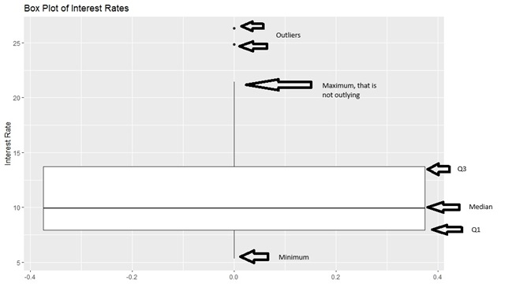

# Descriptive Statistics {#descriptive}

```{r, echo=FALSE}
rm(list = ls())
```

This module is based on OpenIntro Statistics (Diez, Ceytinka-Rundel, Barr), Chapter 2.1. You can access the book for free at https://www.openintro.org/book/os/ Please note that I cover additional topics, and skip certain topics from the book. 

## Uncertainty with Data

When we are analyzing data, there is always going to be some degree of uncertainty, as there is randomness in a lot of phenomena that we observe in our world. An event is **random** if individual outcomes of the event are unpredictable. For example, the weight of the next baby born in a local hospital. Without knowing any information about the biological parents, we have a high degree of uncertainty if we try to predict this baby's weight. Even if we know detailed information about the biological parents (for example they are both very tall), we may feel more confident in predicting that the baby is likely to be heavier than average, but we cannot be certain about this prediction. 

On the other end hand, an event is **deterministic** if we can predict individual outcomes of the event with certainty. For example, if we know the length of a cube is 2 inches, we know for sure that its volume is is $2^3 = 8$ cubic inches, based on rules of mathematics. The volume of a cube with length 2 inches is always going to be 8 cubic inches, so the volume is deterministic. 

*Thought question*: think about data that you see in real life. Write these down. Are these data random or deterministic? 

We will explore tools to help us quantify uncertainty in data. In this module, we will explore fairly standard tools that are used to describe data and give us an idea about the degree of uncertainty we have in the data. When describing data that is quantitative, we usually describe the following: the shape of its distribution, its average or typical value, and its spread and uncertainty.

## Visualizing Data 

Data visualization is the representation of information in the form of pictures. Imagine have access to weights of all newborn babies at a local hospital. Examining each numerical value could be time consuming. So instead, we can use visualizations to give us an idea about the values of the weights. For example, what weights of newborns are common? What proportion of babies have dangerously low weights (which may indicate health risks)? Good data visualizations can give us such information fairly quickly. Next, we will explore some common visualizations that are used for quantitative (or numerical) variables.

### Dot Plots

We will start with a **dot plot**, as it is the most basic visualization for a quantitative variable. We will use the `loan50` dataset from the `openintro` package. The data originally consist of thousands of loans made through the Lending Club platform, but we will randomly select 50 of these loans. Let us study the interest rate the loans the 50 applicants received. 

```{r, message=FALSE, warning=FALSE}
library(tidyverse)
library(openintro)

##create object for data
Data<-loan50
```

For simplicity, we will round the numerical values of the interest rates to the nearest whole number:

```{r}
##round interest rate to whole number
Data<- Data%>%
  mutate(r_int_rate = round(interest_rate))
```

We can create the corresponding dot plot, per Figure \@ref(fig:dotplot):

```{r dotplot, fig.cap="Dot Plot for 50 Interest Rates (rounded)"}
##dotplot
ggplot(Data,aes(x=r_int_rate))+
  geom_dotplot(binwidth=1)+
  theme(
    axis.text.y = element_blank(),  # Remove y-axis labels
    axis.title.y = element_blank(), # Remove y-axis title
    axis.ticks.y = element_blank()  # Remove y-axis ticks
  )+ 
  labs(x="Interest Rates (Rounded)")
```

Notice there is 1 black dot that corresponds to an interest rate of 20 (presumably in percent), so there is one applicant who has a rounded interest rate of 20 percent. There are 8 black dots that correspond to an interest rate to 10 percent, so there are 8 applicants with a rounded interest rate of 10 percent. So interest rates of 10 percent are much more commonly occurring than interest rate of 20 percent. So we can use the height, or number of dots, to help us glean how often the value of a certain interest rate occurs. Based on this dotplot, interest rates between 5 and 11 percent are common, with higher values being less common. 

*Note:* do not get too torn up about the details in the code to produce this dot plot. I have chosen the present the dot plot this way to highlight how we use it, without getting bogged down in the details of how it can be produced. We will not be using dot plots in this class. 

### Histograms

It turns out that dot plots are often not useful for large data sets, but they provide the general idea of how other visualizations for larger data sets work. The height of the dots inform us about the frequency of those values occurring. 

A visualization that is more commonly used for larger data sets is a **histogram**. Instead of displaying how common each value of the variable exists, we think of the values as belonging to a **bin** of values. For example, we can create a bin that contains interest rates between 5 and 7.5 percent, another bin containing interest rates between 7.5 and 10 percent, and so on. A few things to note about histograms:

- By convention, values that lie exactly on the boundary of a bin will belong to the lower bin. For example, an interest rate that is exactly 12.5 percent will belong to the bin between 10 and 12.5 percent, and not the bin between 12.5 to 15 percent. 

- Each bin should have the same width. In our example, the width is 2.5. 

We create this histogram (using the original interest rates) below, per Figure \@ref(fig:hist):

```{r hist, fig.cap="Historgram for 50 Interest Rates"}
##set up sequence to specify the bins
s25<-seq(5,27.5,2.5)

ggplot(Data,aes(x=interest_rate))+
  geom_histogram(breaks=s25,fill="blue",color="orange")+
  labs(x="Interest Rate", title="Histogram of Interest Rates")
```

Similar to the dot plot in Figure \@ref(fig:dotplot), the height of the histogram inform us what values are more commonly occurring. We can see from this histogram that interest rates between 5 and 10 percent are common, much more so than loans with interest rates greater than 20 percent. We could say that we have more certainty that a randomly selected loan applicant will have an interest rate between 5 and 10 percent than an interest rate that is greater than 20 percent. 

#### Shapes of Distribution

Histograms can also give us an idea about the **shape** of the distribution of interest rates. For the histogram in Figure \@ref(fig:hist), most of the loans are less than 15 percent, with only a small number of loans greater than 20 percent. We can say that we have greater certainty that a loan will have an interest rate less than 15 percent.  When the data tail off to the right as in our histogram, the shape is said to be **right-skewed**. When a variable is said to be right-skewed, large values of the variable are much less common than small values of the variable; smaller values are more likely occur.  

- If the histogram has the reverse characteristic, i.e. the data tail off to the left instead, the shape is said to be **left-skewed**. This implies that small values of the variable are much less common than large values of the variable; larger values are more likely to occur.

- Histograms that tail off similarly in both directions are called **symmetric**. Large and small values are of the variable are equally likely. 

- Histograms that have a peak in the middle, and then tail off on both sides are not only symmetric, but also **bell-shaped**, or have a **normal** distribution. Note: it turns out one of the assumptions in linear regression is that the response variable follow a normal distribution. This may seem restrictive, however, we will see in later modules that this assumption is not particularly crucial under some circumstances.

*Thought question:* Can you think of real life variables that have symmetric, right-skewed, left-skewed distributions? Feel free to search the internet for examples.

#### Considerations with Histograms

With our interest rate example, you may have noticed that I made a specific choice on the width of the bins when I created the histograms. It turns out that the width of the bins can impact the shape of the histogram, and potentially, how we interpret the histogram. 

Consider creating a histogram with bin width of 0.5, instead of 2.5, per Figure \@ref(fig:hist05):

```{r hist05, fig.cap="Historgram for 50 Interest Rates, with Bin Width 0.5"}
##set up sequence to specify the bins. width now 0.5
s05<-seq(5,27.5,0.5)

ggplot(Data,aes(x=interest_rate))+
  geom_histogram(breaks=s05,fill="blue",color="orange")+
  labs(x="Interest Rate", title="Histogram of Interest Rates")
```

Comparing Figure \@ref(fig:hist05) with Figure \@ref(fig:hist), note the following:

- Visually, the histogram looks more jagged with smaller bin width, whereas the histogram looks smoother with a larger bin width.

- Smaller bin widths may be preferred if we need information about smaller ranges of interest rates. However, it can be difficult to write about general trends. 

- Larger bin widths may be more useful if we are trying to look for more general trends in the interest rates. 

*Thought question*: What happens if we create a histogram with a bin width that is too large?

### Density Plots {#densplots}

Another visualization for a quantitative variable is a **density plot**. A density plot can be viewed as a smoothed version of the histogram. We can use the heights to inform us about what values are more common. We create a density plot for the interest rates in Figure \@ref(fig:dens):

```{r dens, fig.cap="Density Plot for 50 Interest Rates"}
##density plot
plot(density(Data$interest_rate), main="Density Plot of Interest Rates")
```

Based on Figure \@ref(fig:dens), we see that low interest rates (between 5 and 12.5 percent) are much more common and high interest rates (higher than 20 percent). A few things to note about interpreting density plots:

- The area under the density plot is always equals to 1. 
- To find the proportion of interest rates that are between two values, for example between 10 and 15 percent, we would integrate this density plot over this range, i.e. $\int_{10}^{15} f(x) dx$, where $f(x)$ is a mathematical equation that describes the density plot. We will learn about this equation in more detail in a later module. 
- The values on the vertical axis do not equal to probabilities (a common misconception).

The density plot is found using a method called kernel density estimation (KDE). We will over details about KDE in Section \@ref(KDE) as we need to cover quite a bit of material before doing so. 

#### Considerations with Density Plots

Similar to bins and histograms, density plots are affected by the **bandwidth**. Larger bandwidths lead to smoother density plots, while smaller bandwidths lead to more jagged density plots. We create a density plot that uses a bandwidth that is twice the default in Figure \@ref(fig:dens2) below:

```{r dens2, fig.cap="Density Plot for 50 Interest Rates with Larger Bandwidth"}
plot(density(Data$interest_rate, adjust=2), main="Density Plot of Interest Rates, with Bandwidth Twice the Default")
```

Notice in Figure \@ref(fig:dens2) that the little peak for interest rates between 15 and 20 (which existed in Figures \@ref(fig:dens) and also \@ref(fig:hist)) no longer exists. Using bandwidths that are too large can smooth out some of these peaks. 

*Thought question*: How are bin widths for histograms and bandwidths for density plots related?

## Ordered Statistics

The idea behind ordered statistics is pretty self-explanatory: take your numerical variable, and order the values from smallest to largest. Going back to our example of the interest rates from 50 loan applicants, let $X$ denote the interest rate. Then $x_{(1)}$ will denote the interest rate that is the smallest, $x_{(2)}$ denotes the second smallest interest rate, and $x_{(50)}$ denotes the largest interest rate in our sample of 50. 

### Quantiles

**Quantiles** partition the range of numerical data into continuous intervals (groups) with (nearly) equal proportions. Common quantiles have their own names:

- Quartiles: 4 groups
- Percentiles: 100 groups

We will go over quartiles in more detail.

#### Quartiles {#quart}

Quartiles divide the data into 4 groups, and each group has (nearly) equal number of observations. So there will be three quartiles, denoted by $Q_1, Q_2, Q_3$. 

- The first group will have values between negative infinity and $Q_1$.
- The second group will have values between negative $Q_1$ and $Q_2$.
- The third group will have values between negative $Q_2$ and $Q_3$.
- The fourth group will have values between negative $Q_3$ and infinity.

$Q_2$, sometimes called the second quartile, is the easiest value to find. It is also called the **median** of the data. Going back to our interest rates from the 50 loan applicants. Using our ordered statistics, the median is the middle observation. Since we have an even number of observations, we have two middle observations, $x_{(25)}$ and $x_{(26)}$. In this situation, the median will be the average of these two middle observations. Using R, we find the median to be:

```{r}
median(Data$interest_rate)
```

So roughly half the interest rates are less than 9.93 percent, and roughly half the interest rates are greater than 9.93 percent. You might also recognize another term for the median: the 50th percentile, as 50 percent of the interest rates are less than 9.93. 

To find the middle observation(s) based on a sample of size $n$:

- If $n$ is even, the 2 middle observations will be position $\frac{n}{2}$ and $\frac{n}{2} + 1$ in the ordered statistics.
- If $n$ is odd, the middle observation will be position $\frac{n}{2} + 0.5$ in the ordered statistics. 

$Q_1$ and $Q_3$ (also called the first and third quartiles) are found together, after finding $Q_2$. Note that $Q_2$ divides the data into two groups. Using our interest rates example, one group contains $x_{(1)}, \cdots, x_{(25)}$, and another group contains $x_{(26)}, \cdots, x_{(50)}$. $Q_1$ is the median of the first group, and $Q_3$ is the median of the second group. So for our 50 loan applicants:

- $Q_1$ is $x_{(13)}$, and
- $Q_3$ is $x_{(38)}$.

To find these values in R, we could type:

```{r}
quantile(Data$interest_rate, prob=c(0.25,0.75), type = 1)
```

So $Q_1$ is 7.96 percent, and $Q_3$ is 14.08 percent. It turns out that $Q_1$ is also the 25th percentile, and $Q_3$ is also the 75th percentile, by definition. 

Remember we wrote the following earlier:

- The first group will have values between negative infinity and $Q_1$. So about a quarter of observations are have interest rates less than 7.96 percent.
- The second group will have values between negative $Q_1$ and $Q_2$. So about a quarter of observations have interest rates between 7.96 and 9.93 percent. 
- The third group will have values between negative $Q_2$ and $Q_3$. So about a quarter of observations have interest rates between 9.93 and 14.08 percent. 
- The fourth group will have values between negative $Q_3$ and infinity. So about a quarter of observations have interest rates above 14.08 percent. 

Note: you may notice that we used `type = 1` inside the `quantile()` function. Using `type = 1` gives the values of the first and third quartiles that are based on the method that was just described. There are actually several ways to find quantiles, which may result in slightly differing values, although they all generally meet the definition that $Q_1$ is the 25th percentile, and $Q_3$ is the 75th percentile. 

#### Percentiles

Another common quantile is the percentile. In general the **k-th percentile** is the value of the data point below which $k$ percent of observations are found. So in our earlier example, we said that $Q_3$ of the interest rates is 14.08 percent, and this is also the 75th percentile. So 75 percent of interest rates are less than 14.08 percent. 

### Box Plots

Another visualization used to summarize quantitative data is the box plot. A **box plot** summarizes the 5-number summary. The 5 numbers are the minimum, $Q_1, Q_2, Q_3$, and the maximum. Using our interest rate data, the box plot is shown in Figure \@ref(fig:boxplot):

```{r echo = T, fig.show='hide'}
##box plot
ggplot(Data,aes(y=interest_rate))+
  geom_boxplot()+
  labs(y="Interest Rate", title="Box Plot of Interest Rates")
```

```{r boxplot, fig.cap = "Box Plot of Interest Rates", echo = FALSE}

```

Some people call a box plot a box and whisker plot.

- The boundaries of the box represent $Q_1$ and $Q_3$.
- The thick line in the box represents the median.
- The two whiskers on either side of the box extend to the minimum and maximum, if outliers do not exist. If outliers exist, the whiskers extend to the minimum and maximum values that are not outliers. 

Generally, when we have one quantitative variable, an outlier is an observation whose numerical value is far away from the rest of the data. In other words, it is a lot smaller or larger relative to the rest of the data. 

So for our 50 loans, there are two loan applicants with interest rates around 25 percent that are flagged as being a lot larger than the rest of the loans, which is reasonable since most of the loans are a lot smaller than 20 percent. 

We will not go over the details of how outliers are determined in box plots. If you are interested, you can read Chapter 2.1.5 from [OpenIntro Statistics (Diez, Ceytinka-Rundel, Barr)](https://www.openintro.org/book/os/). Generally, when we are working with one variable, outliers are observations which are a lot larger or smaller than the rest of the observations. 

Notice how much further large values ($Q_3$ and maximum) are from the median, compared to the distance of the small values ($Q_1$ and minimum) from the median. This indicates that the distribution of interest rates are right-skewed. Compare the boxplot of the interest rates in Figure \@ref(fig:boxplot) with its corresponding histogram (Figure \@ref(fig:hist)) and density plot (Figure \@ref(fig:dens)). 

*Thought question*: can you sketch a box plot that represents a variable that is left-skewed? How about a variable that is symmetric?

### Empirical Cumulative Distribution Function {#ecdf}

From the previous sections, we can see how we could use histograms, density plots, and box plots to inform us about what proportion of observations take certain values, and the values of the data that correspond to certain percentiles. However, we are limited to quartiles and not any percentile when using box plots, and we need to find areas under the density plot (using integration, not a trivial task), or add up frequencies on a histogram (can be time consuming). 

A plot that can easily give us values of the variable that correspond to percentiles is the **empirical cumulative distribution function (ECDF)** plot.

Let $X$ denote a random variable, and we have observed $n$ observations of $X$ denoted by $x_1, \cdots, x_n$. Let $x_{(1)}, \cdots x_{(n)}$ denote the ordered statistics of the $n$ observations. The ECDF, denoted by $\hat{F}_n(x)$ is the proportion of sample observations less than or equal to the value $x$ of the random variable. Mathematically, the ECDF is:

$$
 \hat{F}_n(x) = 
  \begin{cases} 
   0, & \text{for } x < x_{(1)} \\
   \frac{k}{n},       & \text{for } x_{(k)} \leq x < x_{(k+1)}, k = 1, \cdots, n-1\\
   1, & \text{for } x \geq x_{(n)}.
  \end{cases}
$$
We shall use a simple toy example to illustrate how an ECDF is constructed. Suppose we ask 5 people how many times to go to the gym (at least 20 minutes) in a typical work week. The answers are: 3, 0, 1, 5, 3. The random variable $X$ is how many times a person goes to the gym for at least 20 minutes, and the ordered statistics are $x_{(1)} = 0, x_{(2)} = 1, x_{(3)} = 3, x_{(4)} = 3, x_{(5)} = 5$. Using the mathematical definition for the ECDF, we have:

- $\hat{F}_n(x) = 0$ for $x < x_{(1)} = 0$. 
- $\hat{F}_n(x) = \frac{1}{5}$ for $0 \leq x < x_{(2)} = 1$. 
- $\hat{F}_n(x) = \frac{2}{5}$ for $1 \leq x < x_{(3)} = 3$. 
- $\hat{F}_n(x) = \frac{4}{5}$ for $3 \leq x < x_{(5)} = 5$. This value is special for this example since we have two observations where $x=3$.
- $\hat{F}_n(x) = 1$ for $x \geq 5$.

The corresponding ECDF plot is shown in Figure \@ref(fig:ecdf):

```{r ecdf, fig.cap="ECDF Plot for Toy Example"}
##toy data
y<-c(3, 0, 1, 5, 3)
##ECDF plot
plot(ecdf(y), main = "ECDF for Toy Example")
```

We can easily find percentiles from this plot, for example, the 40th percentile is equal to 1, going to the gym once a week. About 20 percent of observations go to the gym less than 1 time a week. The video below explains the construction of the ECDF:

<iframe width="560px" height="320px" allowfullscreen="true" allow="autoplay *" title="Mod 01: Empirical Cumulative Distribution Function" src="https://virginiauniversity.instructuremedia.com/embed/d6e01cbb-e682-4291-b969-dc3a1855e952" frameborder="0"></iframe>

Next, we create the ECDF plot for the interest rates from the 50 loan applicants.

```{r ecdfreal, fig.cap="ECDF Plot of Interest Rates" }
plot(ecdf(Data$interest_rate), main = "ECDF Plot of Interest Rates")
abline(h=0.8)
```

I overlaid a horizontal line for the 80th percentile, so we can read on the horizontal axis that this corresponds to an interest rate of about 17 percent. So about 80 percent of loan applicants have an interest rate less than 17 percent. 

*Thought question*: try using the histogram and density plot for the interest rates (Figures \@ref(fig:hist) and \@ref(fig:dens)) to find the interest rate that corresponds to the 80th percentile. Was this easy to perform?


## Measures of Centrality

So far, we have used visualizations to summarize the shape of the distribution of a quantitative variable. Next, we look at common measures of centrality. Loosely speaking, measures of centrality are measures that describe the average or typical value of a quantitative variable. The common measures of centrality are the mean, median, and mode. 

### Mean

The sample **mean** is simply the average value of the variable in our sample. The sample mean for a random variable $X$ is denoted by $\bar{x}$, and is found by:

\begin{equation} 
\bar{x} = \frac{\sum_{i=1}^n x_i}{n}.
(\#eq:mean)
\end{equation}

So, for our toy example of the 5 people and how often they go to the gym in a week, their sample mean is $\bar{x} = \frac{3+0+1+5+3}{5} = 2.4$.

### Median

We went over how to find the median in section \@ref(quart). The **median** is the value of the middle observation in ordered statistics. It is also called $Q_2$, the second quartile, and the 50th percentile, so approximately 50 percent of observations have values smaller than the median. 

So, for our toy example of the 5 people and how often they go to the gym in a week, their sample median is $x_{(3)} = 3$. So about 50 percent of people went to gym less than 3 times in a week. 

### Mode

Another measure is the mode. Mathematically speaking, the **mode** is the most commonly occurring value in the data. So for our toy example, the mode is 3, since 3 occurs twice and occurs the most often in our data. 

### Considerations

A few things to consider when using these measures of centrality:

- The mean is a measure that most people are comfortable with, however, caution needs to be used if the variable is skewed, as extreme outliers and drastically alter the value of the mean. Using our toy example with the gym, suppose the person who visits the gym the most visits 50 times, instead of 5. The numerical value of the sample mean explodes, and does not give a good representation of the central value of how many visits to the gym a person makes in a week. The mean is fine if the variable is symmetric.

- The median is a measure that is recommended for skewed distributions, since the order associated with ordered statistics is not influenced by extreme outliers. Using the gym example, in the previous bullet point, the median is unaffected. 

- The mean being larger than the median is an indication that the distribution is right-skewed. Using our interest rate example, we have:

```{r}
mean(Data$interest_rate)
median(Data$interest_rate)
```

which is consistent with the right skew we saw in the histogram and density plot in Figures \@ref(fig:hist) and \@ref(fig:dens). Conversely, a left-skewed distribution usually has a mean that is smaller than the median. A symmetric distribution typically has similar values for the mean and median. 

- The mean is considered a **sensitive** measure, since its numerical value can be drastically affected by outliers. The median is considered a **robust** measure, since its numerical value is more resistant and is less affected by outliers. 

- The mathematical definition of mode can be difficult to use for variables that are continuous, since it is likely that there are no observations that have the same value when the variable is continuous. In this instance, the mode typically refers to the bin in the histogram that has is the tallest. So, using the histogram in Figure \@ref(fig:hist) for the interest rates, the mode is between 7.5 to 10 percent. 


## Measures of Spread

In the previous sections, we learned about summarizing features a quantitative variable, by using visualizations to summarize its shape, and by using some measures of centrality that describe the average or typical values of the variable. One more feature we can summarize is the spread, associated with the values of a quantitative variable. Measures of spread are considered a way to measure uncertainty. Data that have larger spread have more uncertainty.

### Variance and Standard Deviation

One measure of spread is the variance. The sample **variance** for a random variable $X$ is denoted by $s^2$, or sometimes $s_x^2$, and is found by:

\begin{equation} 
s^2 = \frac{\sum_{i=1}^n (x_i-\bar{x})^2}{n-1}.
(\#eq:variance)
\end{equation}

The variance can be interpreted as the approximate average squared distance of the observations from the mean. The formula in equation \@ref(eq:variance) may look a bit complicated, but let us use the toy example where we asked 5 people how often they go to the gym in a workweek. The answers are: 3, 0, 1, 5, 3, and we had earlier found the sample mean to be $\bar{x} = 2.4$. To calculate the sample variance:

$$
\begin{split}
s^2 &= \frac{\sum_{i=1}^n (x_i-\bar{x})^2}{n-1}\\
 &= \frac{(3-2.4)^2 + (0-2.4)^2 + (1-2.4)^2 + (5-2.4)^2 + (3-2.4)^2}{5-1} \\
&= 3.8 
\end{split}
$$

Notice what we did in the numerator of equation \@ref(eq:variance): we take the difference between each observed value from the sample mean, square these differences, then add up the squared differences. We then divide by $n-1$, rather than $n$, hence the sample variance being the approximate averaged squared distance of the observations from the mean. There is some nuance in the mathematics as to why we divide by $n-1$ instead of $n$, and may not be intuitive as to why we do so. It turns out dividing by $n-1$ makes the sample variance an unbiased estimator of the true variance in the population (denoted by $\sigma^2$) and is more reliable than if we had divided by $n$. We will go over this in more detail in a later module after covering a few additional concepts. 

The video below explains the calculation of the sample variance:

<iframe width="560px" height="320px" allowfullscreen="true" allow="autoplay *" title="Mod 01: Sample Variance" src="https://virginiauniversity.instructuremedia.com/embed/d4a39613-d29e-47de-b5b0-e3a7304d0e16" frameborder="0"></iframe>

Larger values of the sample variance indicate that the observations are generally further away from the sample mean, indicating larger spread, and a higher degree of uncertainty about future values. 

*Thought question*: What does it mean if the sample variance of a set of observations is 0? Why does this indicate their there is little (or no) uncertainty about the set of observations?

Another related measure is the sample **standard deviation**, which is the square root of the sample variance. Similar to the variance, larger values indicated more spread in the data. 

### Interquartile Range 

Another measure of spread is the **interquartile range (IQR)**, and it is the difference between the third and first quartiles,

\begin{equation} 
IQR = Q_3 - Q_1.
(\#eq:IQR)
\end{equation}

The IQR is considered a robust measure of spread, while the sample variance and standard deviations are considered to be sensitive. 
