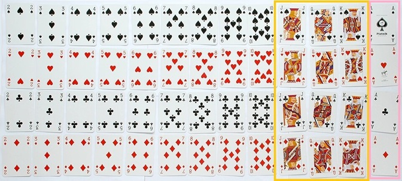

# Probability

```{r, echo=FALSE}
rm(list = ls())
```

This module is based on Introduction to Probability (Blitzstein, Hwang), Chapters 1 and 2. You can access the book for free at https://stat110.hsites.harvard.edu/ (and then click on Book). Please note that I cover additional topics, and skip certain topics from the book. You may skip: Sections 1.4, 1.5, Theorem 1.6.3, Examples 1.6.4, 2.4.5, 2.5.12, 2.7.3 from the book.

## Introduction to Probability

A way of quantifying uncertainty is through probability. Think about these statements: "I am 100% certain that it will rain in the next hour" and "I am 50% certain that it will rain in the next hour". The percentages are used to reflect the degree of certainty about the event happening. The first statement reflects certainty; the second reflects uncertainty as the statement implies the belief that it is equally likely that it will rain or not. In this module, we will learn about the basic concepts about probability.

### Why Study Probability?

The book (Section 1.1) lists 10 different applications of probability, and there are many more applications. I will go as far as to say that anything that deals with data will also deal with probability. 

### Frequentiest and Bayesian View of Probability

There are a couple of main viewpoints on how to interpret probability: **frequentist** and **Bayesian**. Consider the statement that "if we flip a fair coin, the coin has a 50% chance of landing heads". 

- The frequentist viewpoint views probability as the relative frequency associated with an event that is repeated for an infinite number of times. It will interpret the 50% probability as: if we were to flip the coin many many times, 50% of these times will result in the coin landing heads. 

- The Bayesian viewpoint views probability as a measure of belief, or certainty, that an event will happen. It will interpret the 50% probability as: heads and tails are equally likely to occur with a coin flip.

In this coin flip example, both interpretations are reasonable. However, in some instances, the frequentist interpretation may not be as interpretable if we cannot repeat the event many times. For example, the earlier statement about rain: "I am 50% certain that it will rain in the next hour". Whether it will rain or not in the next hour is not a repeatable event, so the frequentist interpretation makes less sense here. 

## Key Concepts in Probability

In this section, we will cover the basic terminology and foundational ideas in probability.

### Sample Space

The **sample space** of an experiment, denoted by $S$, is the set of all possible outcomes of an experiment.

For the rest of this module, we will use the following as an example: consider a standard deck of 52 cards, and we draw one card at random. What is the card drawn? The sample space for this experiment can be viewed as a list of all 52 cards, per Figure \@ref(fig:cards) below.

```{r cards, fig.cap = "Sample Space of Drawing One Card from Standard Deck. Picture from https://en.wikipedia.org/wiki/Standard_52-card_deck", echo = FALSE}
knitr::include_graphics("images/02-cards.jpg")
```

While the definition of sample space may appear elementary, writing out the sample space is almost always the first step in performing any probability calculations.

### Event

An **event** is a subset of the sample space, and is usually denoted by an upper case letter. For example, let $A$ denote the event that I draw a card with a black suit (spades or clubs), and let $B$ denote the event I draw a picture card (Jack, Queen, or King). Events $A$ and $B$ are each shown in Figures Figure \@ref(fig:cardsA) and Figure \@ref(fig:cardsB) below.

```{r cardsA, fig.cap = "Event $A$ (in Blue)", echo = FALSE}

```

```{r cardsB, fig.cap = "Event $B$ (in gold)", echo = FALSE}
knitr::include_graphics("images/02-cardsB.jpg")
```

The sample space of the experiment can be finite or infinite. In our card example, our sample space is finite since we can actually write out all possible outcomes. If the number of possible outcomes is infinite (i.e. we cannot write out the entire list of all possible outcomes), the sample space is infinite. 

We assign a probability to each event. The probability of event $A$ happening is $P(A)$. **If each outcome of a sample space is equally likely and we have a finite sample space, the probability of the event is the number of outcomes belonging to the event divided by the number of outcomes in the sample space.** Using our card example, $P(A) = \frac{26}{52} = \frac{1}{2}$ and $P(B) = \frac{12}{52} = \frac{3}{13}$.

### Complements

The **complement** of an event is the set of all outcomes that do not belong to the event. For example, the complement of $A$, denoted by $A^c$, will be drawing a card with a red suit (hearts or diamonds). One way to think about complements is that the complement of an event is the event not happening. Loking at Figure \@ref(fig:cardsA), this will be the cards that are not outlined in blue. In this example, $P(A^c) = \frac{26}{52} = \frac{1}{2}$.

*Thought question*: What is the probability of drawing a non picture card?

From these examples, you might realize the probability associated with the complement of an event can be found by subtracting the probability of the event from 1, i.e.

\begin{equation} 
P(A^c) = 1 - P(A).
(\#eq:comp)
\end{equation}

Sometimes, the calculation for the probability of the complement of an event is much less tedious than the probability of the event. In such an instance, equation \@ref(eq:comp) will be useful. 

### Unions

The **union** of events is when **at least one** of the events happen. For example, the union of events $A$ and $B$, denoted by $A \cup B$, is the event that the card drawn is either a black suit, or a picture card, or both a black suit and a picture card. This is reflected in Figure \@ref(fig:cardsAB).

```{r cardsAB, fig.cap = "Union of A, B (in blue or gold, or both blue and gold)", echo = FALSE}

```

To find $P(A \cup B)$, we can refer to Figure \@ref(fig:cardsAB) and just count the number of outcomes to belong to either event $A$ (is black suit) or event $B$ (is picture card), and find this is $\frac{32}{52}$. 

The union of $A$ and $B$ can be viewed as the event where either event $A$ or $B$ (or both) happens. 

### Intersections

The **intersection** of events is when **all** of the events happen. Using our example, the intersection of events $A$ and $B$ is denoted by $A \cap B$, is the event that the card drawn is both a black suit and a picture card. Using Figure \@ref(fig:cardsAB), the outcomes belonging to $A \cap B$ are the cards that are outlined in blue and gold. This probability is $P(A \cap B) = \frac{6}{32}$.

### Addition rule

A common mistake that can be made in calculating $P(A \cup B)$ is to just add up the probabilities of each individual event, so the mistake will say this probability is $\frac{26}{52} + \frac{12}{52} = \frac{38}{52}$. The problem with this approach is that the outcomes that belong to both events (black picture cards) get counted twice, when we only want to count them once. This leads to the following formula for calculating probabilities involving unions of two events, and is sometimes called the **addition rule** in probability:

\begin{equation} 
P(A \cup B) = P(A) + P(B) - P(A \cap B).
(\#eq:union)
\end{equation}

Using equation \@ref(eq:union), $P(A \cup B) = \frac{26}{52} + \frac{12}{52} - \frac{6}{32} = \frac{32}{52}$.

### Disjoint or Mutually Exclusive Events

The previous discussion leads to the idea of **disjoint**, or **mutually exclusive** events. Events are disjoint if they cannot happen simultaneously. In our card example, events $A$ and $B$ are not disjoint, since $A$ and $B$ can happen simultaneously, since a card that is drawn can be both black and a picture card, e.g. we draw a king of spades.

Using Figure \@ref(fig:cardsAB) as a visual example, we can see that events $A$ and $B$ are not disjoint since the outcomes in blue overlap with the outcomes in gold. 

Suppose we define another event, $C$, to denote that the card drawn is an Ace. The events $B$ and $C$ are disjoint since a card that is drawn cannot be both a picture card and an ace. This definition of disjoint events leads to the following: for events are disjoint, the probability of their intersection will be 0. 

Using Figure \@ref(fig:cardsBC) below as a visual example, we can see that events $B$ and $C$ are disjoint since the outcomes in gold and pink do not overlap. 

```{r cardsBC, fig.cap = "Events B, C (in gold and pink respectively)", echo = FALSE}

```

Applying this idea to equation \@ref(eq:union), we have the following for disjoint events: for disjoint events, the probability of at least one event happening is the sum of the probabilities for each event.

### Axioms of Probability

The following are called the axioms of probability, which are considered foundation properties associated with probability:

1. The probability of any event, $E$, is non negative, i.e. $P(E) \geq 0$. 
2. The probability that at least one outcome in the sample space occurs is 1, i.e.$P(S) = 1$.
3. If $A_1, A_2, \cdots$ are all disjoint events, then 

$$
P(\bigcup\limits_{i=1}^{\infty} A_{i}) = \sum_{i=1}^{\infty} P(A_i).
$$
In other words, for disjoint events, the probability that at least one event happens is the sum of their individual probabilities.

Note: most writers list these as three axioms. Our book combines the first two axioms into 1, and so write these as two axioms. 

We can easily see how equations \@ref(eq:comp) and \@ref(eq:union) can be derived from these axioms. Note that these equations and the axioms apply in all circumstances, regardless of whether the sample space is finite or not. 

## Conditional Probability

The concept of conditional probability appears in almost all statistical and data science models. In statistical models such as logistic regression, we are trying to use observable data (called predictors, input variables, etc) to model the probabilities associated with the different values of an outcome that is random (called response variable, output variable, etc). If the observable data are predictive of the outcome, then the probabilities associated with the outcome should indicate greater certainty, than if we do not have the observable data. Conditional probabilities allows us to incorporate observable data, or evidence, when evaluating uncertainty with random outcomes.

Consider that we are headed out for lunch, and we need to decide if we want to bring an umbrella (assuming we only bring an umbrella if we think it is going to rain). If we had been working in a windowless basement with no internet, we will have a high degree of uncertainty when evaluating if it will rain or not. However, if we were to look outside and observe the current weather conditions before heading out, we are likely to have a higher degree of certainty when evaluating if it will rain or not. Conditional probabilities allow us to incorporate what we see into our prediction of a random event. 

If we were to use the language of probability to denote this example, let $R$ denote the event that it will rain when we go for lunch. If we had been working in the windowless basement with no internet, we will be calculating $P(R)$, the probability it will rain when we go to lunch. If we are able to incorporate the current weather conditions, this probability will be denoted as $P(R|data)$, where data denotes the current observe weather conditions. $P(R|data)$ can be read as the probability that it will rain when we go to lunch, given what we have observed with the weather. With this example, we can see that $P(R)$ and $P(R|data)$ will be different, since we update our probability given useful information. Notice the $|$ symbol inside the probability. This symbol implies that we are working with a conditional probability, with the given or observed information listed after the $|$.

### Definition {#def}

If $X$ and $Y$ are events, with $P(X)>0$, the conditional probability of $Y$ given $X$, denoted by $P(Y|X)$, is

\begin{equation} 
P(Y|X) = \frac{P(Y \cap X)}{P(X)}.
(\#eq:cond)
\end{equation}

In this definition, we want to update the probability of $Y$ happening, given that we have observed $X$. $X$ can be viewed as the observable data or the evidence we want to incorporate. 

In the Bayesian viewpoint of probability, $P(Y)$ is called the **prior** probability of $Y$ since it reflects our belief about $Y$ before observing any data. $P(Y|X)$ is called the **posterior** probability of $Y$, as it reflects an update on our belief about $Y after incorporating observed data. 

Let us go back to the standard deck of cards example. Let us find $P(B|A)$, the probability that our card is a picture card, given that we know the card is a black suit. Visually, we can use the definition of conditional probability using Figure \@ref(fig:cardscond) below.

```{r cardscond, fig.cap = "Events A, given B", echo = FALSE}
knitr::include_graphics("images/02-cardscond.jpg")
```

We are told that our card is a black suit, so we have only 26 possible outcomes to consider, as the red cards are eliminated and are crossed out in Figure \@ref(fig:cardscond). out of these 26 outcomes, how many are picture cards? So this probability $P(B|A)$ is $\frac{6}{26}$.

Figure \@ref(fig:cardscond) represents the frequentist viewpoint of conditional probability: $P(B|A)$ represents the long run proportion of picture cards among cards that are black suits. 

We can also apply equation \@ref(eq:cond): $P(B|A) = \frac{\frac{6}{52}}{\frac{1}{2}} = \frac{6}{26}$ which gives the same answer. 

*Thought question*: work out the probability that the card drawn is a black suit, given that we know the card is a picture card. 

We can see from this example that in general $P(Y|X) \neq P(X|Y)$. This informs us that we need to be extremely careful when writing out our conditional probabilities and interpreting them, and knowing which one matters to our analysis. For example, the probability that I feel unwell given that I have the flu is close to 1, but the probability that I have the flu given that I feel unwell is not close to 1 (since there are many things that can me me feel unwell). This confusion regarding conditional probabilities is sometimes called the confusion of the inverse or the prosecutor's fallacy. This fallacy wrongly assumes that if the probability of a fingerprint match given that the person is innocent is small, it means that the probability that the person is innocent given a fingerprint match must also be small.  Before going over this fallacy in more detail, we need to cover a few more concepts. 

### Multiplication Rule

From equation \@ref(eq:cond), we have the **multiplication rule** in probability

\begin{equation} 
P(Y \cap X) = P(Y|X) \times P(X) = P(X|Y) \times P(Y).
(\#eq:mult)
\end{equation}

The multiplication rule is useful in finding the probability of multiple events happening, aespecially if the events happen sequentially. As an example, consider drawing two cards, without replacement, from a standard deck of cards. Without replacement means that after drawing the first card, it is not returned to the deck, so there will be 51 cards remaining after the first draw. Let $D_1$ and $D_2$ denote the events that the first draw is a diamond suit and the second draw is a diamond suit respectively. We want to find the probability that both cards drawn are diamond suits. This probability can be written as $P(D_1 \cap D_2) = P(D_1) \times P(D_2|D_1)  = \frac{13}{52} \times \frac{12}{51}  = \frac{156}{2652}$.

### Independent Events

Events are independent if knowledge about whether one event happens or not does not change the probability of the other event happening. This implies that if $X$ and $Y$ are independent events, then the definition of conditional probability simplifies to $P(Y|X) = P(Y)$. Likewise $P(X|Y) = P(X)$. Applying this to the multiplication rule, we have the following for multiplication rule for independent events

\begin{equation} 
P(Y \cap X) = P(Y) \times P(X).
(\#eq:mult2)
\end{equation}

The probability of all events happening is just the product of the probabilities for each individual event, if the events are all independent. 

Going back to our example with the standard deck of cards, where $A$ denotes the event that I draw a card with a black suit (spades or clubs), and $B$ denotes the event I draw a picture card (Jack, Queen, or King). We had earlier found that $P(B) = \frac{12}{52}$ and that $P(B|A) = \frac{6}{26}$. Notice that these two probabilities are numerically equal, which informs us that the events are independent. Knowing whether the card is a black suit or not does not change the probability that the card is a picture card. This makes sense intuitively since the proportion of cars that are picture is the same for black and red suits. 


### Bayes' Rule

The definition of conditional probability in equation \@ref(eq:cond) and the  multiplication rule in equation \@ref(eq:mult) give us **Bayes' rule**

\begin{equation} 
P(Y|X) = \frac{P(X|Y)P(Y)}{P(X)}.
(\#eq:bayes)
\end{equation}

Bayes' rule is useful if we want to find $P(Y|X)$ but we only have information regarding $P(X|Y)$ available. A fairly popular model is called linear discriminant analysis, and it models the conditional probability using Bayes' rule.

### Odds

The **odds** of an event $Y$ are

\begin{equation} 
odds(Y) = \frac{P(Y)}{P(Y^c)}.
(\#eq:odds)
\end{equation}

You may realize that the left hand side of equation \@ref{eq:odds} is equal to the left hand side of a logistic regression equation. 

Using equation \@ref(eq:odds), we can switch from odds to probability easily

\begin{equation} 
P(Y) = \frac{odds(Y)}{1 + odds(Y)}.
(\#eq:odds2)
\end{equation}

### Odds Form of Bayes' Rule

Using Bayes' rule in equation \@ref(eq:bayes) and the definition of odds in equation \@ref(eq:odds), we have the **odds form for Bayes' rule**

\begin{equation} 
\frac{P(Y|X)}{P(Y^c|X)} = \frac{P(X|Y)}{P(X|Y^c)} \frac{P(Y)}{P(Y^c)}. 
(\#eq:oddsbayes)
\end{equation}

### Law of Total Probability

Let $Y_1, Y_2, \cdots, Y_n$ be a partition of the sample space ($Y_1, Y_2, \cdots, Y_n$ are disjoint and their union is the sample space), with $P(Y_i) > 0)$ for all $i$. Then

\begin{equation} 
\begin{split}
P(X) &= \sum_{i=1}^n P(X|Y_i) \times P(Y_i)\\
    &= P(X|Y_1) \times P(Y_1) + P(X|Y_2) \times P(Y_2) + \cdots + P(X|Y_n) \times P(Y_n).
\end{split}
(\#eq:total)
\end{equation} 

The law of total probability informs us of a way to find the probability of $X$. We can divide the sample space in disjoint sets $Y_i$, find the conditional probability of $X$ within each set, and then take a weighted sum of these conditional probabilities, weighted by $P(Y_i)$. This is useful if the conditional probability for each set is easy to obtain. 

The law of total probability in equation \@ref(eq:total) can be applied to the denominator of Bayes' rule in equation \@ref(eq:bayes) to have the following variation of Bayes' rule:

\begin{equation} 
P(Y|X) = \frac{P(X|Y)P(Y)}{\sum_{i=1}^n P(X|Y_i) \times P(Y_i)}.
(\#eq:bayes2)
\end{equation}

### Worked Example

#### Approach 1: Using Bayes' Rule

We consider this worked example on how to apply Bayes' rule and the law of total probability. Suppose my email can be divided into three categories: $E_1$ denotes spam email, $E_2$ denotes important email, and $E_3$ denotes not important email. An email must belong to only one of these categories. Let $F$ denote the event that the email contains the word "free". From past data, I have the following information: 

- $P(E_1) = 0.2, P(E_2) = 0.5, P(E_3) = 0.3$.
- The word "free" appears in 99% of spam email, so $P(F|E_1) = 0.99$.
- The word "free" appears in 10% of important email, so $P(F|E_2) = 0.1$.
- The word "free" appears in 5% of important email, so $P(F|E_3) = 0.05$.

I receive an email that has the word free. What is the probability that it is spam? So we want to find $P(E_1|F)$. Using equation \@ref(eq:bayes2), we have

$$
\begin{split}
P(E_1|F) &= \frac{P(E_1 \cap F)}{P(F)}\\
 &= \frac{P(F|E_1) \times P(E_1)}{P(F|E_1) \times P(E_1) + P(F|E_2) \times P(E_2) + P(F|E_3) \times P(E_3)} \\
&= \frac{0.99 \times 0.2}{0.99 \times 0.2 + 0.1 \times 0.5 + 0.05 \times 0.3}\\
&= 0.7528517
\end{split}
$$

#### Approach 2: Using Tree Diagrams

A tree diagram is useful in finding conditional probabilities and probabilities involving intersections. It is a visual way of displaying the information you have at hand, when you have conditional probabilities over disjoint sets and probabilities for each disjoint set. In our toy example, the disjoint sets are the type of email I receive, $E_1, E_2, E_3$, and the conditional probabilities we have are over these disjoint sets, i.e. $P(F|E_1), P(F|E_2)$ and $P(F|E_3)$. We can put this information visual by first splitting our sample space into the disjoint sets $E_1, E_2, E_3$, and then splitting each disjoint set on whether the email has the word "free" ($F$) or not ($F^c$). This information is displayed in a tree diagram as in Figure \@ref(fig:tree).

```{r tree, fig.cap = "Tree Diagram for Email Example", echo = FALSE}
knitr::include_graphics("images/02-tree.jpg")
```

Each split is represented by a branch, and we write the corresponding probability on each branch. We want to find the probability that a received email is spam given that it contains the word "free", $P(E_1|F)$, and using the definition of conditional probability in equation \@ref(eq:cond)

$$
P(E_1|F) = \frac{P(E_1 \cap F)}{P(F)}.
$$

Looking at the tree diagram in Figure \@ref(fig:tree), we can label the branches that lead to the numerator $P(E_1 \cap F)$, the probability that the email is spam and contains the word free. This is shown on the tree diagram below in Figure \@ref(fig:tree1) below by highlighting the corresponding branches in blue.

```{r tree1, fig.cap = "Tree Diagram for Email Example, Branch for Numerator in Blue", echo = FALSE}
knitr::include_graphics("images/02-treepath1.jpg")
```

So $P(E_1 \cap F) = 0.2 \times 0.99 = 0.198$. We then need to find the denominator $P(F)$. Looking at Figure \@ref(fig:tree), we can see three branches that lead to an email containing the word free: $P(E_1 \cap F)$ or $P(E_2 \cap F)$ or $P(E_3 \cap F)$. This is shown on the tree diagram below in Figure \@ref(fig:tree2) below by highlighting the corresponding branches in gold.

```{r tree2, fig.cap = "Tree Diagram for Email Example, Branches for Denominator in Gold", echo = FALSE}
knitr::include_graphics("images/02-treepath2.jpg")
```

We know the probability for each branch, and we add them up to obtain the denominator $P(F) = 0.2 \times 0.99 + 0.5 \times 0.1 + 0.3 \times 0.05 = 0.263.$ Putting the pieces together, we have

$$
P(E_1|F) = \frac{P(E_1 \cap F)}{P(F)} = \frac{0.198}{0.263} = 0.7528517.
$$

Note: If you compare the intermediate calculations in approach, you end up using the calculations in approach 1, without referring to any of the associated equations. 

## Confusion of the Inverse

We are now ready to talk about the prosecutor's fallacy, or the **confusion of the inverse**, that we had earlier mention in section \@ref(def). In essence, the confusion happens when we falsely equate $P(X|Y)$ to be equal to $P(Y|X)$. In fact, a large value for $P(X|Y)$ does not necessarily imply that $P(Y|X)$ is also large. The term prosecutor's fallacy when this confusion is applied in a criminal trial, e.g. the probability that an abusive relationship ends in murder could be small, but the probability that there was abuse in a relationship that ended in murder could be a lot higher. 

We will go over some examples that are based on real life. 

### Disease Diagnostics

Suppose we are testing a patient if he has a rare disease, which is estimated to be prevalent in 0.5% of all people. Suppose we have a medical test for this disease that is accurate. There can be a number of definitions of accuracy. In disease diagnostics, a couple of measures are sensitivity, which is the proportion of people with the disease who test positive, and specificity, the proportion of people without the disease who test negative. A positive test indicates the person has the disease. Suppose the sensitivity and specificity are both high: 0.95 and 0.9 respectively. Suppose the patient tests positive, what is the probability that the patient actually has the disease? Assume the test always indicates positive or negative. 

For this example, let $D$ denote the event the patient has the disease, and let  + denote the event the patient tests positive on the test, and - denote the event the patient tests negative on the test. Given the information, we have

- $P(D) = 0.005$.
- $P(+|D) = 0.95$.
- $P(-|D^c) = 0.9$.

We wish to find $P(D|+)$. Using Bayes rule and the Law of Total probability, this is

$$
\begin{split}
P(D|+) &= \frac{P(D \cap +)}{P(+)}\\
 &= \frac{P(+|D) \times P(D)}{P(+|D) \times P(D) + P(+|D^c) \times P(D^c)} \\
&= \frac{0.95 \times 0.005}{0.95 \times 0.005 + 0.1 \times 0.995 }\\
&= 0.04556355
\end{split}
$$

which is a small probability, so the patient is highly unlikely to actually have the rare disease. So while the test has high sensitivity with $P(+|D) = 0.95$, this does not imply that a patient who tests positive actually has the disease, since $P(D|+)$ is low. The implication is that for a rare disease, a positive test does not imply you have a high probability of having the disease, even if the test is accurate.

Why does this result make sense? Essentially, a large proportion of a small population could still be numerically much smaller than a small proportion of a large population. The disease is rare, so we have a small population of people with the disease, and almost all of them are detected by the test. We also have an extremely large population of people without the disease, and even a small proportion of them who erroneously test positive could still be a fairly large number. So among all the positive tests, most of the people do not have the disease. We consider the following table based on a population of 20 thousand people. 

|   |  Positive  |  Negative  | Total | 
|:----------:|:-------------:|:------:|:------:|
| Disease |  95 |5  | 100 | 
| No Disease |    1990   | 17910 | 19900 | 
| Total | 2085 | 17915 | 20000 |

Look at the first column, which shows number of people who test positive. A see that a large proportion of diseased people are detected, but since there are relatively few people with the disease, this number is small, 95. A small proportion of people who do not have the disease test positive for the disease, and a small proportion of this large population results in a relatively larger number, 1990. So most of the people who test positive, $95 + 1990 = 2085$ actually do not have the disease. Therefore $P(D|+) = \frac{95}{2085} = 0.04556355$.

We can also explain this result through the Bayes' viewpoint of probability. Without knowing any information about the results of the test, the prior probability $P(D) = 0.005$. However, upon seeing that the person positive, we updated the posterior probability $P(D|+) = 0.04556355$, which is an increase from 0.005 when we knew knowing. The updated posterior probability is about 9 times the prior. So we believe the person is more likely to have the disease upon viewing the positive test, than if we knew nothing about the test result. The posterior probability is still small since its value depends on two pieces of information: the prior $P(D)$ and the sensitivity $P(+|D)$. The product of these values belong to the numerator when calculating $P(D|+)$. The denominator is $P(+|D) \times P(D) + P(+|D^c) \times P(D^c)$. If the prior $P(D)$ is extremely low, then $P(D^c)$ is extremely close to 1, since the person either has the disease or does not have the disease. With $P(D)$ belong extremely low, the numerator is close to 0, and the value of the denominator is close to $P(+|D^c) \times P(D^c)$, therefore $P(D|+)$ is small. 

Notice how we have talking about rare diseases? This confusion of the inverse, thinking that a high sensitivity implies that a person likely to have the disease if they test positive, only applies to rare diseases. If the disease is more prevalent, a high sensitivity is more likely to imply the person has the disease if they test positive.

So why should we take such tests for rare diseases? What should we do? We should go through the test again. It turns out that if you test positive twice for a rare disease, the probability that you have the disease increases by a lot than if you only tested once and tested positive. 

To perform this calculation, we will use the odds form for Bayes' rule, per equation \@ref(eq:oddsbayes)

$$
\begin{split}
\frac{P(D|T_1 \cap T_2)}{P(D^c|T_1 \cap T_2)} &= \frac{P(T_1 \cap T_2 | D)}{P(T_1 \cap T_2 | D^c)} \frac{P(D)}{P(D^c)}\\
 &= \frac{0.95^2}{0.1^2} \frac{0.005}{0.995} \\
&= 0.4535176
\end{split}
$$

where $T_1$ and $T_2$ denote the events the person test positive in the first test and second test respectively. We also assume that the results from each test are independent with previous tests. 

The odds of having the disease given that the person positive twice is 0.4535176. Therefore, using equation \@ref(eq:odds2), the corresponding probability of having the disease given that the person tested positive twice is $P(D|T_1 \cap T_2) = \frac{0.4535176}{1+0.4535176} = 0.3120138$. See how this posterior probability has increased with two positive tests, from 1 positive test.

*Thought question*: perform the calculations to show that the posterior probability that the person has the disease if the person tests positive on 3 tests is 0.8116199. 

*Thought question*: do you notice a certain pattern emerging when performing these calculations as the person undergoes more tests? Could you write either a mathematical equation, or even a function in R, that allows us to quickly compute the probability the person has the disease given that the person tested positive $k$ times, where $k$ can denote any non negative integer?

### Prosecutor's Fallacy

The confusion of the inverse is also called the prosecutor's fallacy (sometimes also called the defense attorney's fallacy depending on which side is making the mistake) when it occurs in a legal setting. Generally, the confusion comes from equating P(evidence|innocent) with P(innocent|evidence).

The book provides a discussion about this in Section 2.8, examples 2.8.1 and 2.8.2.
