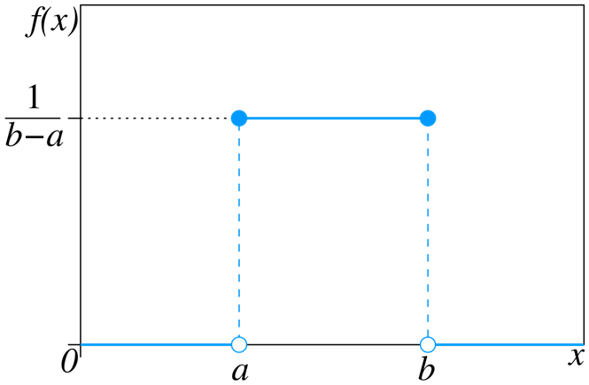
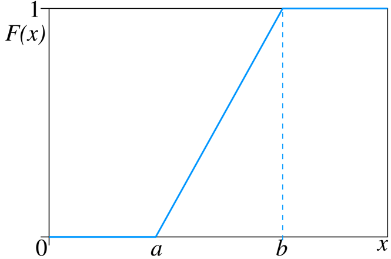
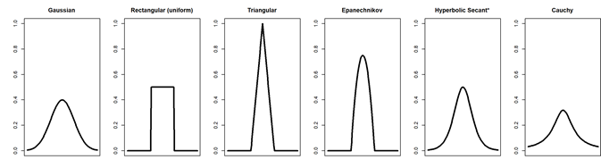

# Continuous Random Variables

```{r, echo=FALSE}
rm(list = ls())
```

This module is based on Introduction to Probability (Blitzstein, Hwang), Chapters 5 and 6. You can access the book for free at https://stat110.hsites.harvard.edu/ (and then click on Book). Please note that I cover additional topics, and skip certain topics from the book. You may skip Examples 5.1.6, 5.1.7, Proposition 5.2.3, Example 5.2.4, Sections 5.2.6, 5.2.7, Definition 5.3.7, Theorem 5.3.8, Example 5.4.7, Sections 5.5, 5.6, 5.7, Proposition 6.2.5, 6.2.6, Theorem 6.3.4, Sections 6.4 to 6.7 from the book.

## Introduction

In the previous module, we learned about discrete random variables. We learned how their distributions can be described by the PMFs and CDFs, how to find their expected values and variances, as well as common distributions for discrete random variables. We will learn about their counterparts when dealing with continuous random variables. The concepts are similar, but how they are computed can be quite different. 

As a reminder:

- A **discrete random variable** can only take on a countable (finite or infinite) number of values.
- A **continuous random variable** can take on an uncountable number of values in an interval of real numbers. 

For example, height of an American adult is a continuous random variable, as height can take on any value in interval between 40 and 100 inches. All values between 40 and 100 are possible. We cannot list all possible real numbers in this range as the list is never ending.

The sample space associated with a continuous random variable will be difficult to list, since it takes on an uncountable number of values. Using the example of heights of American adults, any real number between 40 and 100 inches is possible. 

This is different from a discrete random variable where we would list the sample space, or support, and then find the probability associated with each value in the support. 

Similar to discrete random variables, we want to describe the shape of the distribution, the centrality, and the spread of a continuous random distribution so we have an idea of probabilities associated with different ranges of values of the random variable. 

## Cumulative Distribution Functions (CDFs)

We start by talking about the cumulative distribution function, as its definition applies to both discrete and continuous random variables. The CDF of a random variable $X$ is $F_X(x) = P(X \leq x)$. The difference lies in how a CDF looks visually. 

Take a look at the CDF of a discrete random variable and the CDF of a continuous random variable below in Figure \@ref(fig:4-compare):

```{r 4-compare, fig.cap="CDF for Discrete RV vs CDF for Continuous RV", echo=FALSE}
y<-c(0,1,1,1,2,2,2,3)
## create plot of CDF vs each value in support
par(mfrow=c(1,2))
plot(ecdf(y) , main = "CDF for Discrete RV", xlab="", ylab="Probability")

curve(pnorm, from = -5, to = 5, main = "CDF for Continuous RV", ylab="Probability", xlab="")
```

As mentioned in the previous module, the CDF for a discrete random variable is what is called a step function, as it jumps at each value of the support. On the other hand, the CDF for a continuous random variable increases smoothly as its sample space is infinite. 

The height of the CDF informs us the percentile associated with the value of the random variable. Looking at the CDF for the continuous random variable in Figure \@ref(fig:4-compare), the height is 0.5 when the random variable is 0, so a value of 0 corresponds to the 50th percentile of this distribution. 

The technical definition of a continuous random variable is: A random variable has a continuous distribution if its CDF is differentiable.

A discrete random variable fails in this definition since its derivative is undefined at the jumps. 

### Valid CDFs

The criteria for a valid CDF is the same, it does not matter if the random variable is discrete or continuous:

- non decreasing. This means that as $x$ gets larger, the CDF either stays the same or increases. Visually, a graph of the CDF never decreases as $x$ increases. 
- approach 1 as $x$ approaches infinity and approach 0 as $x$ approaches negative infinity. Visually, a graph of the CDF should be equal to or close to 1 for large values of x, and it should be equal to or close to 0 for small values of x. 

*Thought question*: Look at the CDFs for our example in Figure \@ref(fig:4-compare), and see how they satisfy the criteria listed above for a valid CDF. 

## Probability Density Functions (PDFs)

The **probability density function (PDF)** of a continuous random variable is analogous to the PMF of a discrete random variable. 

The definition of the PDF for continuous random variables is the following: for a continuous random variable $X$ with CDF $F_X(x)$, the PDF of $X$, $f_X(x)$, is the derivative of its CDF, in other words, $f_X(x) = F_X^{\prime}(x)$. The support of $X$ is the set of $x$ where $f_X(x) >0$.

The relationship between the PDF and CDF of a continuous random variable $X$ can be expressed as

\begin{equation} 
F_X(x) = P(X \leq x) = \int_{-\infty}^{x} f_X(x) dx.
(\#eq:4-PDFCDF)
\end{equation}

We take a look at an example below. Suppose we have a continuous random variable $X$ with its CDF and PDF displayed below, and we want to find $P(X \leq 1)$:

```{r 4-prob, fig.cap="Probabilities from CDF and PDF", echo=FALSE}
par(mfrow=c(1,2))
curve(pnorm, from = -4, to = 4, main = "CDF for Continuous RV", ylab="Probability", xlab="")
abline(h=0.84, col="blue")
abline(v=1, col="blue")

curve(dnorm, from = -4, to = 4, main = "PDF for Continuous RV", ylab="Density", xlab="")

colorArea <- function(from, to, density, ..., col="blue", dens=NULL){
    y_seq <- seq(from, to, length.out=500)
    d <- c(0, density(y_seq, ...), 0)
    polygon(c(from, y_seq, to), d, col=col, density=dens)
}

colorArea(from=-4, to=1, dnorm)
```

We can find $P(X \leq 1)$ in two different ways:

- from the CDF, find the value of 1 on the horizontal axis, and read off the corresponding value on the vertical axis (blue lines). This tells us that $P(X \leq 1) = 0.84$.
- from the PDF, find the area under the PDF where $X \leq 1$. This area corresponds to the shaded region in blue, and will be equal to 0.84 if we performed the integration per equation \@ref(eq:4-PDFCDF).

Compare equation \@ref(eq:4-PDFCDF) with equation \@ref(eq:3-CDF) and note the similarities and differences. For discrete CDFs, we sum the PMF over all values less than or equal to $x$, whereas for continuous CDFs, we integrate, or accumulate the area, under the PDF over all values less than or equal to $x$. Some people view the integral as a continuous version of a summation. 

From equation \@ref(eq:4-PDFCDF), we can generalize a way to find the probability $P(a<X<b)$  for a continuous random variable $X$:

\begin{equation} 
P(a<X<b) = F_X(b) - F_X(a) = \int_{a}^{b} f_X(x) dx.
(\#eq:4-integrate)
\end{equation}

In other words, to find the probability for a range of values for $X$, we just find the area under its PDF for that range of values. Going back to our example, if we want to find $P(0<X<1)$, we will find the area under its PDF for $0<X<1$, like in Figure \@ref(fig:4-prob2) below:

```{r 4-prob2, fig.cap="Probabilities from PDF", echo=FALSE}
curve(dnorm, from = -4, to = 4, main = "PDF for Continuous RV", ylab="Density", xlab="")

colorArea <- function(from, to, density, ..., col="blue", dens=NULL){
    y_seq <- seq(from, to, length.out=500)
    d <- c(0, density(y_seq, ...), 0)
    polygon(c(from, y_seq, to), d, col=col, density=dens)
}

colorArea(from=-0, to=1, dnorm)
```

As mentioned, the PDF of a continuous random variable is analogous, but not exactly the same as, to the PMF of a discrete random variable. One common misconception is that the PDF tells us a probability, for example, that the value of $f_X(2) = P(X=2)$, if $X$ is continuous. This is only correct if $X$ is discrete. In fact, if we look at equation \@ref(eq:4-integrate) a little more closely, $P(X=c) = 0$ if $X$ is continuous and $c$ is a constant, since the area under its PDF will be 0. 


### Valid PDFs

The PDF of a continuous random variable must satisfy the following criteria:

- Non negative: $f_X(x) \geq 0$,
- Integrates to 1: $\int_{-\infty}^{\infty}f_X(x) dx = 1$.

### PDFs and Density Plots

Recall in Section \@ref(pmfhist), we learned that for discrete random variables, the PMF and histogram are related. The PMF represents the long-run proportion, while the histogram represents the relative frequency based on our data. As the sample size gets larger, the PMF should match the histogram. 

Similarly for continuous random variables, the PDF and the density plot are related. The PDF is associated with the distribution of a known random variable, while the density plot is estimated from our data, and if our data follows a known random variable, the PDF should match the density plot as the sample size gets larger. 

We will go over some of the details on how density plots are created at the end of this module, in Section \@ref(KDE), as we still need to cover a bit more concepts. 

## Summaries of a Distribution

Next, we will talk about some common summaries associated with a distribution. These involve measures of centrality and variance, which we have covered before. We will also talk about a couple of other measures: skewness and kurtosis.

### Expectations

The **expected value** of a continuous random variable $X$ is

\begin{equation} 
E(X) = \int_{-\infty}^{\infty} x f_X(x) dx.
(\#eq:4-EX)
\end{equation}

Another common notation for $E(X)$ is $\mu$, or sometimes $\mu_X$ show that we are writing the mean of the random variable $X$.

If we compare equation \@ref(eq:4-EX) with equation \@ref(eq:3-EX), we notice that we use an integral instead of a summation now that we are working with continuous random variables. 

The interpretation of expected values is still the same: the expectation of a random variable can be interpreted as the long-run mean of the random variable, i.e. if we were able to repeat the experiment an infinite number of times, the expectation of the random variable will be the average result among all the experiments. It is still a measure of centrality of the random variable. 

The **linearity of expectations** still hold in the same way, per equation \@ref(eq:3-linEX). It does not matter if the random variable is discrete or continuous.

The **Law of the Unconscious Statistician (LOTUS)** also still applies. For a continuous random variable $X$, it is (unsurprisingly):

\begin{equation} 
E(g(X)) = \int_{-\infty}^{\infty} g(x) f_X(x).
(\#eq:4-lotus)
\end{equation}

Notice again when we compare equation \@ref(eq:4-lotus) with its discrete counterpart in equation \@ref(eq:3-lotus): we have just replaced the summation with an integral. 

*Thought question*: Can you guess how to write the equation for the variance of a continuous random variable? Hint:  the variance for a discrete random variable is given in equation \@ref(eq:3-var2).

#### Median

The value $m$ is the **median** of a random variable $X$ if $P(X \leq c) \geq \frac{1}{2}$ and $P(X \geq c) \geq \frac{1}{2}$.

Intuitively, the median is the value $m$ which splits the area under the PDF into half (or as close to half as possible if the random variable is discrete). Half the area will be to the left of $m$, the other half of the area will be to the right of $m$. 

#### Mode

For a continuous random variable $X$, the mode is the value $c$ that maximizes the PDF: $f_X(c) \geq f_X(x)$ for all $x$.

For a discrete random variable $X$, the mode is the value $c$ that maximizes the PMF: $P(X=c) \geq P(X=x)$ for all $x$. Intuitively, the mode is the most commonly occurring value of a discrete random variable

#### Loss Functions

A goal of statistical modeling is to use the model to make predictions. We want to be able to quantify the quality of our prediction, or the prediction error. Suppose we have an experiment that can be described by a random variable $X$, and we want to predict the value of the next experiment. The mean and median are natural guesses for the value of the next experiment.

It turns out there a several ways to quantify our prediction error. These are usually called loss functions. Suppose our predicted value is denoted by $x_{pred}$. A couple of common loss functions are:

- **Mean squared error (MSE)**: $E(X-x_{pred})^2$,
- **Mean absolute error (MAE)**: $E|X-x_{pred}|$.

It turns out that the expected value $E(X)$ minimizes the MSE, and the median minimizes the MAE. So depending on what loss function suits our analysis, we could use either the mean or median for our predictions. We will cover these ideas in more detail in a later module (and indeed in later courses in this program).

### Variance

The **variance** of a continuous random variable $X$ is

\begin{equation} 
Var(X) = \int_{-\infty}^{\infty} (x-\mu)^2 f_X(x) dx.
(\#eq:4-var)
\end{equation}

The properties of variance is still the same as in Section \@ref(var-prop). It does not matter if the random variable is discrete or continuous. A common notation used for variance is $\sigma^2$, or sometimes $\sigma_X^2$ to show it is the variance of the random variable $X$. 

### Moments

Before talking about other measures that are used to describe distributions, we will cover some terminology that is used for these measures. Suppose we have a random variable $X$.

- The **$n$th moment** of $X$ is $E(X^n)$. So the expected value, or the mean, is sometimes called the first moment.
- The **$n$th central moment** of $X$ is $E((X-\mu)^n)$. So the variance is sometimes called the second central moment.
- The **$n$ standardized moment** of $X$ is $E(\frac{(X-\mu)^n}{\sigma})$.

### Skewness

One measure that is used to describe the shape of a distribution is skewness, which is a measure of symmetry (or measure of skewness). The **skew** of a random variable $X$ is the third standardized moment:

\begin{equation} 
Skew(X) = E \left(\frac{(X-\mu)^3}{\sigma} \right)
(\#eq:4-skew)
\end{equation}

A random variable $X$ has a **symmetric distribution about its mean** if $X - \mu$ has the same distribution as $\mu - X$. Fairly often, people will just say that $X$ is symmetric; it is almost always assumed that the symmetry is about its mean.

Intuitively, symmetry means that the PDF of $X$ to the left of its mean is the mirror image of the PDF of $X$ to the right of its mean. We look at a couple of examples below in Figure \@ref(fig:4-symm):

```{r 4-symm, fig.cap="PDFs for Symmetric RV vs Skewed RV", echo=FALSE}
par(mfrow=c(1,2))
curve(dnorm, from = -4, to = 4, main = "PDF for Symmetric RV", ylab="Probability", xlab="")
abline(v=0, col="blue")

curve(dexp, from = 0, to = 10, main = "PDF for Skewed RV", ylab="Probability", xlab="")
abline(v=1, col="blue")
```
The blue vertical lines indicate the mean of these distributions. Notice the mirror image in the first plot, but not in the second plot. 

If a distribution is not symmetric, we can say its distribution is asymmetric, or is skewed. The values of $Skew(X)$ that are associated with different shapes are:

- $Skew(X) = 0$: $X$ is symmetric.
- $Skew(X) > 0$: $X$ is right skewed.
- $Skew(X) < 0$: $X$ is left skewed.

### Kurtosis

One more measure deals with the **tail** behavior of a distribution. Visually, the tails of a PDF are associated with probabilities of extreme values for a random variable. A distribution that is heavy tailed means that extreme values (on both ends) are more likely to occur. Tail behavior is an important consideration in risk management in finance: e.g. a heavy left tail in the PDF could mean a financial crisis. Figure \@ref(fig:4-kurt) shows an example of a heavy tailed distribution (in blue), compared to a Gaussian distribution (in black). We will talk more about the Gaussian distribution in the next subsection.

```{r 4-kurt, fig.cap="PDF for Heavy Tailed Distribution", echo=FALSE}
x_values <- seq(-4, 4, length = 100)

# Plot the standard normal distribution
curve(dnorm, from = -4, to = 4, main = "PDF for Symmetric RV", ylab="Probability", xlab="")

# Add the t-distribution with 10 degrees of freedom
curve(dt(x,df=1), from = -4, to = 4, add=TRUE, col="blue")
```

A common measure of tail behavior is the **Kurtosis**. The kurtosis of a random variable $X$ is the shifted fourth standardized moment:

\begin{equation} 
Kurt(X) = E \left(\frac{(X-\mu)^4}{\sigma} \right) - 3.
(\#eq:4-kurt)
\end{equation}

The reason for subtracting (or shifting by) 3 is so that the Gaussian distribution (a commonly used distribution for continuous random variables) has a kurtosis of 0. Note: Some authors call equation \@ref(eq:4-kurt) the **excess kurtosis** and the kurtosis does not subtract the 3. 

The values of $Kurt(X)$ that are associated with tail behaviors are:

- $Kurt(X) = 0$: $X$ is similar tails to Gaussian distribution.
- $Kurt(X) > 0$: $X$ has heavier tails compared to Gaussian distribution (extreme values more likely).
- $Kurt(X) < 0$: $X$ has smaller tails compared to Gaussian distribution (extreme values less likely).

## Common Continuous Random Variables

Next, we will introduce some commonly used distributions that may be used for continuous random variables. A number of common statistical models (for example, linear regression) are based on these distributions.

### Uniform

A random variable that follows a uniform distribution on the interval $(a,b)$ is a completely random number between $a$ and $b$. Notionally, an upper case $U$ is usually used to denote a uniform random variable. $U$ is said to have a **uniform distribution** on the interval $(a,b)$, denoted as $U \sim(a,b)$, if its PDF is

\begin{equation} 
f_X(x) = \begin{cases} 
  \frac{1}{b-a} & \text{if } a<x<b \\
  0 & \text{otherwise }. 
\end{cases}
(\#eq:4-U)
\end{equation}

Note that the parameters $a,b$ also help define the support of a uniform distribution. Figure \@ref(fig:4-U) below displays a plot of the PDF of a $U(a,b)$:

```{r 4-U, fig.cap = "PDF of U(a,b). Picture from https://en.wikipedia.org/wiki/Continuous_uniform_distribution", echo = FALSE}

```

*Thought question*: Can you verify that this is a valid PDF?

Figure \@ref(fig:4-Ucdf) below displays a plot of the CDF of a $U(a,b)$:

```{r 4-Ucdf, fig.cap = "CDF of U(a,b). Picture from https://en.wikipedia.org/wiki/Continuous_uniform_distribution", echo = FALSE}

```

Some properties of the uniform distribution:

- Its mean is $E(U) = \frac{a+b}{2}$.
- Its variance is $Var(U) = \frac{(b-a)^2}{12}$.
- Its skewness is 0, so it is symmetric.
- Its kurtosis is -$\frac{6}{5}$, so its tails are not as heavy compared to a Gaussian distribution. 

*Thought question*: Can you see why a uniform distribution is symmetric? Can you see why its tails are not heavy?

If the support of a uniform distribution is between 0 and 1, we have a **standard uniform distribution**. We will talk about the importance of the standard uniform distribution in the next subsection. 

#### Universality of Uniform

It turns out that we can construct a random variable with any continuous distribution based on a standard uniform distribution. This fact is used to simulate random numbers from continuous distributions. This fact is called the **Universality of the Uniform**: Let $F_X(x)$ denote the CDF of a continuous random variable $X$, then:

1. Let $U \sim U(0,1)$ and $X = F^{-1}(U)$. Then $X$ is a random variable with CDF $F_X(x)$.
2. $F_X(X) \sim U(0,1)$.

To give some insight into what this means, we look at an example. Another continuous distribution is called the standard logistic distribution, which we will denote with $X$. Its CDF is

$$
F_X(x) = \frac{e^x}{1+e^x}.
$$
Let $U \sim U(0,1)$. The first part of the universality of the uniform informs us that the inverse of the CDF for the standard logistic is $F_X^{-1}(U) \sim X$, so we invert $F_X(x)$ to get its inverse $F_X^{-1}(x)$. This is done by setting the CDF of $X$ to be equal to $u$, i.e. let $u = \frac{e^x}{1+e^x}$, and solving for $x$:

$$
\begin{split}
u + u e^x &= e^x\\
\implies u &= e^x (1-u) \\
\implies e^x &= \frac{u}{1-u} \\
\implies x &= \log (\frac{u}{1-u}).
\end{split}
$$

Therefore $F^{-1}(u) = \log (\frac{u}{1-u})$ and $F^{-1}(U) = \log (\frac{U}{1-U})$. Therefore $\log (\frac{U}{1-U})$ follows a standard logistic distribution.

Let us use simulations to show what is going on. First, we simulate 10,000 reps from a standard uniform distribution, then invert these values using $\log (\frac{u}{1-u})$, and create the density plot of $\log (\frac{u}{1-u})$.  These steps are shown in Figure \@ref(fig:4-universe) below:

```{r 4-universe, fig.cap="Uniform to Logistic"}
set.seed(4)

reps<-10000 ##number of reps
u<-runif(reps) ##simulate standard uniform
invert<- log(u/(1-u)) ##invert based on F inverse. These should now follow standard logistic

par(mfrow=c(1,3))
plot(density(u), main="Density Plot from 10,000 U's")
plot(density(invert), main="Density Plot after Inverting", xlim=c(-6,6))
curve(dlogis, from = -7, to = 7, main = "PDF for Logistic", ylab="Density", xlab="")
```

From Figure \@ref(fig:4-universe):

- The first plot shows the density plot from our 10,000 reps from a standard normal. This is close to the PDF of a standard uniform.
- The second plot shows the density plot after inverting our 10,000 reps from a standard normal, i.e. $F^{-1}(u) = \log (\frac{u}{1-u})$.
- The third plot shows the PDF of a standard logistic. Notice how similar this looks to the second plot. 

So we see that $\log (\frac{U}{1-U})$ follows a standard logistic distribution.

The second part of the universality of the uniform informs us that if $X$ follows a standard logistic distribution, then $F(X) = \frac{e^X}{1 + e^X} \sim U(0,1)$.

So, we can see the purpose of the universality of the uniform:

- For part 1, we can simulate reps from any distribution, as long as we know its CDF. The software you use may not be able to simulate reps from a particular distribution, but you can write code to simulate reps from this distribution based on the standard uniform. 
- For part 2, we can convert a random variable with an unknown distribution to one that is known: the standard uniform. 

### Normal

Another widely used distribution for continuous random variables is the normal, or Gaussian distribution. This is a distribution that is symmetric and bell-shaped. This is probably the most important distribution in statistics and data science due to the central limit theorem. We will define this theorem in a later module, but loosely speaking, it says that if we take the average of a bunch of random variables, the average will approximate a normal distribution, even if the random variables are individually not normal. 

A lot of questions that we wish to answer are based on averages. For example

- Does the implementation of certain technologies in a class improve test scores for students, on average?
- Are male Gentoo penguins heavier than their female counterparts, on average?
- Does replacing traffic lights with a roundabout reduce the number of traffic accidents, on average?

What the central limit theorem implies is that even if test scores, weights of Gentoo penguins, and number of traffic accidents do not follow a normal distribution, their average values will approximate a normal distribution. 

#### Standard Normal

First, we will talk about the **standard normal distribution**, as other normal distributions can be viewed as variations of the standard normal. A standard normal distribution has mean 0 and variance 1. It is usually denoted by $Z$. We can also write $Z \sim N(0,1)$ to say that $Z$ is normally distributed with mean 0 and variance 1. The PDF of a standard normal distribution is:

\begin{equation} 
\phi(z) = \frac{1}{\sqrt{2 \pi}} e^{-z^2/2}.
(\#eq:4-Z)
\end{equation}

Notice the constant $\frac{1}{\sqrt{2 \pi}}$ in equation \@ref(eq:4-Z). Its presence is needed to make the PDF valid, since the PDF must integrate to 1. Such constants are called **normalizing constants**.

Figure \@ref(fig:4-Z) below displays its PDF:

```{r 4-Z, fig.cap="PDF of Standard Normal"}
curve(dnorm, from = -4, to = 4, main = "PDF for Z", ylab="Density", xlab="")
```

From Figure \@ref(fig:4-Z), we can see the following properties of a standard normal distribution (these will apply for any normal distribution):

- Its PDF is symmetric about its mean. In Figure \@ref(fig:4-Z), the PDF is symmetric about 0, i.e. $\phi(-z) = \phi(z)$.
- This implies that the tail areas are also symmetric. For example, $P(Z \leq -2) = P(Z \geq 2)$.
- Its skew is 0, since it is symmetric.

There is actually no closed-formed equation for the CDF of a standard normal (or any normal distribution). We write $\Phi(z) = P(Z \leq z) = \int_{\infty}^z \phi(z) dz$ to express the CDF of a standard normal.

Notice that we have special letters $Z, \phi, \Phi$ to denote the standard normal distribution. This is an indication of how often it is used to warrant its own notation. 

#### From Standard Normal to Other Normals {#norm}

If $Z \sim N(0,1)$, then $X = \mu + \sigma Z \sim N(\mu, \sigma^2)$. In other words, if $Z$ is standard normal, then $X = \mu + \sigma Z$ follows a normal distribution with mean $\mu$ and variance $\sigma^2$. The parameters of a normal distribution are the mean $\mu$ and variance $\sigma^2$. 

Note that some authors say the parameters are the mean $\mu$ and standard deviation $\sigma$ instead, so be careful when reading notation associated with normal distributions from various sources. For example, $N(0,2)$ in our class and our book means normal distribution with mean 0 and variance 2, but for some other authors, $N(0,2)$ means normal distribution with mean 0 and standard deviation 2. Indeed, the functions in R use this alternate parameterization, so you need to be careful. 

*Thought question*: Can you use the linearity of expectations to explain why $X$ has mean $\mu$? Can you use properties of variance from Section \@ref(var-prop) to explain why $X$ has variance $\sigma^2$?

Notice how we started from a standard normal $Z$, and transformed $Z$ by multiplying it by $\sigma$ and then adding $\mu$ to get any normal distribution. This transformation is called a **location-scale** transformation, or sometimes shifting and scaling. The scale changes since we multiply by a constant $\sigma$; the location is transformed since its mean changes from 0 to $\mu$. 

We can also reverse this transformation and state the following: If $X \sim N(\mu, \sigma^2)$, then $Z = \frac{X-\mu}{\sigma} \sim N(0,1)$. If we start with $X \sim N(\mu, \sigma^2)$, then we can transform $X$ by subtracting \mu, and then dividing by $\sigma$, to obtain $Z$. This particular transformation is called **standardization**:

\begin{equation} 
Z = \frac{X-\mu}{\sigma}.
(\#eq:4-standardize)
\end{equation}

The PDF of any normal distribution $X \sim N(\mu, \sigma^2)$ is

\begin{equation} 
f_X(x) = \frac{1}{\sigma \sqrt{2 \pi}} \exp \left(-\frac{(x - \mu)^2}{2 \sigma^2} \right).
(\#eq:4-pdfNormal)
\end{equation}

*Thought question*: Compare equations \@ref(eq:4-pdfNormal) and \@ref(eq:4-Z). Can you see how equation \@ref(eq:4-Z) can be derived from equation \@ref(eq:4-pdfNormal)?

#### 68-95-99.7% Rule

The following property holds for any normal distribution, and is often called the **68-99-99.7%** rule. For any normal distribution $X \sim N(\mu, \sigma^2)$:

- $P(\mu - \sigma < X < \mu + \sigma) \approx 0.68$,
- $P(\mu - 2\sigma < X < \mu + 2\sigma) \approx 0.95$,
- $P(\mu - 3\sigma < X < \mu + 3\sigma) \approx 0.997$.

What these mean is that for any normal distribution:

- About 68% of observed values will fall within 1 standard deviation of the mean,
- About 95% of observed values will fall within 2 standard deviations of the mean, and
- About 99.7% of observed values will fall within 3 standard deviations of the mean.

The last statement is the basis for the term [six sigma](https://en.wikipedia.org/wiki/Six_Sigma) used in manufacturing, since the range virtually all data points should fall within a range that is six sigma wide (assuming they follow a normal distribution). Visually, this rule is shown in Figure \@ref(fig:4-rule) when applied to the standard normal:

```{r 4-rule, fig.cap="68-95-99.7 Rule", echo=FALSE}
colorArea <- function(from, to, density, ..., col="blue", dens=NULL){
    y_seq <- seq(from, to, length.out=500)
    d <- c(0, density(y_seq, ...), 0)
    polygon(c(from, y_seq, to), d, col=col, density=dens)
}

par(mfrow=c(3,1))
curve(dnorm, from = -4, to = 4, main = "PDF for Z", ylab="Density", xlab="")
colorArea(from=-1, to=1, dnorm)
curve(dnorm, from = -4, to = 4, main = "PDF for Z", ylab="Density", xlab="")
colorArea(from=-2, to=2, dnorm)
curve(dnorm, from = -4, to = 4, main = "PDF for Z", ylab="Density", xlab="")
colorArea(from=-3, to=3, dnorm)
```

We will work out the first statement, that about 68% of the observed values will fall within 1 standard deviation of the mean for any normal distribution. We will use R to help us verify this rule for a standard normal:

```{r}
upper1<-pnorm(1) ## what is percentile associated with Z=1 (i.e. 1 standard deviation above mean)
lower1<-pnorm(-1) ## what is percentile associated with Z=-1 (i.e. 1 standard deviation below mean)
upper1-lower1 ## find proportion in between 1 SD above and below mean.
```
*Thought question*: how would you tweak this code to verify the other two statements associated with the 68-95-99.7% rule?

## Using R 

R has built in functions to compute the density, CDF, percentiles, as well as simulate data of common distributions. We will start with a random variable $Y \sim N(1, 9)$ as an example.

1. To find $f_Y(2)$, use:

```{r}
dnorm(2, 1, 3) ##supply the value of Y you want, then the parameters mu and sigma
```
The density $f_Y(2)$ is 0.1257944. Note: In R, the normal distribution is parameterized by the mean and standard deviation, which is different from these set of notes and our book, which uses the mean and variance.

2. To find $P(Y \leq 2)$, use:

```{r}
pnorm(2, 1, 3) ##supply the value of Y you want, then the parameters mu and sigma
```

The probability that $Y$ is less than or equal to 2 is 0.6305587.

Alternatively, we can standardize this normal distribution, and use the standard normal. The standardization, per equation \@ref(eq:4-standardize), gives us

$$
z = \frac{2-1}{3} = \frac{1}{3},
$$

so

$$
\begin{split}
P(Y \leq 2) &= P(\frac{Y-\mu}{\sigma} \leq \frac{2-1}{3}) \\
            &= P(Z \leq \frac{1}{3}) \\
            &= \Phi(\frac{1}{3})
\end{split}
$$

which can be found using

```{r}
pnorm(1/3) ##don't supply mu and sigma means you want to use standard normal
```

which gives the same answer as `pnorm(2,1,3)`. 

3. To find the value on the support that corresponds to the 90th percentile, use:

```{r}
qnorm(0.9, 1, 3) ##supply the value of the percentile you need, then the parameters mu and sigma
```

The 90th percentile of $Y \sim N(1,3)$ is 4.844655. 

If we want to use the standard normal, we could find its 90th percentile:

```{r}
qnorm(0.9)
```
and then apply the location scale transformation

```{r}
qnorm(0.9)*3 + 1 ##multiply by sigma, then add mu
```
which is the same answer as `qnorm(0.9,1,3)`.

4. To simulate 10 draws (repetitions) of $Y$, use:

```{r}
set.seed(2) ##use set.seed() so we get the same random numbers each time the code is run
rnorm(10, 1, 3) ##supply the number of simulated data you need, then the parameters mu and sigma
```
This outputs a vector of length 10. Each value represents the result of each rep. So the first value drawn from $Y \sim N(1,3)$ -1.6907436, the second value drawn is 1.5545476 and so on.

Just like in Section \@ref(Rdis), notice these functions all ended with `norm`. We just added a different letter first, depending on whether we want the density (analogous to PDF), CDF, percentile, or random draw. The letters are `d`, `p`, `q`, and `r` respectively. 

One thing to note: if we do not supply the mean and standard deviation, for example we type `rnorm(10)`, R will assume you want to use a standard normal distribution, so `rnorm(10)` will draw 10 random numbers from a standard normal.

### Density Plots and Kernel Density Estimation {#KDE}

We are now ready to talk about how density plots, like the ones in Figure \@ref(fig:4-universe) are created. Recall the difference between density plots and PDFs:

- A plot of the PDF describes the distribution of a known random variable. 
- A density plot is based on our data, and is used to describe the distribution of our data. Our data may or may not follow a commonly known random variable. If it does, then a plot of the PDF and the density plot should match up as we gather more and more data. 

Proportions are found in the same way, by finding the area under the PDF or density plot for the appropriate range on the support. 

Suppose we have $n$ observed values of an unknown random variable $X$: $x_1, x_2, \cdots, x_n$.The density $f$ of $X$ is unknown and we want to estimate it with our data. To estimate the density $f$, we use the **kernel density estimator**:

\begin{equation} 
\hat{f}_h(x) = \frac{1}{nh} \sum_{i=1}^n K \left( \frac{x-x_i}{h}\right ),
(\#eq:4-KDE)
\end{equation}

where $K$ is the **kernel** and $h$ is a smoothing parameter, often called the **bandwidth**. Looking at equation \@ref(eq:4-KDE), the KDE can be viewed as a weighted average of the relative likelihood of observing a particular value, with values nearer the specific value on the support receiving a higher weight. 

The kernel can be viewed as a weighting function, with the weights following the shape of a distribution that the user specifies (usually symmetric). Common kernel functions and their shapes are displayed in Figure \@ref(fig:4-KDE):

```{r 4-KDE, fig.cap = "Common Kernals. Picture adapted from https://tgstewart.cloud/compprob/kde.html", echo = FALSE}

```

The horizontal axis on the kernel can be viewed as the distance of the value of a data point from a specific value on the support, and the mid point on the horizontal axis represents a distance of 0. 

- Looking at the normal kernel, nearest values receive the highest weight, and values further away receive less weight. 
- For the uniform kernel, values within a certain distance receive a weight, and values beyond a certain distance receive no weight.
-  The Epanechnikov (parabolic) kernel is a mix of both: values beyond a certain distance receive no weight, and values within a certain distance receive a weight that is roughly inversely proportional to the distance. 

$h$ is the smoothing parameter and is analogous to bin width in histograms. Larger values result in smoother looking density plots.

Let us go back to an old example. We will use the `loan50` dataset from the `openintro` package. The data originally consist of thousands of loans made through the Lending Club platform, but we will randomly select 50 of these loans. Let us study the interest rate the loans the 50 applicants received. 

```{r 4-R, fig.cap="Density Plot for 50 Interest Rates", message=FALSE, warning=FALSE}
library(openintro)

##create object for data
Data<-loan50

##create density plot using default
plot(density(Data$interest_rate), main="Density Plot of Interest Rates")
```

This actually uses KDE with the default settings: kernel is normal, and the bandwidth is based on  [Silverman's rule of thumb](https://en.wikipedia.org/wiki/Kernel_density_estimation#A_rule-of-thumb_bandwidth_estimator).

To change these, we add the `kernel` and `adjust` argument when using the `density()` function, for example, to use the Epanechnikov kernal with twice the default bandwidth:

```{r 4-R2, fig.cap="Density Plot for 50 Interest Rates, Epanechnikov Kernel, Twice the Bandwidth", message=FALSE, warning=FALSE}

##create density plot using different settings
plot(density(Data$interest_rate, kernel = "epanechnikov", adjust = 2), 
     main="Density Plot of Interest Rates")
```

### Density Plots and Histograms

In Section \@ref(densplots), we mentioned that density plots can be viewed as smoothed versions of a histogram. We create a histogram of interest rates, and overlay a density plot in blue, per Figure \@ref(fig:4-R3) below:

```{r 4-R3, fig.cap="Histogram and Density Plot for 50 Interest Rates", message=FALSE, warning=FALSE}
hist(Data$interest_rate, prob = TRUE, main = "Histogram with Density Plot", xlab="Interest Rates")

##create density plot using default
lines(density(Data$interest_rate), col="blue")
```


### Numerical Summaries

Equations \@ref(eq:4-EX), \@ref(eq:4-var), \@ref(eq:4-skew), and \@ref(eq:4-kurt) are used to obtain the mean, variance, skewness, and kurtosis of a known distribution from a random variable. To calculate these quantities based on a sample of observed data, $x_1, x_2, \cdots, x_n$, we use:

\begin{equation} 
\bar{x} =  \frac{1}{n} \sum_{i=1}^n x_i,
(\#eq:4-xbar)
\end{equation}

\begin{equation} 
s_X^2 =  \frac{1}{n-1} \sum_{i=1}^n (x_i - \bar{x})^2,
(\#eq:4-sampvar)
\end{equation}

where $\bar{x}$ and $s_x^2$ denote the sample mean and variance respectively. The sample skewness and sample kurtosis are

\begin{equation} 
\text{sample skewness } =  \frac{\frac{1}{n} \sum_{i=1}^n (x_i - \bar{x})^3}{s_X^3},
(\#eq:4-sampskew)
\end{equation}

and

\begin{equation} 
\text{sample kurtosis } =  \frac{\frac{1}{n} \sum_{i=1}^n (x_i - \bar{x})^4}{s_X^4} - 3.
(\#eq:4-sampkurt)
\end{equation}

The functions `mean()`, `var()`, `skewness()`, and `kurtosis()` compute these quantities in R. The latter two functions come from the `moments` package so be sure to install and load it prior to using them. 

```{r}
mean(Data$interest_rate) ##mean
var(Data$interest_rate) ##variance

library(moments)
moments::skewness(Data$interest_rate) ##greater than 0
moments::kurtosis(Data$interest_rate) ##greater than 0
```

So our data is also right skewed and heavy tailed. 
