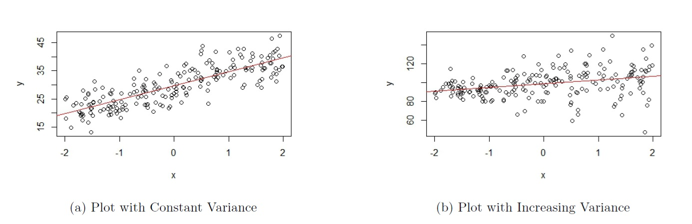
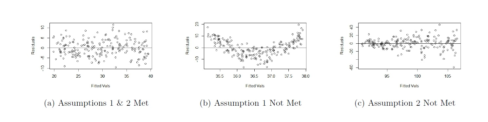
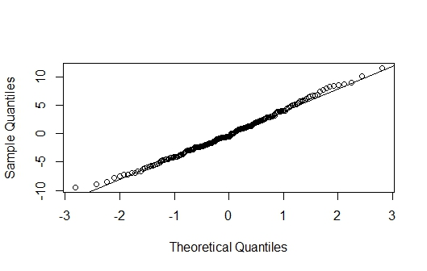
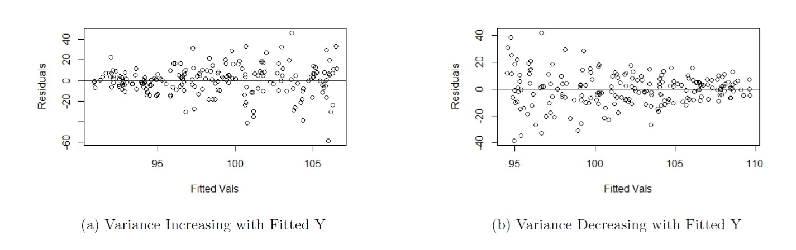

# Model Diagnostics and Remedial Measures in SLR {#diag}

## Introduction

```{r, echo=FALSE}
rm(list = ls())
```

The regression model is based on a number of assumptions. Those assumptions are made so that we can apply commonly used probability distributions to we quantify the variability associated with our estimated regression model. This means that if the assumptions are not met for our regression model, then how we quantify the variability associated with our model is no longer reliable. All our analysis with statistical inference becomes questionable.
 
In this module, you will learn how to assess whether the regression assumptions are met. We will explore ways in which we can transform our variables after diagnosing which assumptions are not met so that we can still proceed to build our regression model.

## Assumptions in Linear Regression

In module \@ref(slr), we stated the SLR model as

\begin{equation} 
y=\beta_0+\beta_{1} x + \epsilon. 
(\#eq:5SLRmod)
\end{equation} 

where $f(x) = \beta_0 + \beta_1 x$. We need to make some assumptions for the error term $\epsilon$. Mathematically, the assumptions are expressed as

\begin{equation} 
\epsilon_1,\ldots,\epsilon_n \ i.i.d. \sim N(0,\sigma^2)
(\#eq:5assumptions)
\end{equation}

Breaking down \@ref(eq:5assumptions) the assumptions can be expressed as the following:

1. The errors have **mean 0**. 
2. The errors have **constant variance denoted by $\sigma^2$**. 
3. The errors are **independent**. 
4. The errors are **normally distributed**.

Let's dig a little deeper into the meaning and implications of these 4 assumptions.

### Assumption 1: Errors have mean 0.

For each value of the predictor, the errors have **mean 0**. A by-product of this statement is that the relationship between $y$ and $x$, as expressed via $y \approx f(x)$, is correct. So, if $f(x) = \beta_0 + \beta_1 x$, then the relationship is approximately linear. 

The plots in Figure \@ref(fig:ass1) are based on simulated data. The scatterplot shown in Figure \@ref(fig:ass1)(a) is an example of when this assumption is met. As we move from left to right on the plot, the data points are generally evenly scattered on both sides of the regression line that is overlaid. 

```{r ass1, fig.cap='Assumption 1', echo=FALSE, message=FALSE}
knitr::include_graphics("images/ass1.jpg")
```

The scatterplot shown in Figure \@ref(fig:ass1)(b) is an example of when this assumption is **not** met. As we move from left to right on the plot in Figure \@ref(fig:ass1)(b), the data points are generally not evenly scattered on both sides of the regression line that is overlaid.

- When $-2 \leq x \leq -1.2$, the data points are generally above the regression line; 
- then when $-1.2 < x < 1$, the data points are generally below the regression line; 
- and then when $x \geq 1$, the data points are generally above the regression line. 

*Please see the associated video for more explanation on how to use Figure \@ref(fig:ass1) to assess assumption 1.* 

#### Consequences of violating this assumption

**Predictions will be biased**. This means that predicted values will systematically over- or under- estimate the true values of the response variable. Of the 4 assumptions listed, this is **most crucial assumption**.

Using Figure \@ref(fig:ass1)(b) as an example, this implies that

- when $-2 \leq x \leq -1.2$, the regression line will systematically under-predict the response variable;
- then when $-1.2 < x < 1$, the regression line will systematically over-predict the response variable; 
- and then when $x \geq 1$, the regression line will systematically under-predict the response variable.

### Assumption 2: Errors have constant variance

For each value of the predictor, the error terms have **constant variance**, denoted by $\sigma^2$. This implies that when looking at a scatterplot, the vertical variation of data points around the regression equation has the same magnitude everywhere.

The plots in Figure \@ref(fig:ass2) are based on simulated data. The scatterplot shown in Figure \@ref(fig:ass2)(a) is an example of when this assumption is met (this figure is actually the same as Figure \@ref(fig:ass1)(a), so the data that produced these plots satisfy both assumptions). As we move from left to right on the plot, the vertical variation of the data points about the regression line is approximately constant. 

```{r ass2, fig.cap='Assumption 2', echo=FALSE, message=FALSE}

```

The scatterplot shown in Figure \@ref(fig:ass2)(b) is an example of when this assumption is **not** met. As we move from left to right on the plot in Figure \@ref(fig:ass2)(b), the vertical variation of the data points about the regression line becomes larger as the value of the response variable gets larger, so the variance is not constant. 

*Please see the associated video for more explanation on how to use Figure \@ref(fig:ass2) to assess assumption 2.* 

#### Consequences of violating this assumption

**Statistical inference will no longer be reliable.** This means that the results from any hypothesis test, confidence interval, or prediction interval are no longer reliable.

Interestingly, for the scatterplot in Figure \@ref(fig:ass2)(b), we can say that assumption 1 is met, since the the data points are generally evenly scattered on both sides of the regression line. Predictions will still be unbiased; the predicted response, $\hat{y}$, do not systematically over- or under-predict the response variable. So if our goal is to assess if the relationship is approximately linear, this scatterplot is fine. We do lose the utility from hypothesis tests, CIs, and PIs. 

### Assumption 3: Errors are independent

A by-product of this assumption is that the values of the response variable, $y_i$, are independent from each other. Any $y_i$ does not depend on other values of the response variable. 

#### Consequences of violating this assumption

**Statistical inference will no longer be reliable.** This means that the results from any hypothesis test, confidence interval, or prediction interval are no longer reliable.

### Assumption 4: Errors are normally distributed

If we were to create a density plot of the errors, the errors should follow a normal distribution.

#### Consequences of violating this assumption

The regression model is fairly robust to the assumption that the errors are normally distributed. In other words, violation of this particular assumption is not very consequential. **Of the 4 assumptions, this is the least crucial to satisfy.**

## Assessing Regression Assumptions

There are a few visualizations that help in detecting violations of the regression assumptions. These visualizations are:

- Scatterplot of $y$ against $x$ (assumptions 1 and 2).
- Residual plot (assumptions 1 and 2).
- Autocorrelation function (ACF) plot of residuals (assumption 3).
- Normal probability plot of residuals (often called QQ plot) (assumption 4). 

### Scatterplot

We can examine the scatterplot of $y$ against $x$ to check for assumptions 1 and 2. We want to see the following in the scatterplot:

- **No nonlinear pattern** (assumption 1).
- Data points **evenly scattered** (for each value on the x-axis) around fitted line (assumption 1).
- Vertical variation of data points constant (assumption 2).

We have used Figure \@ref(fig:ass2)(a) as an example of a scatterplot that meets these assumptions. Let us take a look at another example that we have worked with. This scatterplot is from the `elmhurst` dataset from the `openintro` package that we have been seeing in tutorials. We are regressing the amount of gift aid a student receives based on the student's family income. The corresponding scatterplot is shown in in Figure \@ref(fig:elmhurst).

```{r elmhurst, fig.cap='Scatterplot of Gift Aid Against Family Income', echo=FALSE, message=FALSE}
library(openintro)
Data<-openintro::elmhurst

##Fit a regression model
result<-lm(gift_aid~family_income, data=Data)

##plot
plot(Data$family_income, Data$gift_aid, xlab="Family Income", ylab="Gift Aid (in $1000s)", main="")
abline(result)
```

In Figure \@ref(fig:elmhurst), we see that the data points are evenly scattered around the fitted line. We also see the vertical variation of the data points is fairly constant. So assumptions that the errors have 0 mean and constant variance appear to be met. 

#### Practice question

The data are about the prices of used cars. We are regressing the sale price of the car against the age of the car. The corresponding scatterplot is shown in Figure \@ref(fig:mazda). Based on Figure \@ref(fig:mazda), which of assumptions 1 or 2 (or both, or neither), is met? We will go over this in the tutorial. 

```{r, echo=FALSE}
rm(list = ls())
```

```{r mazda, fig.cap='Scatterplot of Sale Price Against Age', echo=FALSE, message=FALSE}
Data<-read.table("mazda.txt", header = TRUE, sep = "")

##Fit a regression model
result<-lm(Price~Age, data=Data)
##plot
plot(Data$Age, Data$Price, xlab="Age", ylab="Price", main="")
abline(result)
```

### Residual plot

While using the scatterplot is an intuitive way of assessing regression assumptions, it has a limitation. It cannot be used if we have multiple predictors in our regression, which we will encounter (and happens more often than just having one predictor). Another visualization that we can use to assess assumptions 1 and 2 is a **residual plot**. This is a scatterplot of residuals, $e$, against fitted values, $\hat{y}$. We want to observe the following in a residual plot.

- Residuals should be **evenly scattered** across the horizontal axis (assumption 1).
- The residuals should have **similar vertical variation** across the plot (assumption 2).
- Some writers combine these two points into the following statement: the residuals should fall in a **horizontal band around 0** with no apparent pattern (assumption 1, 2). 

The residual plots in Figure \@ref(fig:resplots) are based on simulated data from Figures \@ref(fig:ass1)(a), \@ref(fig:ass1)(b), and \@ref(fig:ass2)(b).

```{r resplots, fig.cap='Residual Plots from Fig 1(a), 1(b), 2(b) Respectively', echo=FALSE, message=FALSE}

```

We make the following observations:

- From Figure \@ref(fig:resplots)(a), we see that the residuals are evenly scattered across the horizontal axis, and their vertical variation is fairly constant across the plot. So both assumptions are met.
- From Figure \@ref(fig:resplots)(b), we see that the residuals are **not** evenly scattered across the horizontal axis, although their vertical variation is fairly constant across the plot. So only assumption 1 is not met. 
- From Figure \@ref(fig:resplots)(c), we see that the residuals are evenly scattered across the horizontal axis, but their vertical variation is **not constant** across the plot. In fact, the vertical variation is increasing as we move from left to right. So only assumption 2 is not met.

If you compare the conclusions from the residuals plots and scatterplots, they are the same. In SLR, the takeaways should be consistent.

*Please see the associated video for more explanation on how to use Figure \@ref(fig:resplots) to assess assumptions 1 and 2.* 

#### Practice questions

1. The residual plot in Figure \@ref(fig:practice)(a) comes from regressing gift aid against family income for the `elmhurst` dataset. Based on this residual plot, which assumptions are met?

2. The residual plot in Figure \@ref(fig:practice)(b) comes from regressing price of cars against age for the used cars dataset. Based on this residual plot, which assumptions are met?

*Please see the associated video as I go over these practice questions.*

```{r practice, fig.cap='Residual Plots for Practice Questions', echo=FALSE, message=FALSE}
knitr::include_graphics("images/practice.jpg")
```

### ACF plot

Assumption 3 states that the errors are **independent**. This assumption implies that the values of the response variable are independent from each other. This assumption is typically assessed via knowing the nature of the data.

- If the observations were obtained from a random sample, it is likely that the observations will be independent from each other. This is the very nature of a random sample and why random samples are preferred over convenience samples.

- If the data has some inherent sequence, it is likely the observations will not be independent, and are dependent. For example, if I record the value of a stock at the end of each day, the value at day 2 is likely to be related to its value at day 1. So the values of stock prices at the end of each day are not independent. 

An autocorrelation function (ACF) plot of the residuals may be a used to help assess if the assumption that the errors are independent is met. However, the plot is not a substitute for using your understanding about the nature of the data and should only be used as a confirmation.

The ACF plot measures the correlation between a vector of observations and the lagged versions of the observations. If the observations are uncorrelated, the correlations between the vector of observations and lagged versions of these observations are theoretically 0. We may create an ACF plot for the residuals from our regression. 

The ACF plot in Figure \@ref(fig:ass3)(a) and is based on simulated data that were independently generated. 

```{r ass3, fig.cap='Assumption 3', echo=FALSE, message=FALSE}
knitr::include_graphics("images/ass3.jpg")
```

A few notes about the ACF plot:

- The ACF at lag 0 is always 1. The correlation of any vector with itself is always 1. 
- The dashed horizontal lines represent critical values. An ACF at any lag beyond the critical value indicates an ACF that is significant. We have evidence of correlation (and hence dependence) in our residuals.
- If the observed values for the response variable are independent, then we would expect the ACFs at lags greater than 0 to be insignificant. Do note that because we are conducting multiple hypothesis tests, do not be too alarmed if the ACFs are slightly beyond the critical values at an isolated lag or 2. 

Based on Figure \@ref(fig:ass3)(a), we see that the ACFs at all lags greater than 0 are insignificant. We do not have evidence the residuals are correlated with each other, so we do not have evidence that assumption 3 is not met. 

Sometimes, the dataframe can be sorted in some manner (e.g. increasing order for response variable), and if so, we would actually expect to see significant correlations in the ACF plot. The ACF plot in Figure \@ref(fig:ass3)(b) is such an example. The residuals are from the same simulated dataset, only with the data sorted by the response variable. If we had just looked at the ACF plot in Figure \@ref(fig:ass3)(b) without understanding the data were simulated independently and then sorted, we would have erroneously concluded that the residuals are not independent and the regression assumption is not met. 

### QQ plot

A normal probability plot (also called a QQ plot) is used to assess if the distribution of a variable is normal. It typically plots the residuals against their theoretical residual if they followed a normal distribution. A QQ line is typically overlaid. If the plots fall closely to the QQ line, we have evidence that the observations follow a normal distribution. Figure \@ref(fig:qq) shows a QQ plot that comes from a normally distributed variable. 

```{r qq, fig.cap='QQ Plot', echo=FALSE, message=FALSE}

```

### Remedial measures

We now know how to assess if specific regression assumptions are not met. The remedial measures involve transforming either the predictor variable and / or the response variable. These transformations are chosen to handle violations to assumptions 1 and / or 2 respectively. The general strategy on selecting which variable to transform:

- Transforming the response variable, $y$, affects both assumptions 1 and 2. 
  - Visually, we can think of transforming $y$ in terms of stretching or squeezing the scatterplot of $y$ against $x$ vertically. Thus, transforming $y$ affects the shape of the relationship and the vertical spread of the data points. 
  - However, the **choice on how we transform $y$ is based on handling assumption 2.**
- Transforming the predictor variable, $x$ affects assumption 1 and does not theoretically affect assumption 2. 
   - Visually, we can think of transforming $x$ in terms of stretching or squeezing the scatterplot of $y$ against $x$ horizontally. Thus, transforming $x$ affects the shape of the relationship but not the vertical spread of the data points. 
  - Therefore, **transforming $x$ is based on handling assumption 1.**
- If assumption 2 is not met, we transform $y$ to stabilize the variance and make it constant.
- If assumption 1 is not met, we transform $x$ to find the appropriate shape to relate the variables. 
- If both assumptions are not met, we transform $y$ first to stabilize the variance. Once assumption 2 is solved, check if assumption 1 is not met. If not met, transform $x$.

Assumption 1 deals with whether the way we have expressed how $y$ and $x$ are related, through $f(x)$, is appropriate. Assumption 2 deals with the vertical variation of the data points in the scatterplot. 

## Remedial Measures: Variance Stabilizing Transformations

We transform the response variable to stabilize the variance (assumption 2). There are a couple of ways to decide the appropriate transformation:

1. Pattern seen in residual plot can guide choice in how to transform the response variable.
2. Box-Cox plot.

### Use Pattern in Residual Plot

We can stabilize the variance of the errors based on the residual plot, if we see either of the following scenarios:

- vertical variation of residuals **increasing** as fitted response increases, or as we move from left to right, as in Figure \@ref(fig:variance)(a), or
- vertical variation of residuals **decreasing** as fitted response increases, or as we move from left to right, as in Figure \@ref(fig:variance)(b).

```{r variance, fig.cap='Non Constant Variance in Residual Plot', echo=FALSE, message=FALSE}

```

Note that increasing variance as fitted response increases is much more common with real data. Generally, larger values of a variable are associated with larger spread. 

We transform $y$ using $y^{*} = y^{\lambda}$, with $\lambda$ chosen based on whether the variance of the residuals is increasing or decreasing with fitted response: 

- For Figure \@ref(fig:variance)(a), choose $\lambda < 1$.
  - If $\lambda = 0$, it means we use a logarithmic transformation with base e, i.e. $y^* = \log(y)$. 
  - Note that a logarithm with no base means a natural log, or ln. 
- For Figure \@ref(fig:variance)(b), choose $\lambda > 1$.

So based on the residual plot, we have a range of values for $\lambda$.

### Box-Cox Plot

We can use a Box-Cox plot to help us narrow the range of $\lambda$ to use. It is a plot of the log-likelihood function against $\lambda$, and we choose $\lambda$ that maximizes this log-likelihood function. For example, Figure \@ref(fig:bcplot) shows the Box Cox plot generated for the regression associated with the residual plot in Figure \@ref(fig:variance)(b).

```{r bcplot, fig.cap='Box-Cox Plot based on Figure 9(b)', echo=FALSE, message=FALSE}
knitr::include_graphics("images/bcplot.jpg")
```

Notice an approximate 95% CI is provided for $\lambda$. A few comments on how to use the Box-Cox plot:

- Three vertical dashed lines are displayed: the middle line corresponds to the optimal value of $\lambda$; the other two lines are the lower and upper bounds of a 95% CI for $\lambda$.
- We choose $\lambda$ within the CI (or even close to it) that is easy to understand. We do not have to choose the optimal value, especially if its value is difficult to interpret. In this example, I will choose $\lambda = 2$, so a square transformation for $y$. Transform response with $y^* = y^2$. Regress $y^*$ against $x$. 
- If 1 lies in the CI, **no transformation** on $y$ may be needed.
- If a transformation is needed, a **log transformation** is preferred, since we can still interpret the estimated coefficients. It is difficult to interpret with any other type of transformation.
- View the Box-Cox procedure as a guide for selecting a transformation, rather than being definitive.
- Need to recheck the residuals after every transformation to assess if the transformation worked. 

### Interpretation with Log Transformed Response

A log transformation on the response is preferred over any other transformation, as we can still interpret regression coefficients. A couple of ways to interpret the estimated slope $\hat{\beta}_1$:

- The predicted response variable is **multiplied by a factor** of $\exp(\hat{\beta_1})$ for a one-unit increase in the predictor.
- We can also subtract 1 from $\exp(\hat{\beta_1})$ to express the change as a percentage. 
  - If $\hat{\beta}_1$ is positive, we have a percent **increase**. The predicted response variable increases by $(\exp(\hat{\beta_1}) - 1) \times 100$ percent for a one-unit increase in the predictor.
  - If $\hat{\beta}_1$ is negative, we have a percent **decrease**. The predicted response variable decreases by $(1 - \exp(\hat{\beta_1})) \times 100$ percent for a one-unit increase in the predictor.
  
*Please see the associated video as I go over the math explaining how we interpret regression coefficients when the response variable is log transformed.*

## Remedial Measures: Linearization Transformations

We first ensure the variance has been stabilized and assumption 2 is met. If $f(x)$ does not accurately capture the relationship between the variables, we transform the predictor variable to meet assumption 1. Some writers call this a linearization transformation, as we seek to make the transformed version of the predictor variable, $x^*$, to be approximately linear with the response variable (or transformed $y$), i.e. $y = \beta_0 + \beta_1 x^* + \epsilon$. We do not consider transforming the response variable to deal with assumption 1, as transforming the response variable is likely to reintroduce violation of assumption 2. 

The general strategy on how to transform the predictor is via a scatterplot of $y$ (or $y^*$) against $x$. We use the pattern seen in the plot to decide how to transform the predictor. Some examples are shown in Figure \@ref(fig:xstar) below.

```{r xstar, fig.cap='Transformations for x', echo=FALSE, message=FALSE}
knitr::include_graphics("images/xstar.jpg")
```

### Hierarchical Principle

One thing to be aware of is the **hierarchical principle**: if the relationship between the response and predictor is of a higher order polynomial (e.g. quadratic, cubic), the hierarchical principle states that the lower order terms should remain in the model. For example, if the relationship is of order $h$, fit $y = \beta_0 + \beta_1 x + \beta_2 x^2 + \cdots + \beta_h x^h + \epsilon$ via a multiple linear regression framework. We will see how to do this in the next module.

### Interpretation with Log Transformed Predictor

A log transformation on the predictor is preferred over any other transformation, as we can still interpret the regression coefficient, $\hat{\beta}_1$, in a couple of ways: 

- For an $a\%$ increase in the predictor, the predicted response **increases by $\hat{\beta}_1 \log(1+ \frac{a}{100})$.**
- $\log(1 + \frac{1}{100}) \approx \frac{1}{100}$ (Taylor series). So an alternative interpretation is: for a 1% increase in the predictor, the predicted response increases by approximately $\frac{\hat{\beta}_1}{100}$.

*Please see the associated video as I go over the math explaining how we interpret regression coefficients when the predictor variable is log transformed.*

### Interpretation with Log Transformed Response and Predictor

If both response and predictor variables are log transformed, the regression coefficient, $\hat{\beta}_1$, can be interpreted in a couple of ways:

- For an $a\%$ increase in the predictor, the predicted response is **multiplied by $(1 + \frac{a}{100})^{\hat{\beta}_1}$.**

- $(1 + \frac{1}{100})^{\hat{\beta}_1} \approx 1 + \frac{\hat{\beta}_1}{100}$ (Taylor series). So an alternative interpretation is: for a 1% increase in the predictor, the predicted response **increases by approximately $\hat{\beta}_1$ percent.** Note that this approximation works better when ${\hat{\beta}_1}$ is small in magnitude.

*Please see the associated video as I go over the math explaining how we interpret regression coefficients when the both response and predictor variables are log transformed.*

### Some General Comments about Assessing Assumptions and Transformations

- When assessing the assumptions with a residual plot, we are assessing if the assumptions are reasonably / approximately met.

- With real data, assumptions are rarely met 100%. 

- If unsure, proceed with model building, and test how model performs on new data. If poor performance, go back to residual plot to assess what transformation will be appropriate. 

- Assess the plots to decide which variables need to be transformed, and how. The choice of transformation should be guided by what you see in the plots, and not by trial and error.

- A residual plot should always be produced after each transformation. A Box Cox plot could also be produced. The plots should be assessed if the transformation helped in the way you intended. 

- Solve assumption 2 first, then assumption 1. 

## R Tutorial

```{r, echo=FALSE}
rm(list = ls())
```

### Example 1

The linear regression model involves several assumptions. Among them are:

1. The errors, for each fixed value of $x$, have mean 0. This implies that the relationship as specified in the regression equation is appropriate. 
2. The errors, for each fixed value of $x$, have constant variance. That is, the variation in the errors is theoretically the same regardless of the value of $x$ (or $\hat{y}$).
3. The errors are independent.
4. The errors, for each fixed value of $x$, follow a normal distribution.

To assess assumptions 1 and 2, we can examine scatterplots of:

- $y$ versus $x$.
- residuals versus fitted values, $\hat{y}$.

Assumption 3 is assessed based on knowledge of the data. An autocorrelation (ACF) plot of the residuals may also be used.

Assumption 4 is assessed with a normal probability plot, and is considered the least crucial of the assumptions. 

We will see how to generate the relevant graphical displays to help us assess whether the assumptions are met, and if needed, carry out transformations on the variable(s) so the assumptions are met. 

For this tutorial, we will go over a dataset involving prices of used cars (Mazdas). The two variables are the sales price of the used car, and the age of the car in years. Download the data file, `mazda.txt` and read the data: 

```{r}
Data<-read.table("mazda.txt", header=TRUE, sep="")
```

#### Model Diagnostics with Scatterplots {-}

We can use a scatterplot of the response variable against the predictor to assess assumptions 1 and 2:

```{r, warning=FALSE, message=FALSE}
library(tidyverse)

##scatterplot, and overlay regression line
ggplot2::ggplot(Data, aes(x=Age,y=Price))+
  geom_point()+
  geom_smooth(method = "lm", se=FALSE)+
  labs(x="Age", y="Sales Price", title="Scatterplot of Sales Price against Age")
```

To assess assumption 1, the data points should be evenly scattered on both sides of the regression line, as we move from left to right. We do not see this in the scatterplot, so assumption 1 is not met. When age is between 0 and 2, the data points are mostly above the line. When age is between 5 and 11, the data points are mostly below the line, and when age is greater than 13, the data points are above the line.  

To assess assumption 2, the vertical spread of the data points should be constant as we move from left to right. The spread seems to be decreasing as we move from left to right (or in other words, the spread is increasing as the response increases), so assumption 2 is not met.

#### Model Diagnostics with Residual Plots {-}

Sometimes, a residual plot is easier to visualize than a scatterplot. We fit our SLR model using `lm()` as usual. Applying the `plot()` function to an object created with `lm()` actually produces a four diagnostic plots. To display the four diagnostic plots in a 2 by 2 array, we specify `par(mfrow = c(2, 2))` so the plotting window is split into a 2 by 2 array:

```{r}
result<-lm(Price~Age, data=Data)
par(mfrow = c(2, 2))
plot(result)
```

+ The first plot (top left) is the residual plot, with residuals on the y-axis and fitted values on the x-axis. The residual plot can be used to address assumptions 1 and 2. A red line is overlayed to represent the average value of the residuals for differing values along the x-axis. This line should be along the x-axis without any apparent curvature to indicate the form of our model is reasonable. This is not what we see, as we see a clear curved pattern. So assumption 1 is not met. For assumption 2, we want to see the vertical spread of the residuals to be fairly constant as we move from left to right. We do not see this in the residual plot; the vertical spread increases as we move from left to right, so assumption 2 is not met. 

+ The second plot (top right) is the normal probability plot (also called a QQ plot), and addresses assumption 4. If the residuals are normal, the residuals should fall along the 45 degree line. The regression model is fairly robust to this assumption though; the normality assumption is the least crucial of the four. 

+ The third plot (bottom left) is a plot of the square root of the absolute value of the standardized residuals against the fitted values (scale-location). This plot should be used to assess assumption 2, the constant variance assumption. A red line is overlayed to represent the average value on the vertical axis for differing values along the x-axis. If the variance is constant, the red line should be horizontal and the vertical spread of the plot should be constant. This plot should be used to assess assumption 2, if we have a small sample size. Otherwise, this plot should tell a similar story to the first plot (top left) when assessing assumption 2. 

+ The last plot (bottom right) is a plot to identify influential outliers. Data points that lie in the contour lines with large Cook's distance are influential. None of our data points have Cook's distance greater than 0.5. As a general rule of thumb, observations with Cook's distance greater than 1 are flagged as influential. We will talk more about influential observations in a future module.

Now that we know that both assumptions 1 and 2 are not met. We need to transform the response variable first, to stabilize the variance. 

Based on the residual plot, we see that the variance of the residuals increases as we move from left to right. So we know we need to transform the response variable using $y^* = y^\lambda$ with $\lambda < 1$. A log transform should be considered since we can still interpret regression coefficients. 

#### Box Cox Transformation on y {-}

The Box Cox plot can be used to decide how to transform the response variable. The transformation takes the form $y^* = y^{\lambda}$, with the value of $\lambda$ to be chosen. If $\lambda = 0$, we perform a $\log$ transformation. 

We will use the `boxcox()` function from the `MASS` package:

```{r results='hide', message=FALSE, warning=FALSE}
library(MASS) ##to use boxcox function
MASS::boxcox(result)
```

We can "zoom in" on the plot to have a better idea about the value of $\lambda$ we can use, by specifying the range of `lambda` inside the function:

```{r}
##adjust lambda for better visualization. Choose lambda between -0.5 and 0.5
MASS::boxcox(result, lambda = seq(-0.5, 0.5, 1/10)) 
```

We can choose any value of $\lambda$ within the CI. A log transformation is preferred if possible, since we can still interpret coefficients. Since 0 lies in the CI, we choose $\lambda = 0$, to log transform the response variable to get $y^* = \log(y)$. We regress $y^*$ against $x$, and check the resulting residual plot:

```{r}
##transform y and then regress ystar on x
ystar<-log(Data$Price)
Data<-data.frame(Data,ystar)
result.ystar<-lm(ystar~Age, data=Data)
par(mfrow = c(2, 2))
plot(result.ystar)
```

We need to reassess assumptions 1 and 2 after the transformation.

+ For assumption 2, we see that the vertical spread of the residuals in the residual plot (top left) is fairly constant, as we move from left to right. So assumption 2 is met. The log transformation worked.

+ We also notice that the residuals are now evenly scattered across the horizontal axis in the residual plot (top left). So assumption 1 is now met.

We do not need to perform any other transformations. 

#### Interpreting Coefficients with Log Transformed Response {-}

So our regression equation is

```{r}
result.ystar
```

$\hat{y^*} = 10.1878 - 0.1647x$, where $y^* = \log(y)$. To interpret the slope:

- The price of used Mazdas is multiplied by $\exp(-0.1647) = 0.8481481$ for each year older the car is.
- The price of used Mazdas decreases by $(1 - 0.8481481) \times 100$ percent, or 15.18519 percent, for each year older the car is.

#### ACF Plot of Residuals {-}

We have yet to assess the assumption that the observed prices are independent from each other. Assuming that these prices are from different cars and not the same car measured repeatedly over time, there is no reason to think the prices are dependent on each other. 

We an also produce an ACF plot to confirm our thought:

```{r}
acf(result.ystar$residuals, main="ACF Plot of Residuals with ystar")
```

None of the ACFs beyond lag 0 are significant, so we don't have evidence that the observations are dependent on each other. 

### Example 2

```{r, echo=FALSE}
rm(list = ls())
```

For this second example, we will go over an example for the `faraway` package. The dataframe is called `gala`. The data are about species diversity on the Galapagos Islands. There are 30 islands, and for each island, we have data on 7 variables. We will focus on the variable `Species`, which denotes the number of plant species found on the island, and `Area`, the area of the island in squared kilometers. We wish to see how the number of plant species of an island is related to the area of the island.

```{r, warning=FALSE, message=FALSE}
library(faraway)
Data<-faraway::gala
```

#### Model Diagnostics with Scatterplots {-}

We can use a scatterplot of the response variable against the predictor to assess assumptions 1 and 2.

```{r, warning=FALSE, message=FALSE}
library(tidyverse)

##scatterplot, and overlay regression line
ggplot2::ggplot(Data, aes(x=Area,y=Species))+
  geom_point()+
  geom_smooth(method = "lm", se=FALSE)+
  labs(x="Area of Island (sq km)", y="# of Plant Species", 
       title="Scatterplot of Number of Plant Species against Area of Galapagos Island")
```

To assess assumption 1, the data points should be evenly scattered on both sides of the regression line, as we move from left to right. This plot looks nonlinear.

To assess assumption 2, the vertical spread of the data points should be constant as we move from left to right. This can be a bit difficult to assess with this scatterplot, although observations with small areas are closer to the line, which suggests the assumption is not met. 

#### Model Diagnostics with Residual Plots {-}

Fairly often, when assessing regression assumptions, a residual plot is easier to visualize than a scatterplot.

```{r}
result<-lm(Species~Area, data=Data)
par(mfrow = c(2, 2))
plot(result)
```

+ From the residual plot (top left), we see a curved pattern, so we have a nonlinear relationship. Assumption 1 is not met.

+ From the scale-location plot (bottom left), the vertical variance of the plots appear to be higher for islands with larger fitted valies, so assumption 2 is not met. 

Now that we know that both assumptions 1 and 2 are not met. We need to transform the response variable first, to stabilize the variance. 

#### Box Cox Transformation on y {-}

From the scale-location plot, we see the variance of the residuals is increasing, so we expect to transform the response variable with $y^* = y^{\lambda}$ with $\lambda < 1$. So see which specific value of $\lambda$ to use, we can use the Box Cox plot:

```{r, message=FALSE}
library(MASS)
MASS::boxcox(result)
```

A log transformation is preferred if possible, since we can still interpret coefficients. Since 0 lies in the CI, we choose $\lambda = 0$, to log transform the response variable to get $y^* = \log(y)$. We regress $y^*$ against $x$, and check the resulting residual plot:

```{r}
##log transform response and add to dataframe
Data$y.star<-log(Data$Species)
##perform new regression
result.ystar<-lm(y.star~Area, data=Data)
par(mfrow = c(2, 2))
plot(result.ystar)
```

We need to reassess assumptions 1 and 2 after the transformation.

+ For assumption 2, we see that the vertical spread of the residuals in the residual plot (top left) is fairly constant, as we move from left to right. So assumption 2 is met. The log transformation worked in stabilizing the variance.

+ However, the residual plot still appears to be nonlinear. So assumption 1 is still not met. 

#### Transformation on x {-}

To see which specific transformation on the predictor to use, we create a scatterplot of the transformed response and the predictor.

```{r, message=FALSE}
ggplot2::ggplot(Data, aes(x=Area,y=y.star))+
  geom_point()+
  geom_smooth(method = "lm", se=FALSE)+
  labs(x="Area of Island (sq km)", y="Log # of Plant Species", 
       title="Scatterplot of Log Number of Plant Species against Area of Galapagos Island")
```

This plot resembles a logarithmic curve, so we use a log transformation on the predictor, so let $x^{*} = \log(x)$. As usual, a log transformation is preferred since we can still interpret the regression coefficients. We then perform a regression using both the log transformed response variable and predictor, and assess the diagnostic plots.

```{r}
##log transform predictor and add to dataframe
Data$x.star<-log(Data$Area)

##perform new regression
result.xystar<-lm(y.star~x.star, data=Data)
par(mfrow = c(2, 2))
plot(result.xystar)
```

Based on the residual plot (top left), both assumptions are met. The residuals are evenly scattered across the horizontal axis with no pattern. The vertical spread of the residuals is also constant. So the transformations worked. 

#### Interpreting Coefficients with Log Transformed Response and Predictor {-}

So our regression equation is

```{r}
result.xystar
```

$\hat{y^*} = 2.9037 + 0.3886x^{*}$, where $y^* = \log(y)$ and $x^* = \log(x)$. There are a couple of ways to interpret the slope:

+ For a 1% increase in the area of a Galapagos island, the number of plant species found on the island is multiplied by $(1.01)^{0.3886} =  1.003874$, OR

+ For a 1% increase in the area of a Galapagos island, the number of plant species increases by about 0.3886%.
