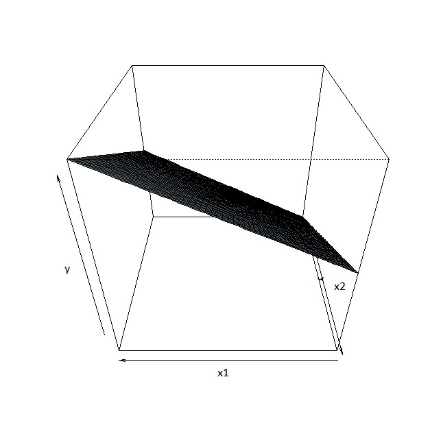

# Multiple Linear Regression (MLR) {#mlr}

## Introduction

```{r, echo=FALSE}
rm(list = ls())
```

Linear regression models are used to explore the relationship between variables as well as make predictions. Simple linear regression (SLR) concerns the study of only one predictor variable with one response variable. However, given the context, it may be clear there are multiple predictors that relate to the response variable. In such a context, we want to:

- Improve predictions on the response variable by including more useful predictors.
- Assess how a predictor relates to the response variable when controlling for other predictors. 

**Multiple linear regression (MLR)** models allow us to examine the effect of multiple predictors on the response variable simultaneously.

There are a couple of ways to think about MLR:

- Extension of SLR to MLR.
- SLR as a special case of MLR.

As a motivating example, we look at data regarding black cherry trees. The data, `cherry` come from the `openintro` package. Researchers want to understand the relationship between the volume of these trees and their diameter and height. Data come from 31 trees in the Allegheny National Forest, Pennsylvania.

```{r, message=FALSE, warning=FALSE}
library(openintro)
Data<-openintro::cherry
```

From this context, we know that volume of a tree is influenced by its diameter and height, so we have more than one predictor in this study. 

As you read this set of notes, take note of the similarities and differences between SLR and MLR.

## Notation in MLR

We write the **MLR model** as:

\begin{equation} 
y_i = \beta_0+\beta_1 x_{i1} + \beta_2 x_{i2} + \cdots + \beta_{k} x_{i k} + \epsilon_i.
(\#eq:6MLRmod)
\end{equation}

In this setup, we have $k$ quantitative predictors. The notation in \@ref(eq:6MLRmod) are as follows:

- $y_i$: value of response variable for observation $i$,
- $\beta_0$: **intercept** for MLR model,
- $\beta_j$: **coefficient** (or slope) for predictor $j$, for $j = 1, 2, \cdots, k$. We have $k$ predictors, each with its corresponding coefficient. 
- $x_{ij}$: observation $i$'s  value for predictor $j$. Notice there are two numbers in the subscript. The first number denotes which observation, and the second denotes which predictor.
- $\epsilon_i:$ **error** for observation $i$.

The **assumptions** in MLR are identical to SLR:

\begin{equation} 
\epsilon_1,\ldots,\epsilon_n \ i.i.d. \sim N(0,\sigma^2).
(\#eq:6assumptions)
\end{equation}

Let us use the `cherry` data from `openintro` as an example:

```{r}
head(Data)
```

- $y_2$ = 10.3 cubic feet, the volume for observation 2
- $x_{41} = 10.5$ inches, observation 4's diameter (predictor 1) 
- $x_{22} = 65$ feet, observation 2's height (predictor 2) 

The MLR model in \@ref(eq:6MLRmod) is often expressed using matrices, which is a lot neater:

$$
\left[
\begin{array}{c}
   y_1  \\
   y_2  \\
   \vdots   \\
   y_n
\end{array}
\right] =
\left[
\begin{array}{cccc}
   1 & x_{11} & \cdots & x_{1k}  \\
   1 & x_{21} & \cdots & x_{2k}  \\
   \vdots   \\
   1 & x_{n1} & \cdots & x_{nk}  \\
\end{array}
\right]
\left[
\begin{array}{c}
\beta_0 \\
\beta_1 \\
\vdots \\
\beta_{k}
\end{array}
\right] +
\left[
\begin{array}{c}
   \epsilon_1  \\
   \epsilon_2  \\
   \vdots   \\
   \epsilon_n
\end{array}
\right],
$$

or

\begin{equation} 
\boldsymbol{y} = \boldsymbol{X \beta} + \boldsymbol{\epsilon}.
(\#eq:6matrix)
\end{equation}

The notation in \@ref(eq:6matrix) are as follows:

- $\boldsymbol{y}$: **vector of responses** (length $n$),
- $\boldsymbol{\beta}$: **vector of parameters** (length $p = k+1$, where $p$ denotes the number of regression parameters),
- $\boldsymbol{X}$: **design matrix** (dimension $n \times p$),
- $\boldsymbol{\epsilon}$: **vector of residuals** (length $n$).

The formulation in \@ref(eq:6matrix) is the basis for calling the model a "linear" regression. The model is **linear in the parameters**, not the predictors. A common misconception is that the model is linear in the predictors. 

Following \@ref(eq:6MLRmod), the **MLR equation** can be written as:

\begin{equation} 
E(y|x) = \beta_0+\beta_1 x_1 + \beta_2 x_2 + \cdots + \beta_{k} x_k.
(\#eq:6MLR)
\end{equation}

And in turn, the **estimated MLR equation** can be written as:

\begin{equation} 
\hat{y} = \hat{\beta_0}+\hat{\beta_1} x_1 + \hat{\beta_2} x_2 + \cdots + \hat{\beta_{k}} x_k.
(\#eq:6MLReq)
\end{equation}

### Interpreting coefficients in MLR

The interpretation of estimated coefficients are similar with SLR, with a small caveat: $\hat{\beta}_j$ denotes the change in the predicted response per unit change in $x_j$, **when the other predictors are held constant.** There are other common ways to state the bold part:

- when controlling for the other predictors.
- when the other predictors are taken into account.
- after adjusting for the effect of the other predictors.

If you are familiar with how a partial derivative is interpreted in multivariate calculus, you will realize that the interpretation of estimated coefficients in MLR sound like how a partial derivative is interpreted.

Let us look at the estimated regression equation for the `cherry` data:

```{r}
result<-lm(volume~., data=Data)
result
```

The estimated MLR equation is $\hat{y} = -57.9877 + 4.7082x_1 + 0.3393x_2$. The estimated coefficient for diameter inform us that for each additional inch in diameter, the predicted volume of a cherry tree increases by 4.7082 cubic feet, while holding height constant.

### Visualizing MLR

How should we visualize an MLR equation? Suppose we have two predictor variables, $x_1$ and $x_2$, with MLR equation $E(y|x_1,x_2) = 2 + 5x_1 + 5x_2$. A **contour plot** can be used to visualize a response variable with two predictors:

```{r, echo=FALSE}
FUN<-function(x1,x2) ##define a new function FUN to compute the response

{

y<-2 + 5*x1 + 5*x2

return(y)

}

x<-seq(0,5,by=0.1) 
y<-x
z<-outer(x,y,FUN) ##compute the response for the given values of x and y

contour(x,y,z,xlab="x1",ylab="x2", main="Contour Plot y = 2 + 5x1 + 5x2")
abline(h=1, col="red")
```

The contour plot creates an axis for each predictor. The value of the response variable is denoted by the contour lines with the actual value displayed on the line. In this toy example, $\beta_1 = 5$. This means that if we hold $x_2$ constant (e.g. set $x_2 = 1$ per the red horizontal line), increasing $x_1$ by 1 unit increases the mean of $y$ by 5 units.

The regression equation $E(y|x_1,x_2) = 2 + 5x_1 + 5x_2$ is sometimes called a **regression plane**, instead of a regression line, since we have more than 1 predictor. We can visualize this regression plane below

```{r echo=FALSE, message=FALSE}

```

Due to limitations in human visualization, going beyond a 3-dimensional plot (1 response and 2 predictors) is difficult.

*Please see the associated video for a little more explanation regarding the contour plot and 3-dimensional plot*.

## Estimating coefficients in MLR

From \@ref(eq:6MLReq), the predicted response (or fitted values), can be written in matrix form as:

\begin{equation} 
\boldsymbol{\hat{y}} = \boldsymbol{X\hat{\beta}},
(\#eq:6yhat)
\end{equation}

where $\boldsymbol{\hat{\beta}} = (\hat{\beta_0}, \hat{\beta_1}, \cdots, \hat{\beta_k})^\prime$.

We use the **method of least squares** to find the estimated coefficients in MLR. This is the same idea when applied in SLR. The method involves minimizing the **sum of squared residuals**, $SS_{res}$. In SLR, we minimize

$$
\sum\limits_{i=1}^{n} \left[ y_i - (\hat{\beta_0}+\hat{\beta_1} x_i) \right]^{2}
$$

with respect to $\hat{\beta_0}, \hat{\beta_1}$. In MLR, the $SS_{res}$ can be expressed in matrix form:

\begin{equation}
Q = \left(\boldsymbol{y - X\hat{\beta}}\right)^{\prime} \left(\boldsymbol{y - X\hat{\beta}}\right)
(\#eq:6min)
\end{equation}

To minimize the $Q = SS_{res}$ with respect to $\hat{\beta_0}, \hat{\beta_1}, \cdots, \hat{\beta_k}$, We take partial derivatives of $Q$ and set them all to 0, i.e. $\frac{\nabla  Q}{\nabla \hat{\beta}}=0$. Solving for these equations, we get

\begin{equation} 
\boldsymbol{\hat{\beta}} = \left[
\begin{array}{c}
   \hat{\beta}_0  \\
   \hat{\beta}_1 \\
   \vdots \\
   \hat{\beta}_k
\end{array}
\right]  =
\left(\boldsymbol{X}^{\prime} \boldsymbol{X} \right)^{-1} \boldsymbol{X}^{\prime} \boldsymbol{y} .
(\#eq:6b)
\end{equation}

**Residuals** are found in the same way in SLR:

$$
e_i = y_i - \hat{y_i},
$$

or in matrix form:

\begin{equation} 
\boldsymbol{e} = \boldsymbol{y} - \boldsymbol{\hat{y}} = \boldsymbol{y} - \boldsymbol{X\hat{\beta}}.
(\#eq:6res)
\end{equation}

### Estimating variance of errors

Similar to SLR, $MS_{res}$ is used to estimate $\sigma^2$, the variance of the error terms. $MS_{res}$ if found using

\begin{equation}
MS_{res}=\frac{SS_{res}}{n-p},
(\#eq:6MSres)
\end{equation}

where $p$ denotes the **number of regression parameters**. In SLR, $p=2$, since we have an intercept and one slope. Note: I have seen too many people think $p$ denotes the number of predictors. This is incorrect! As we move forward, we will explore more complicated regression models and we always think in terms of number of regression parameters. 

### Distribution of least squares estimators

Following the Gauss Markov theorem, the least squares estimators $\boldsymbol{\hat{\beta}}$ are unbiased, i.e.

\begin{equation} 
\boldsymbol{E\left(\hat{\beta}\right)} = \boldsymbol{\beta},
(\#eq:6mean2)
\end{equation}

with **variance-covariance matrix** given by

\begin{equation} 
\boldsymbol{Var}\left(\boldsymbol{\hat{\beta}}\right) = \sigma^{2}\left(\boldsymbol{X^{\prime}X} \right)^{-1}
(\#eq:6cov2)
\end{equation}

with $\sigma^{2}$ estimated by $MS_{res}$. A few notes about the variance-covariance matrix of the least squares estimators:

- it is of dimension $p \times p$,
- the diagonal elements denote the variance of each estimated parameter. For example, the first diagonal element denotes the variance of $\hat{\beta}_0$, the first estimated parameter.
- the off-diagonal elements denote the covariance between respective parameters. For example, the (1,2) entry denotes the covariance between $\hat{\beta}_0$ and $\hat{\beta}_1$.

*Please see the associated video for a demonstration on how to read a variance-covariance matrix.*

## ANOVA $F$ Test in MLR

### Sum of squares

As in simple regression, the **analysis of variance (ANOVA) table** for an MLR model displays quantities that measure how much of the variability in the response variable is explained (and not explained) by the regression model. The underlying conceptual idea for the construction of the analysis of variance table is the same:

\begin{equation} 
SS_T = SS_R + SS_{res}.
(\#eq:6SS)
\end{equation}

What change are the associated degrees of freedom:

- df for $SS_R$: $df_R = p-1$
- df for $SS_{res}$: $df_{res} = n-p$
- df for $SS_T$: $df_T = n-1$

Notice the degrees of freedom in SLR has $p=2$. 

### ANOVA table

The ANOVA table is thus

| Source of Variation  |  SS  |  df  | MS | F |
|:----------:|:-------------:|:------:|:------:|:------:|
| Regression |  $SS_R=\sum\left(\hat{y_i}-\bar{y}\right)^2$ | $df_R = p-1$  | $MS_R=\frac{SS_R}{df_R}$ | $\frac{MS_R}{MS_{res}}$ |
| Error |    $SS_{res} = \sum\left(y_i-\hat{y_i}\right)^2$   | $df_{res} = n-p$ | $MS_{res}=\frac{SS_{res}}{df_{res}}$ | `***` |
| Total | $SS_T=\sum\left(y_i-\bar{y}\right)^2$ | $df_T = n-1$ | `***` | `***` |

### ANOVA $F$ test

The null and alternative hypotheses associated with the ANOVA $F$ test are:

$$
H_0: \beta_1=\beta_2=...=\beta_{k}=0, H_a: \text{ at least one of the coefficients is not 0.}
$$
So the null hypothesis states the regression coefficients for all predictors are 0. Notice how this statement simplifies in SLR. 

There are a few different ways to view these hypothesis statements:

- Is our MLR model **useful**?
- Is our MLR model **preferred** over an intercept-only model?
- Can we drop **all** our predictors from the MLR model?

The test statistic is still

\begin{equation}
F = \frac{MS_R}{MS_{res}}
(\#eq:6ANOVA)
\end{equation}

which is compared with an $F_{p-1,n-p}$ distribution.

### Coefficient of determination

The **coefficient of determination, $R^2$,** is still

\begin{equation} 
R^{2} = \frac{SS_R}{SS_T} = 1 - \frac{SS_{res}}{SS_T},
(\#eq:6R2)
\end{equation}

where $R^{2}$ is interpreted as **the proportion of variance in the response variable that is explained by the predictors**.

#### Caution with $R^2$

Adding more predictors to a model can only increase $R^2$, as $SS_{res}$ never becomes larger with more predictors and $SS_T$ remains the same for a given set of responses. 

- So even adding predictors that don't make sense will increase $R^2$.
- $R^2$ should be used to compare models with the same number of parameters. 
- $R^2$ is a popular measure as it has a nice geometric interpretation.

In response to this caution, we have the **adjusted $R^2$**, denoted by $R_{a}^{2}$:

\begin{equation} 
R_{a}^{2} = 1 - \frac{\frac{SS_{res}}{n-p}}{\frac{SS_T}{n-1}} = 1 - \left(\frac{n-1}{n-p} \right) \frac{SS_{res}}{SS_T}.
(\#eq:6adjusted)
\end{equation}

$R_{a}^{2}$ increases if the added predictors significantly improve the fit of the model, and decreases otherwise. 

Let us go back to the `cherry` dataset as an example:

```{r}
summary(result)
```

The ANOVA $F$ statistic is 255` with a small p-value. So we reject the null hypothesis and state that our MLR model with diameter and height as predictors is useful. 

The $R^2$ is 0.948. About 94.8% of the variance in volume of cherry trees can be explained by their diameter and height.

The $R_{a}^{2}$ is 0.9442. This value is used in comparison with another model to decide which should be preferred. 

## $t$ Test for Regression Coefficient in MLR

We can assess whether a regression coefficient is significantly different from 0 in an MLR. The null and alternative hypotheses are very much the same as in SLR:

$$
H_0: \beta_j = 0, H_a: \beta_j \neq 0.
$$
What these hypotheses mean in words:

- The null hypothesis supports dropping predictor $x_j$ from the MLR model, **in the presence of the other predictors.**
- The alternative hypothesis supports keeping predictor $x_j$ in the MLR model, or that we **cannot drop it in the presence of the other predictors.**

Notice the meaning of the null and alternative hypotheses are a little different than in SLR, where other predictors are not taken into account. 

The test statistic is still

\begin{equation} 
t = \frac{\hat{\beta}_j}{se(\hat{\beta}_j)}
(\#eq:6ttest)
\end{equation}

which is compared with a $t_{n-p}$ distribution.

Let us take a look at the `cherry` dataset:

```{r}
summary(result)$coefficients
```

Notice the $t$ statistics associated with testing for the coefficient for each predictor is highly significant. So we do not have evidence to drop any of the other predictors to simplify the model. 

### Caution in interpretating $t$ test in MLR

An insignificant $t$ test for a coefficient $\beta_j$ in MLR indicates that predictor $x_j$ can be removed from the model (and leave the other predictors in). It is **not needed in the presence of the other predictors.** 

1. A common misstatement many make is that an insignificant $t$ test for a coefficient $\beta_j$ in MLR implies that predictor $x_j$ has no linear relation with the response variable. This is not necessarily correct!

    - If $x_j$ is highly correlated with at least one of the other predictors, or is a linear combination of a number of other predictors, $x_j$ will probably be insignificant as the addition of $x_j$ doesn't help in improving the model. This concept is called **multicollinearity** which we will explore in more depth in the next module. $x_j$ does not provide independent information from the other predictors, and so will not be needed when the other predictors are in the model. 

    - $x_j$ itself may still be linearly related to the response variable, on its own.

    - If your goal is to assess if $x_j$ is linearly related to the response, need to use SLR.

2. Another common misstatement people make is that if they observe more than one $t$ statistic that is insignificant, it means that all of the associated predictors can be dropped from the model. This again is not necessarily correct.

    - An insignificant $t$ test informs us we can drop that particular predictor, while leaving the other predictors in the model. We can only drop one predictor at a time based on $t$ tests. 
    
Notice the limitation of the $t$ test and ANOVA $F$ test in MLR:

- We can **only drop 1 predictor** based on a $t$ test.
- We can **drop all predictors** based on an ANOVA $F$ test.
- What if we wish to drop more than 1 predictor simultaneously, but not all, from the model? We will explore this via another $F$ test in the next module.

## CIs in MLR

### CI for regression coefficient

The general form for CIs is still the same:

\begin{equation}
\mbox{estimator} \pm (\mbox{multiplier} \times \mbox{s.e of estimator}). 
(\#eq:6CI)
\end{equation}

The $100(1-\alpha)\%$ CI for $\beta_j$ is

\begin{equation} 
\hat{\beta}_j \pm t_{1-\alpha/2;n-p}  se(\hat{\beta}_j) = \hat{\beta}_j \pm t_{1-\alpha/2;n-p} s \sqrt{C_{jj}}
(\#eq:6CIb)
\end{equation}

where $C_{jj}$ denotes the $j$th diagonal entry in variance-covariance matrix of the estimated coefficients, $\boldsymbol{Var}\left(\boldsymbol{\hat{\beta}}\right)$.

The multiplier is now based on a $t_{n-p}$ distribution, instead of a $t_{n-2}$ distribution for SLR.

### CI of the mean response

Since we have multiple predictors, we may interested in the CI for the mean of the response, when the predictors are each equal to specific values. Let the vector $\boldsymbol{x_0}$ denote these values on each predictor, specifically

$$
\boldsymbol{x_0} = (1, x_{01}, x_{02}, \cdots, x_{0k})^{\prime},
$$

where $x_{0j}$ denotes the value for predictor $x_j$. The CI for the mean response when $\boldsymbol{x} = \boldsymbol{x_0}$ is

\begin{equation}
\hat{\mu}_{y|\boldsymbol{x_0}}\pm t_{1-\alpha/2,n-p}s\sqrt{\boldsymbol{x_0}^{\prime} \boldsymbol{(X^\prime X)^{-1}} \boldsymbol{x_0}}.
(\#eq:6CImean)
\end{equation}

### PI of a new response

For a new value of the response when $\boldsymbol{x} = \boldsymbol{x_0}$, the PI is

\begin{equation} 
\hat{y}_0\pm t_{1-\alpha/2,n-p}s \sqrt{1+ \boldsymbol{x_0}^{\prime} \boldsymbol{(X^\prime X)^{-1}} \boldsymbol{x_0}}.
(\#eq:6pred)
\end{equation}

## R Tutorial

```{r, echo=FALSE}
rm(list = ls())
```

For this tutorial, we will learn how to fit multiple linear regression (MLR) in R. You will realize that fitting MLR is very similar to fitting SLR.

We will look at data regarding black cherry trees. The data, `cherry`, come from the `openintro` package. Researchers want to understand the relationship between the volume (in cubic feet) of these trees and their diameter (in inches, at 54 inches above ground) and height (in feet). Data come from 31 trees in the Allegheny National Forest, Pennsylvania.


```{r, message=FALSE, warning=FALSE}
library(openintro)
Data<-openintro::cherry
```

### Scatterplot matrix {-}

A scatterplot matrix is useful to create scatterplots involving more than two quantitative variables. We will use the `ggpairs()` function from the `GGally` package:

```{r, message=FALSE, warning=FALSE}
library(GGally)
##scatterplot matrix
GGally::ggpairs(Data)
```

A few pieces of information are presented in the output. Notice the output is displayed in a matrix format. 

- The off-diagonal entries of the output give us the scatterplot and correlation between the corresponding pair of quantitative variables.
    + For example, look at the scatterplot in row 3, column 1 of the output. The corresponding label for the column is `diam` and the label for the row is `volume`. This informs us this is a scatterplot for `volume` on the vertical axis and `diam` on the horizontal axis. We see a strong positive linear association between these two variables. 
    + The correlation between `volume` and `diam` is displayed in row 1, column 3. Again, notice the label for the column and row. This correlation is 0.967, which is high.
    + For practice, locate the scatterplot of `volume` and `height` and its corresponding correlation. Also locate the scatterplot of `diam` and `height` and its corresponding correlation. 
- The diagonal entries display the density plot of the corresponding variable. For example, the third diagonal entry displays the density plot for `volume`. We can see that the distribution is somewhat right skewed as most trees have a volume between 10 and 40 cubic feet. 

### Fit MLR using `lm()` {-}

To fit multiple linear regression (MLR)

```{r}
##Fit MLR model, using + in between predictors
result<-lm(volume~diam+height, data=Data)
```

where we list the predictors after `~` with a `+` operator in between the predictors. Another way would be 

```{r, eval=FALSE}
result<-lm(volume~., data=Data)
```

The `.` after `~` informs the `lm()` function to use every column other than `volume` in the data frame as predictors. 

Just like with simple linear regression (SLR) we can get relevant information using `summary()`:

```{r}
summary(result)
```

- The estimated regression equation is $\hat{y} = -57.988 + 4.708 diam + 0.339height$.
    + The estimated coefficient for `diam` is interpreted as: the predicted volume of a cherry tree increases by 4.708 cubic feet per inch increase in diameter, while holding height constant.
    + The estimated coefficient for `height` is interpreted as: the predicted volume of a cherry tree increases by 0.339 cubic feet per foot increase in height, while holding diameter constant.
- The $R^2$ is 0.948. About 94.8% of the variance in volume of cherry trees can be explained by their diameter and height.
- The residual standard error is 3.882. This estimates $\sigma$, the standard deviation of the error term.


### Inference with MLR {-}

Just like SLR, each coefficient is tested against a null hypothesis that $\beta_j = 0$ with a two-sided alternative. The test is significant for both coefficients, so we cannot drop either predictor from the model.

The ANOVA $F$ statistic is 255, with a small p-value. So data supports the claim that our model is useful. 

The confidence intervals for the coefficients can be found using `confint()`:

```{r}
confint(result,level = 0.95)
```


The confidence interval for the mean response and the prediction interval for a new observation given a specific value of the predictors can also be found using `predict()`. For example, when the diameter is 10 inches and height is 80 feet:

```{r}
newdata<-data.frame(diam=10, height=80)

predict(result, newdata, level=0.95,
        interval="confidence")
predict(result, newdata, level=0.95,
        interval="prediction")
```

You might realize by now we are using the same functions as we did in SLR.

**Note**: Obviously, all these calculations are performed and interpreted assuming the regression assumptions are met. Regression assumptions are checked in the same way as in SLR. On your own, as practice, assess the regression assumptions. 
