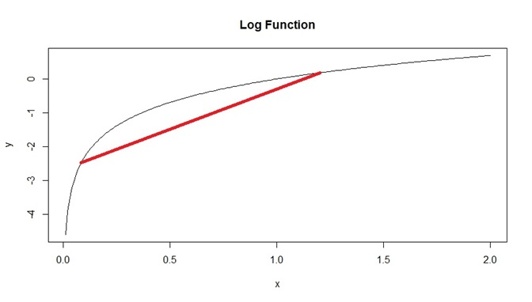
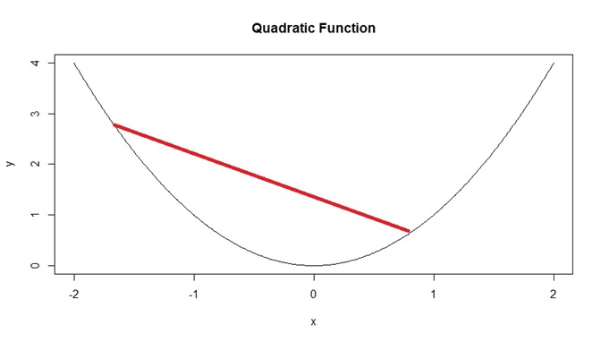
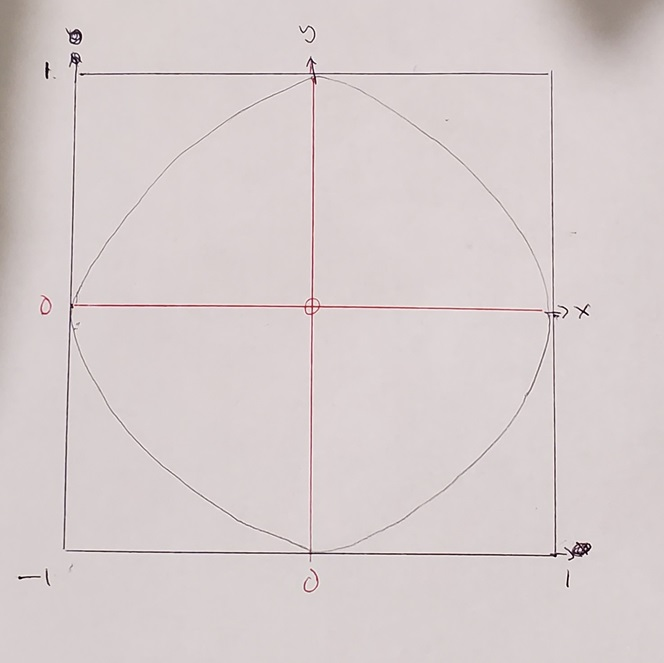

# Inequalities, Limit Theorems, and Simulations

```{r, echo=FALSE}
rm(list = ls())
```

This module is based on Introduction to Probability (Blitzstein, Hwang), Chapter 10. You can access the book for free at https://stat110.hsites.harvard.edu/ (and then click on Book). Please note that I cover additional topics, and skip certain topics from the book. You may skip Example 10.1.3, 10.1.4, 10.1.7 to 10.1.9, Theorem 10.1.12, Example 10.2.5, 10.2.6, 10.3.7, and Section 10.4 from the book.

## Introduction

It can be difficult to calculate probabilities and expected values, for example, when the PDF of a distribution is unknown, or its integral is too difficult to work out. You may notice that we used simulations to approximate probabilities and expected values in some of the examples in previous modules. With improvement in computing capabilities, simulations can now be performed faster and is a tool that is used more and more. Other tools to calculate difficult probabilities and expected values include using inequalities to bound the probabilities (e.g. the probability cannot be greater or less than a certain value), or approximating using known theorems. We'll look at these three tools in this module.

### Module Roadmap

- Section \@ref(inequalities) covers 3 famous inequalities that are used in probability (Cauchy-Schwartz, Jensen, Chebyshev), as well as their implications.
- Section \@ref(limits) covers 2 of the most consequential theorems in probability, the Law of Large Numbers and the Central Limit Theorem. We will be invoking these 2 theorems in a number of the remaining modules .
- Section \@ref(MCsims) covers Monte Carlo simulations, which is a computational tool used to estimate probabilities, especially when they may be difficult to derive "by hand". We will be using Monte Carlo simulations extensively for the rest of this class. 

## Inequalities {#inequalities}

If a probability or expected value is difficult to calculate, it may be easier to find a bound via an inequality. This usually means that we can guarantee that a certain probability or expected value is within a certain range of values, which narrows down the possible values for the exact answer. For example, instead of being able to calculate the probability of a certain event, we may be able to show that its probability is no more than 0.1, so we know the event is unlikely to happen. We will cover a couple of the most well-known inequalities in probability.

### Cauchy-Schwartz Inequality

The **Cauchy-Schwarz inequality** is one of the most famous inequalities in mathematics and has many applications. In the context of probability, it is written as: For any random variables $X$ and $Y$ with finite variances

\begin{equation} 
|E(XY)| \leq \sqrt{E(X^2)E(Y^2)}.
(\#eq:6-CS)
\end{equation}

Next, we use the Cauchy-Schwartz inequality to prove a couple of properties that we have stated in earlier modules:

1. The Cauchy-Schwartz inequality can be used to show the correlation between any two random variables with finite variances must be between -1 and 1. A quick proof is as follows: we apply equation \@ref(eq:6-CS) to the **centered** random variables $X - \mu_X$ and $Y - \mu_Y$:

$$
\begin{split}
|E[(X - \mu_X)(Y - \mu_Y)]| & \leq \sqrt{E[(X - \mu_X)^2] E[(Y - \mu_Y)^2]} \\
\implies |Cov(X,Y)| & \leq \sqrt{Var(X) Var(Y)} \\
\implies |Corr(X,Y)| & \leq 1.
\end{split}
$$

View the video below for a more detailed explanation of this proof:

<iframe width="560px" height="320px" allowfullscreen="true" allow="autoplay *" title="Module 06: Cauchy Schwartz and Correlation" src="https://virginiauniversity.instructuremedia.com/embed/bf9948b4-1c86-4529-9b49-53c808b4a0be" frameborder="0"></iframe>

2. The Cauchy-Schwarz inequality can also be used to show that the variance of any random variable has to be non negative. A quick proof is as follows: we apply equation \@ref(eq:6-CS) to the random variable $X$ and to a constant 1:

$$
\begin{split}
|E(X)| & \leq \sqrt{E(X^2)E(1^2)}. \\
\implies |E(X)| & \leq \sqrt{E(X^2)} \\
\implies E(X)^2 & \leq E(X^2) \\
\implies 0 & \leq E(X^2) - E(X)^2 = Var(X).
\end{split}
$$
View the video below for a more detailed explanation of this proof:

<iframe width="560px" height="320px" allowfullscreen="true" allow="autoplay *" title="Module 06: Cauchy Schwartz and Variance" src="https://virginiauniversity.instructuremedia.com/embed/856ad59e-6e7f-4039-97e5-d1ce7397752c" frameborder="0"></iframe>

Note: One other place that you may seen the Cauchy-Schwarz inequality is in the proof of the triangle inequality in geometry. 

### Jensen's Inequality

You may have noticed in previous modules, we have written about transforming a random variable. One way of transforming a random variable is through a scale change, in other words, the value of the random variable is multiplied by a constant. This can happen when we change the units of the variable. For example we want to convert a random variable based on weight from kilograms to pounds. If $X$ and $Y$ denote the weight in kilograms and pounds respectively, we can write $Y = 2.2X$. If we know the expected value of $X$, we can easily find the expected value for $Y$ by multiplying $E(X)$ by 2.2. This is fairly intuitive and is based on the linearity of expectations using equation \@ref(eq:3-linEX). 

Before stating Jensen's inequality, we have to cover a couple of concepts: linear vs non linear transformations, and convex vs concave functions. 

#### Linear and Non Linear Transformations {#linnonlin}

A way to think about transformations is to write $Y = g(X)$, where $g$ is a function that describes the transformation. In the kilograms to pounds example, $g$ is exactly 2.2, so $Y = 2.2X$. This transformation is a **linear transformation** since the graph of $Y = 2.2X$ is a straight line. In this example, $E(Y) = E(2.2X) = 2.2E(X)$.

What if we use a **non linear transformation**? A popular non linear transformation is a log transformation. This is used when a random variable is right skewed (which happens pretty often in real data, such as wages, since only a few people make really high wages and the vast majority of people have wages on the lower end). Expected values are often used in statistical models for predictions; however, we know that the mean may not be the best measure of centrality with skewed data. One way to transform right skewed data to become less skewed is to log transform the data. In this example, we have $Y = \log(X)$, so $g(x) = \log(x)$. If we know the expected value of the original variable, $E(X)$, can we easily find the expected value of $Y$? Can we write $E(Y) = E(\log(X)) = \log E(X)$? This is actually incorrect. It turns out that such operations do not work for non linear transformations, i.e. if $g$ is non linear, $E(g(X))$ is not necessarily equal to $g(E(X))$. A log transformation is not linear since the graph of $Y = \log(X)$ is not a straight line. 

Let us use a toy example to show this. Suppose we roll a fair six-sided die, and let $X$ denote the number of dots the die shows. For this game, we get to win money based on the result of the roll, specifically twice the result. Let $D$ denote the winnings for this game, so $D = 2X$. Since we know $E(X) = 3.5$, this means that the expected winnings for this game is $E(D) = E(2X) = 2E(X) = 7$, since we have linear transformation here. The code below verifies these:

```{r}
X<-c(1,2,3,4,5,6) ##support for X

D<-2* X ##winnings

mean(X) ##EX since die is fair
mean(D) ##Expected winnings. This is equal to 2 times mean(X)
```
Now suppose the winnings is now defined as the squared of the number of dots the die shows. Let $T$ denote the new winnings, so $T = X^2$. Since this is a non linear transformation, $E(T) = E(X^2)$ may not equal to $E(X)^2$:

```{r}
X<-c(1,2,3,4,5,6) ##support for X

T<-X^2 ##winnings

mean(T) ##Expected winnings. 
mean(X)^2 ##not equal
```
In this example, we see that $E(T) > E(X)^2$, in other words, $E(g(X)) > g(E(X))$, when $g(x) = x^2$. Is $E(g(X)) > g(E(X))$ always for any non linear function $g$? It turns out that this is not always the case.

To summarize:

- If $g$ is linear, then $E(g(X)) = g(E(X))$, and we can use linearity of expectations.
- If $g$ is non linear, then $E(g(X)) \neq g(E(X))$. 

#### Convex and Concave Functions

In the example above, we have an instance where $E(g(X)) \neq g(E(X))$. The direction of the inequality depends on whether the function $g$ is convex or concave. There are a couple of ways to decide if a function is convex or concave:

- Using derivatives: 
    - A function $g(x)$ is **convex** if its second derivative is non negative, i.e. $g^{\prime \prime}(x) \geq 0$ over its domain. The domain is the set of all values of $x$ for which $g(x)$ is defined. 
    - A function $g(x)$ is **concave** if its second derivative is non positive, i.e. $g^{\prime \prime}(x) \leq 0$ over its domain.

- Using visuals: 
    - A function $g(x)$ is **convex** if every line segment joining two points on its graph is never below the graph.
    - A function $g(x)$ is **concave** if every line segment joining two points on its graph is never above the graph.
    
We now look at a couple of functions to see if they are convex or concave:

- $g(x) = \log(x)$ is a concave function. 
    - Its second derivative is $g^{\prime \prime}(x) = -\frac{1}{x^2}$. Note the domain of $\log(x)$ is positive real numbers (it is undefined when $x \leq 0$), so its second derivative is always negative. 
    - We can also look at a graph of $y = \log(x)$, and draw line segments that join two points on its graph. All of these lines are never above the graph. Figure \@ref(fig:concave) below shows an example with one line segment, but we can see that any line segment that joins two points on the graph will never be above the graph.
    
```{r concave, fig.cap = "Example of Concave Function", echo = FALSE}

```

- $g(x) = x^2$ is a convex function.
    - Its second derivative is $g^{\prime \prime}(x) = 2$, which is always positive.
    - We can also look at a graph of $y = x^2$, and draw line segments that join two points on its graph. All of these lines are never below the graph. Figure \@ref(fig:convex) below shows an example with one line segment, but we can see that any line segment that joins two points on the graph will never be below the graph.
    
```{r convex, fig.cap = "Example of Convex Function", echo = FALSE}

```

*Thought question*: Consider the function $g(x) = \frac{1}{x}$, i.e. the inverse function. Can you explain why this function is convex when $x>0$ and is concave when $x<0$?

#### Jensen's Inequality

We are now ready to state **Jensen's inequality**. Let $X$ denote a random variable. If $g$ is convex, then $E(g(X)) \geq g(E(X))$. If $g$ is concave, then $E(g(X)) \leq g(E(X))$.

The equality holds only if $g$ is a linear function. It turns out linear functions are both convex and concave. The book goes through a simple proof of Jensen's inequality and is worth reading. Next, we apply Jensen's inequality to a few examples:

1. We apply Jensen's inequality to the toy example in Section \@ref(linnonlin). As a reminder, suppose we roll a fair six-sided die, and let $X$ denote the number of dots the die shows. The winnings is defined as the squared of the number of dots the die shows. Let $T$ denote the new winnings, so $T = X^2$, so $g(x) = x^2$ is the function representing this non linear transformation. We established that the quadratic function is convex, so Jensen's inequality tells us that $E(g(X)) \geq g(E(X))$, i.e. that $E(T) > E(X)^2$ which we showed in the code. 

2. As mentioned in Section \@ref(linnonlin), a log transformation is often applied to make data that are right skewed less skewed, so that popular methods such as linear regression, tree based methods, $K$ nearest neighbors can be used (these methods can be sensitive to outliers since they are based on conditional expectations or conditional means). What often happens is the log transformation is applied to the variable of interest, the model is fit, a prediction is made for the log transformed variable using conditional expectations, and the exponential is applied to this predicted value to convert it back to the original variable. Jensen's inequality tells us that the exponential of the average log variable is greater than the average variable, and our model over estimates. 

3. Jensen's inequality can also be used to show that the sample standard deviation is a biased estimator of the population standard deviation, which appears counter intuitive, since the sample variance is an unbiased estimator of the population variance, i.e. $E(s^2) = \sigma^2$, but $E(s) \neq \sigma$. The quick proof is

$$
E(s) = E(\sqrt{s^2}) \leq \sqrt{E(s^2)} = \sigma.
$$

So the sample standard deviation underestimates the population standard deviation. However, this bias tends to be small if the sample size is large. We will cover ideas relating to unbiased estimators in a future module in more detail. 

### Chebyshev's Inequality

A common inequality that is used for probability is **Chebyshev's inequality**. It provides an upper bound on the probability that a random variable is at least a certain distance from its mean. Let $X$ be a random variable with mean $\mu$ and variance $\sigma^2$. Then for any $a>0$, 

\begin{equation} 
P(|X-\mu| \geq a) \leq \frac{\sigma^2}{a^2}.
(\#eq:6-CI)
\end{equation}

An alternative way of expressing Chebyshev's inequality is to let $a = c \sigma$ in equation \@ref(eq:6-CI), so that it can be interpreted as providing an upper bound on the probability that a random variable is at least $c$ standard deviations from its mean:

\begin{equation} 
P(|X-\mu| \geq c \sigma) \leq \frac{\sigma^2}{c^2 \sigma^2} = \frac{1}{c^2}.
(\#eq:6-CIalt)
\end{equation}

Using equation \@ref(eq:6-CIalt), we can say the following about the upper bond on the probability that a random variable is at least 1, 2, and 3 standard deviations from its mean:

- When $c=1$,

$$
P(|X-\mu| \geq \sigma) \leq \frac{1}{1^2} = 1.
$$
This informs us that the probability that a random variable is at least one standard deviation from its mean is no more than 1. The upper bound is not very informative in this setting since we know probabilities cannot be greater than 1.

- When $c=2$, 

$$
P(|X-\mu| \geq 2\sigma) \leq \frac{1}{2^2} = 0.25.
$$

This informs us the probability that a random variable is at least two standard deviations from its mean is no more than 0.25. In other words, there cannot be more than a 25% chance that a random variable is at least 2 standard deviations from its mean, or there cannot be less than a 75% chance that a random variable is within 2 standard deviations from its mean, since $P(|X-\mu| \leq 2\sigma)$ is the complement of $P(|X-\mu| \geq 2\sigma)$.

- When $c=3$, 

$$
P(|X-\mu| \geq 3\sigma) \leq \frac{1}{3^2} = \frac{1}{9}.
$$

There cannot be more than a 11.11% chance that a random variable is at least 3 standard deviations from its mean, or there cannot be less than a 88.89% chance that a random variable is within 3 standard deviations from its mean.

*Thought question*: Can you explain how these results are consistent with the 68-99-99.7% rule for normal distributions, as stated in Section \@ref(rulenorm)?

Notice that Chebyshev's inequality can be applied to any distribution, and can be used to provide bounds on how data can be spread out. It is more flexible than the 68-99-99.7% rule for normal distributions as it can be applied to any distribution, but the bounds are not as exact as they are an inequality. There can be a trade-off in relaxing assumptions and accuracy of results. 

## Limit Theorems {#limits}

In the previous subsection, we used inequalities to provide bounds on probabilities and expectations that may be difficult to calculate. Another way of handing difficult calculations would be to use approximations for the distribution of the random variable, instead of the exact distribution of the random variable. Generally speaking, these approximations work better when we have more data (i.e. when the sample size is larger). These approximations are covered by two of the most important limit theorems: the Law of Large Numbers and the Central Limit Theorem. These theorems approximate the distribution of the sample mean of i.i.d. (independent and identically distributed) random variables as the sample size gets larger.

Note: The idea of i.i.d. random variables implies that each observed value of the random variable is independent of each other, and that each observed value come from the same random variable. For example, let $X$ denote the number of dots from a roll of a 6-sided fair die, and let $X_1, X_2$ denote the value of the first and second roll respectively. $X_1$ and $X_2$ are i.i.d. since the outcomes from the first and second roll do not influence each other, so they are independent. $X_1$ and $X_2$ are identically distributed as they both follow the same distribution, $Mult_6(1, (1/6, 1/6, 1/6, 1/6, 1/6, 1/6))$. 

For the rest of this section, Section \@ref(limits), assume we have i.i.d. $X_1, \cdots, X_n$ with finite mean $\mu$ and finite variance $\sigma^2$. For all positive integers $n$ (i.e. for any possible sample size), define the sample mean as $\bar{X}_n = \frac{X_1 + \cdots + X_n}{n}$. We can easily derive the expected value and variance of the sample mean using properties of expectations and variances. Its expected value is

\begin{equation} 
\begin{split}
E(\bar{X}_n) &= E(\frac{X_1 + \cdots + X_n}{n}) \\
             &= \frac{1}{n}E(X_1 + \cdots + X_n) \\
             &= \frac{1}{n} (E(X_1) + \cdots + E(X_n)) \\
             &= \frac{1}{n} (\mu + \cdots + \mu) \\
             &= \mu.
\end{split}
(\#eq:6-Emean)
\end{equation}

Its variance is

\begin{equation} 
\begin{split}
Var(\bar{X}_n) &= Var(\frac{X_1 + \cdots + X_n}{n}) \\
             &= \frac{1}{n^2}Var(X_1 + \cdots + X_n) \\
             &= \frac{1}{n^2} (Var(X_1) + \cdots + Var(X_n)) \\
             &= \frac{1}{n^2} (\sigma^2 + \cdots + \sigma^2) \\
             &= \frac{\sigma^2}{n}.
\end{split}
(\#eq:6-Varmean)
\end{equation}

View the video below for a more detailed explanation of these results:

<iframe width="560px" height="320px" allowfullscreen="true" allow="autoplay *" title="Module 06: Properties of Sample Mean" src="https://virginiauniversity.instructuremedia.com/embed/86d05cc6-56b2-4186-96ce-c1a641acb2b0" frameborder="0"></iframe>

Equation \@ref(eq:6-Emean) informs us that the long-run average of sample means is equal to the population mean. We can imagine this if we had taken different random samples of size $n$ from a population, and for each random sample we find the sample mean, and then average all these sample means. This average equals to the population mean $\mu$. The code below provides a demonstration of these steps:

- We simulate a random sample of $X_1, \cdots, X_{500}$ i.i.d. from standard normal.
- Compute the sample mean and store it.
- Repeat the previous steps for a total of 10 thousand reps.
- Find the average of the 10 thousand sample means. 

```{r}
reps<- 10000 ##take 10000 random samples. This value should be large
n<-500 ##sample size for each random sample
xbar<-array(0,reps) ##store the sample mean for each random sample

set.seed(90)

for (i in 1:reps)
  
{
  
  xbar[i]<-mean(rnorm(n)) ##find and store sample mean for each random sample
  
}

mean(xbar) ##average the sample means. This should be close to 0. 
```


Equation \@ref(eq:6-Varmean) informs us how to calculate the variance of the sample means. We can imagine this if we had taken different random samples of size $n$ from a population, and for each random sample we find the sample mean, and then find the variance of all these sample means. It is the variance of the original random variable divided by $n$. This means as the sample size gets larger, the variance of the sample means get smaller, in other words, the sample means tend to get closer to the population mean. We re run the code from above and also find the variance of the sample means.

```{r}
var(xbar) ##variance of sample means. This should be close to 1/500, since n=500. 
```


### Law of Large Numbers

The **Law of Large Numbers (LLN)** states that as $n$ gets larger and approaches infinity, the sample mean $\bar{X}_n$ converges to the true mean $\mu$. This implies that the sample mean tends to get closer to the population mean with larger sample sizes. The key word here is tends to, it is not a guarantee that the sample mean always gets closer to the population mean whenever $n$ gets larger, but it generally does. This explains why we tend to trust results from larger sample sizes. 

Another implication of the LLN is that we can use simulations to verify theoretical results, since these results usually require us to simulate data based on a large number of independent replications. 

The LLN is a by product of equations \@ref(eq:6-Emean) and \@ref(eq:6-Varmean). Equation \@ref(eq:6-Varmean) informs us that as $n$ gets larger, the variance of the sample mean gets smaller. Equation \@ref(eq:6-Emean) informs us that the sample mean is unbiased, i.e. its long run average is equal to the true mean. Collectively, these inform us that as $n$ gets larger, the sample mean is more likely to be closer to the true mean. 

We use an example to illustrate the LLN, which comes from flipping a fair coin. Let $X$ denote whether the coin lands heads or tails, and let $X=1$ for heads and $X=0$ for tails. We can say that $X \sim Bern(0.5)$ since the coin is fair. Imagine flipping the coin $n$ times, and record the outcome after each flip, so $X_1, \cdots, X_n$ denote the outcome of each flip. We know that $E(X) = 0.5$ since $X \sim Bern(0.5)$. The LLN informs us that $\bar{X}_1, \cdots, \bar{X}_n$ should usually get closer to 0.5 as $n$ increases. In other words, the value of the sample proportion after each flip should get usually closer to 0.5 with more flips. The code below simulates this example for $n=500$, and Figure \@ref(fig:4-LLN2) shows how the sample proportions get closer to 0.5, in general, as $n$ increases. 

```{r 4-LLN2, fig.cap="LLN Example 2"}
n<-500 ##make this big, but not too big otherwise picture is difficult to see

set.seed(23)

X<-rbinom(n,1,0.5) ##simulate 500 flips of fair coin

totals<-cumsum(X) ##count total number of heads after each flip
index<-1:n
props<-totals/index ##find proportion of heads after each flip

##create visual. LLN says that as n gets larger, the value of the sample proportion tends to get closer to 0.5
plot(props, type="l", main="Prop vs Sample Size", ylab="Proportion", xlab="n")
abline(h=0.5, col="blue") ##overlay 0.5 for easy comparison
```

View the video below for a more detailed explanation of the code:

<iframe width="560px" height="320px" allowfullscreen="true" allow="autoplay *" title="Module 06: Law of Large Numbers" src="https://virginiauniversity.instructuremedia.com/embed/d5516684-77b9-474c-a862-8f2a7377d0b8" frameborder="0"></iframe>

Note: `set.seed()` was used so you can reproduce these results exactly. However, the observation that the sample mean tends to get closer to the true mean as $n$ increases will happen regardless of what `set.seed()` was used, or even if `set.seed()` was not used. 

Note: The LLN actually comes in two versions, the Weak Law of Large Numbers (WLLN), and the Strong Law of Large Numbers (SLLN). The book goes into some detail about their definitions and differences. What I have written gives an intuitive explanation of what the LLN implies. 

#### Misconceptions with LLN

One key idea with the LLN is that the sample mean **tends to get closer to the true mean as $n$ gets larger**. The key words here are "tends" and "as $n$ gets larger". 

A misunderstanding of the LLN is the **gambler's fallacy**, which erroneously believes that the sample mean must "self correct" and get closer to the population mean with small increments of $n$. 

Using the example from flipping a fair coin. The gambler's fallacy erroneously thinks that:

- The proportion of heads should be close to 0.5, even with small $n$.
- The results of subsequent flips should self correct, i.e. the proportion of heads get closer to 0.5 with the next flip. For example, if the first 5 flips are heads, the next flip is "due" to be tails since the proportion should get closer to 0.5 with the next flip. 

The convergence to 0.5 comes from flipping the coin many times. 

### Central Limit Theorem {#CLT}

The LLN informs us that the sample mean converges to the true mean. Statistical theory informs us about the expected value and variance of the sample mean in equations \@ref(eq:6-Emean) and \@ref(eq:6-Varmean). But these do not inform us about the distribution of $\bar{X}_n$. This is where the **Central Limit Theorem (CLT)** comes in. 

The CLT states that as the sample size gets larger and tends to infinity, the distribution of $\bar{X}_n$ after standardization approaches a standard normal distribution, i.e.

\begin{equation} 
\sqrt{n} \left(\frac{\bar{X}_n \ - \mu}{\sigma} \right) \to N(0,1).
(\#eq:6-CLT)
\end{equation}

The CLT is called an **asymptotic** result, as it informs us about the **limiting distribution** of $\bar{X}_n$ as $n$ gets larger and tends to infinity. The CLT implies an approximation when $n$ is large enough. For large $n$, the distribution of $\bar{X}_n$ is approximately $N(\mu, \frac{\sigma^2}{n})$.

The implication of the CLT is that even if our data do not follow a normal distribution, the average value of the data can be approximated by a normal distribution if our sample size is large enough. As mentioned in Section \@ref(normdist), a lot of questions in research deal with averages. 

We consider this hypothetical situation. Suppose the waiting time for customers calling customer service during lunch time is known have a mean of 600 seconds with standard deviation 30 seconds. The company decides to cut costs and reduces staffing at the call center, and claims that wait times are not affected negatively. The customers are convinced otherwise. A researchers obtains the wait times from 500 customers who call in during lunch time after staffing is reduced. The sample mean of the wait times for these customers is 700 seconds. Can this data be used to counter the company's claim that wait times have been affected?

One possible calculation will be to assume the company is correct, that wait times have not changed, on average. If so, the sample means will be approximately normal, with mean 600 and variance $\frac{30^2}{500}$, i.e. $\bar{X}_{500} \sim N(600, \frac{30^2}{500})$. We then calculate $P(\bar{X}_{500} \geq 700)$, the probability that we have sample mean that is equal to or greater than 700 seconds. Using R, this probability is virtually 0, which is very small, indicating that our data is inconsistent with the company's claim. 

```{r}
1-pnorm(700, 600, 30/sqrt(500))
```
The CLT is traditionally associated with the distribution of the sample mean $\bar{X}_n$. It can be applied to the sum as well, due to properties of expectations and variances. Let $T_n = X_1 + \cdots + X_n = n \bar{X}_n$ denote the sum of $n$ i.i.d. random variables. The CLT says that, for large $n$, the distribution of $T_n$ is approximately $N(n\mu, n\sigma^2)$.

#### Considerations with CLT {#considerCLT}

One question that is raised when the CLT is used is how large does the sample size $n$ have to be for the approximation to be accurate? While suggestions are plentiful (usually along the lines to sample size being at least 25 or 30), there is no fixed answer to this question. It depends on the distribution of $X$. In general, the more skewed $X$ is, $n$ needs to be larger for the approximation to work. On the other hand, if $X$ is already normal, then the distribution of $\bar{X}_n$ is exactly $N(\mu, \frac{\sigma^2}{n})$ for any sample size $n$. We look at a couple of examples based on different distributions.

1. $X$ is standard normal. Our code will do the following:

- We simulate $n$ draws from $X$ for $n = 1$. 
- To obtain the distribution of $\bar{X}_n$ for each value of $n$, we repeat the previous step for a total of 10 thousand reps, then produce a histogram of the 10 thousand values of $\bar{X}_n$.
- Repeat the previous two steps, with different values of $n$. We will use $n= 5, 30, 100$ as well
- We expect the histograms for $\bar{X}_n$ to all look normal for all values of $n$ we used. 

```{r 6-CLTnorm, fig.cap="Distribution of Sample Means when X is N(0,1), n varied", echo=FALSE}
reps<-10000 ##reps
n<-c(1,5,30,100) ##different values of n we are using

samp_means<-array(0,c(length(n),reps)) ##array to store the sample means from each rep and each value of n

par(mfrow=c(2,2)) ## show the 4 plots in a 2x2 array

set.seed(4)

for (i in 1:length(n))
  
{
  
  for (j in 1:reps)
  
  {
  
  samp_means[i,j]<-mean(rnorm(n[i]))
  
  }
  
  hist(samp_means[i,],xlab="Xbars", main=paste("X is N(0,1), n is", n[i]))
  
}
```

Figure \@ref(fig:6-CLTnorm) displays the histograms from this simulation, and matches what we expect from the CLT. Since $X$ is normal, $\bar{X}_n$ follows a normal distribution for any value of $n$. 

2. $X$ is Poisson with parameter 1. This is a skewed distribution. We use code that mimics the previous example, with the only difference being that our data are simulated from $Pois(1)$ instead of standard normal. When $n$ is small, we expect the distribution of $\bar{X}_n$ to not look normal. As $n$ gets larger, we expect the distribution of $\bar{X}_n$ will look more normal. 

```{r 6-CLTpois, fig.cap="Distribution of Sample Means when X is Pois(1), n varied", echo=FALSE}
reps<-10000 ##reps
n<-c(1,5,30,100) ##different values of n we are using

samp_means<-array(0,c(length(n),reps)) ##array to store the sample means from each rep and each value of n

par(mfrow=c(2,2)) ## show the 4 plots in a 2x2 array

set.seed(4)

for (i in 1:length(n))
  
{
  
  for (j in 1:reps)
  
  {
  
  samp_means[i,j]<-mean(rpois(n[i], lambda=1))
  
  }
  
  hist(samp_means[i,],xlab="Xbars", main=paste("X is Pois(1), n is", n[i]))
  
}
```
Figure \@ref(fig:6-CLTpois) displays the histograms from this simulation, and matches what we expect. When $n$ is 1 or 5, the histograms are clearly not normal, so the CLT approximation will not work well. When $n=30$ the histogram looks approximately normal, and when $n=100$, the histogram looks even closer to a normal distribution. 


## Monte Carlo Simulations {#MCsims}

You may have noticed that we have used simulations in the earlier sections of this module (and previous modules) to help explain certain concepts. These simulations are called **Monte Carlo** methods, or Monte Carlo simulations. The idea behind Monte Carlo methods is to used repeated random sampling (and by repeated, we mean repeated a large number of times) to estimate features of data, usually probabilities and expected values. Monte Carlo methods are used for the following purposes:

1. When the probability or expectation is too complicated to work out by hand. Recall that finding probabilities and expectations by hand involve summations or integrals, and it becomes obvious that working with summations and especially integrals can get onerous. 

2. To verify theoretical results involving probability or expectations. While a lot of theory is proved using mathematics, most academic papers include Monte Carlo simulations to verify the theoretical results. We have done these to verify the LLN and CLT in the previous subsection (under some circumstances). 

3. To help confirm that you understand the meaning of theoretical results. The only way your code matches the theory is if you understand the theory. 

### Monte Carlo Methods for Expected Values

Suppose we want to find some expectation for a continuous random variable $X$, $E(g(X))$, where $g$ is some function. LOTUS says that we need to use equation \@ref(eq:4-lotus), i.e. $E(g(X)) = \int_{-\infty}^{\infty} g(x) f_X(x).$ Monte Carlo methods avoid doing this integration by simulating $X_1, \cdots, X_M$ from $X$ and estimate $E(g(X))$ with the sample mean of $g(X)$, $\frac{1}{M} \sum_{i=1}^M g(X_i)$. The LLN tells us that as $M$ gets larger, this sample mean converges to $E(g(X))$.

Monte Carlo methods replace the integral (or summation) with simulating a random variable repeatedly many times. We use a simple example to illustrate this idea.

Let $X$ be a standard normal distribution. Suppose we want to find the value of $E(X^2)$. If we try to find this using LOTUS, we will need to find $\int_{-\infty}^{\infty} x^2 \frac{1}{\sqrt{2 \pi}} e^{-x^2/2} dx$. Instead of working out this integral by hand, we carry out a Monte Carlo simulation by doing these steps:

- Simulate $M$ random values from a standard normal, where $M$ is large.
- Calculate $X_1^2, \cdots, X_M^2$.
- Find the sample average of $X_1^2, \cdots, X_M^2$.

```{r}
set.seed(5)

reps<-10000 ## this is M

Xs<-rnorm(reps) ##generate M values of X

squared.values<-Xs^2 ##square each X

mean(squared.values) ##sample average of squared values. 

##when reps is large, this sample mean should be close to the true E(X^2), which is 1
```
Since $X$ is standard normal, we know $E(X) = 0$ and $Var(X) = E(X^2) - E(X)^2 = E(X^2) = 1$. We see in our simulation that our estimated value for $E(X^2)$ is pretty close to its theoretical value. 

### Monte Carlo Methods for Probabilities

Suppose we want to find the probability that a random variable satisfies some event $E$, $P(E)$. We could perform a summation or integral to find this probability, or estimate the probability using Monte Carlo methods. What we will do is simulate $X_1, \cdots, X_M$ from $X$, where $M$ is large, in other words, simulate a large number of replicates of $X$. We then count how many of the $X_i$s correspond to event $E$ happening, and then divide this number by $M$, the number of replicates. We use an example to illustrate this idea.

Let $X$ be a standard normal distribution. Suppose we want to find the probability $P(X^2 > 1)$. We carry out a Monte Carlo simulation by doing these steps:

- Simulate $M$ random values from a standard normal, where $M$ is large.
- Calculate $X_1^2, \cdots, X_M^2$.
- Count the number of times $X_i^2$ is greater than 1.
- Divide this number by $M$ to estimate the probability, since probability can be interpreted as a long-run proportion.

```{r}
set.seed(5)

reps<-10000 ## this is M

Xs<-rnorm(reps) ##generate M values of X

squared.values<-Xs^2 ##square each X

sum(squared.values>1)/reps ##count the number of times X^2 is greater than 1, and divide by M

##when reps is large, this proportion should be close to
1-pchisq(1, df=1)
##it turns out that squaring a standard normal gives a chi-squared distribution with 1 df.
```

We see the estimated probability $P(X^2 > 1)$ is close to its theoretical probability. 

### Monte Carlo Methods for Other Purposes

Monte Carlo methods are not exclusively used estimating expected values and probabilities. They are versatile and can be used for a number of purposes, as long we need repeated random sampling. 

A fun example that is pretty famous uses Monte Carlo simulations to estimate the value of $\pi$.  We can consider the following hypothetical dart throwing experiment to do so, based on the figure below:

```{r circle, fig.cap = "Board for Dart Throwing Experiment", echo = FALSE}

```

The experiment works in this way:

- The dart will always land in the square, and has an equal probability of landing on any spot on the square.
    - We can let $X \sim U(-1,1)$ to represent the position of the dart on the x-axis of the circle in Figure \@ref(fig:circle).
    - We can let $Y \sim U(-1,1)$ to represent the position of the dart on the y-axis of the circle in Figure \@ref(fig:circle).
- We will throw a large number of darts. For each dart, we will see if it lands in the circle or not.
    - To assess if a dart lies in the circle, we assess whether $x_i^2 + y_i^2 \leq 1$ for dart $i$. If this condition is met, we know dart $i$ lies in the circle, if not, it lies outside the circle.
- It stands to reason that $\frac{\text{Area of circle}}{\text{Are of square}} = \frac{\pi}{4} \approx \frac{\text{Number of darts landing in circle}}{\text{Number of darts thrown}}$.
- Therefore, after throwing a large number of darts, $\pi \approx 4 \times \frac{\text{Number of darts landing in circle}}{\text{Number of darts thrown}}.$

The code below carries out this experiment with 10 thousand reps (or 10 thousand dart throws):

```{r}
reps<-10000 ##number of dart throws

count<-0 ##counter that keeps track of number of throws inside circle

set.seed(222)

for (i in 1:reps) {

x<-runif(1,min=-1, max=1) ##simulate landing spot on x axis
y<-runif(1,min=-1, max=1) ##simulate landing spot on y axis

  if (x^2 + y^2 <= 1){
    count <- count+1 ##counter adds 1 if dart lands in circle
  }

}

##estimate pi. should be close to real value of pi. Gets closer if we throw more darts
count/reps * 4 
```

We see the estimated value for $\pi$ using this Monte Carlo simulation is close to its true value.

### Considerations with Monte Carlo Methods

In the examples above, we compared estimated values using Monte Carlo methods with their real values, so we could see the methods work. However, if we do not know the real values, two questions will come to mind:

1. How many replicates do we need? We only know the estimated values converge to the true values as we increase the number of replicates. Using more replicates will make the simulation run longer on your computer. 

2. Related to the previous question, how close is close enough? How do you know your estimated value from the simulation is close enough to the truth? There is no way of knowing if the true value is unknown.

#### set.seed() in R

You may have noticed that in the provided simulations, we use  a function `set.seed()` and input a number. This is to enable others to replicate the exact same results, if someone wants to verify the code.

With Monte Carlo simulations, we are generating numbers randomly. When we set the seed with `set.seed()` with a certain number, we ensure the same random numbers are generated each time the code is run.

We will not go into the details of how R generates the random numbers, and random number generation is a whole field in itself. 

In terms of running the examples, you can choose to copy the code and exclude the line with `set.seed()`. You should still observe that the estimated values from the simulations are close to the true values. 
