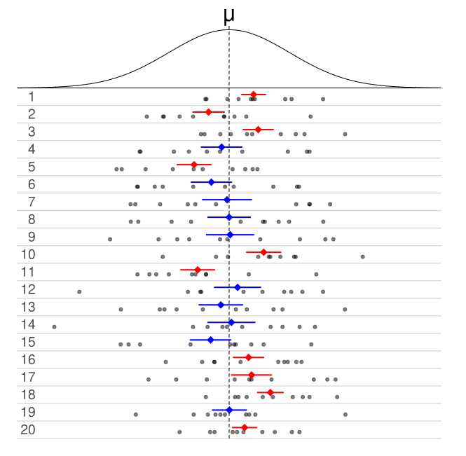

# Confidence Intervals

```{r, echo=FALSE}
rm(list = ls())
```

This module is based on Introduction to Probability for Data Science (Chan), Chapter 9.1 and 9.2. You can access the book for free at https://probability4datascience.com. Please note that I cover additional topics, and skip certain topics from the book. 

## Introduction

In Section \@ref(est), we use data from our sample to estimate parameters of a population. For example, we could use the sample mean systolic blood pressure of 750 randomly selected American adults to estimate the mean systolic blood pressure of all American adults. We also established that estimators such as the sample mean have randomness in them. If we were to obtain another random sample of 750 American adults, the sample mean blood pressure from this other sample is likely to be different from the original random sample. So is there uncertainty in our estimator due to random sampling. We also learned about ways to measure how "well" an estimator does in estimating the parameter, such as bias, variance, standard error, and mean-squared error of the estimator. 

In this section, we will introduce confidence intervals. Confidence intervals build on the ideas from Section \@ref(est): that estimators are random and we can quantify their uncertainty. The purpose of a confidence interval is to provide a range of plausible values for an unknown population parameter, based on a sample. A confidence interval not only provides the estimated value of the parameter, but also a measure of uncertainty associated with the estimation.

We will first cover confidence intervals for the mean and confidence intervals for the proportion, two of the most basic confidence intervals. These intervals are based on the fact that the distribution of their corresponding estimators, the sample mean and sample proportion, are known as long as certain conditions are met. You will notice that the general ideas in finding confidence intervals are pretty similar; confidence intervals for other estimators that have known distributions will be constructed similarly. In the last subsection of this module, we will learn about the bootstrap, which is used when the distribution of an estimator is unknown. 

## Confidence Interval for the Mean

### Randomness of Estimators

Suppose we are trying to estimate the mean systolic blood pressure of all American adults, by using the sample mean of 750 randomly selected American adults. The sample mean is an estimator for the population mean. We want to be able to report the value of the estimator, as well as our uncertainty about the estimator. A way to measure the uncertainty of an estimator is through the variance or standard error of the estimator. Larger values indicate a higher degree of uncertainty, as an estimator with larger variance means that the value of the estimator is likely to be different among random samples. 

The Monte Carlo simulations in Section \@ref(estprops) show that there is a distribution associated with an estimator. We will start with the sample mean, since its distribution is known (see Section \@ref(sampdistmean)). We will talk about the confidence interval for the mean first, before generalizing these ideas to other estimators with known distributions. 

### Randomness of Confidence Intervals

The **confidence interval** is a probability applied to the estimator $\bar{X}_n$. Instead of focusing on the estimated value of the sample mean and its variance, we construct a confidence interval for the mean that takes the form:

\begin{equation} 
I = \left(\bar{X}_n - \epsilon, \bar{X}_n + \epsilon \right).
(\#eq:8-CIbasic)
\end{equation}

Some terminology associated with intervals of the form in equation \@ref(eq:8-CIbasic):

- $\epsilon$ is often called the **margin of error**. (Yes that margin of error that you often see reported in elections polls). This value is a function of the standard error of the estimator, so it gives a measure of uncertainty of the estimated value. 

  - Remember that the uncertainty being measured is the uncertainty due to random sampling, not due to other sources of uncertainty such as not getting a representative sample, people lying, etc. As mentioned in earlier modules, other methods are used to handle such issues and belong to the field of survey sampling, which is very interesting and an active area of research. We will not get into these issues in this class.

- The value of $\bar{X}_n - \epsilon$ is often called the **lower bound** of the confidence interval. 

- The value of $\bar{X}_n + \epsilon$ is often called the **upper bound** of the confidence interval. 

- The value of $\bar{X}_n$ is often called the **point estimate** of the the population mean.

Equation \@ref(eq:8-CIbasic) is sometimes expressed as 

\begin{equation} 
\text{point estimate } \pm \text{ margin of error}.
(\#eq:8-CIbasic2)
\end{equation}

Indeed, a lot of confidence intervals take on the form expressed in equation \@ref(eq:8-CIbasic2), as long as the sampling distribution of the estimator is symmetric. Given the interval for the mean expressed in equation \@ref(eq:8-CIbasic), we ask what is the probability that the interval $I$ includes the true value of the parameter $\mu$, i.e. we want to evaluate

\begin{equation} 
P(\mu \in  I) = P(\bar{X}_n - \epsilon \leq \mu \leq \bar{X}_n + \epsilon).
(\#eq:8-CIprob)
\end{equation}

It is important to bear in mind that since the estimator, the sample mean $\bar{X}_n$ is a random variable, there will also be randomness in the interval $I$. The numerical values of the lower and upper bounds will change with a different random sample, since the value of $\bar{X}_n$ will change. 

The idea of the interval $I$ being random is represented in Figure \@ref(fig:8-CI) below:

```{r 8-CI, fig.cap = "Randomness of Confidence Interval. Picture from  https://en.wikipedia.org/wiki/Confidence_interval", echo = FALSE}

```

- The density curve in the top of Figure \@ref(fig:8-CI) represents the PDF of a random variable, that represents the distribution of some variable in the population that we wish to study. 
- Each row of dots represents the values of 10 randomly sampled data points from the PDF.
- The colored lines in each row represent the lower and upper bounds of a 50% confidence interval calculated from the sampled data points in the row.
- The colored dot in the center of the confidence interval represents $\bar{x}$ for the sampled data points in the row.
- The intervals in blue represent confidence intervals that contain the value of $\mu$, while the intervals in red represent confidence intervals that do not contain the value of $\mu$.

In Figure \@ref(fig:8-CI), we note that 50% of the confidence intervals capture the value of $\mu$, so the probability per equation \@ref(eq:8-CIprob) is 0.5. This matches with theory since each confidence interval in Figure \@ref(fig:8-CI) was computed at 50\% confidence. 

If we were to create 95% confidence intervals for each row in Figure \@ref(fig:8-CI), the upper and lower bounds of the intervals will be adjusted so that we will expect 19 of these 20 intervals to contain the value of $\mu$. 

This illustration gives us an interpretation of the probability associated with a confidence interval per equation \@ref(eq:8-CIprob): When we construct a 95\% confidence interval, there is a 95\% chance the random interval $I$ will contain the true value of the parameter. In other words, if we have 100 random samples and we construct 95\% confidence intervals based on each sample, we expect 95 of these intervals to contain the value of the parameter. 

The idea of the probability that the random interval $I$ captures the true parameter gives rise to the **confidence level**. The confidence level of a confidence interval is denoted by $1-\alpha$, i.e. if we construct an interval at 95\% confidence, $\alpha=0.05$. Equation \@ref(eq:8-CIprob) can be written as

\begin{equation} 
P(\bar{X}_n - \epsilon \leq \mu \leq \bar{X}_n + \epsilon) = 1 - \alpha.
(\#eq:8-CIalpha)
\end{equation}

We will then say $I$ is a $(1-\alpha) \times 100\%$ confidence interval, or $I$ is a confidence interval with confidence level of $(1-\alpha) \times 100\%$.

Now that we have established that confidence intervals are random and the definition of the confidence level, we are ready to go into the details of constructing the confidence interval for the mean.

### Constructing Confidence Interval for the Mean

We remind ourselves of the sampling distribution of the sample mean, $\bar{X}_n$, from Section \@ref(sampdistmean). There are a couple of conditions to consider:

1. $X_1, \cdots, X_n$ are i.i.d. from a normal distribution with finite mean $\mu$ and finite variance $\sigma^2$. Then $\bar{X}_n \sim N(\mu, \frac{\sigma^2}{n})$.

2. $X_1, \cdots, X_n$ are i.i.d. from any distribution with finite mean $\mu$ and finite variance $\sigma^2$, and if $n$ is large enough, then $\bar{X}_n$ is approximately $N(\mu, \frac{\sigma^2}{n})$. 

If either of these conditions are met, then the distribution of $\bar{X}_n$ after standardization is either a standard normal or approaches a standard normal distribution, so $\frac{\bar{X}_n - \mu}{\frac{\sigma}{\sqrt{n}}} = \frac{\bar{X}_n - \mu}{\sqrt{Var(\bar{X})}} = \frac{\bar{X}_n - \mu}{SE(\bar{X}_n)}$ is either standard normal or approximately standard normal when $n$ is large enough. 

To simplify the notation as it pertains to the confidence interval for the mean, we will let $\hat{Z} = \frac{\bar{X}_n - \mu}{SE(\bar{X})}$, so $\hat{Z}$ is standard normal or approximately standard normal. $\hat{Z}$ can be called the **standardized version of the sample mean** or a **standardized score**.

#### Critical Value

We perform some math operations on equation \@ref(eq:8-CIalpha) to see how we can construct a confidence interval for the mean:

\begin{equation} 
\begin{split}
P(\bar{X}_n - \epsilon \leq \mu \leq \bar{X}_n + \epsilon) &= 1 - \alpha \\
\implies P(|\bar{X}_n - \mu| \leq \epsilon) &= 1 - \alpha \\
\implies P \left(|\hat{Z}| = |\frac{\bar{X}_n - \mu}{SE(\bar{X}_n)}|  \leq \frac{\epsilon}{SE(\bar{X}_n)} = z^{*} \right) &= 1 - \alpha \\
\implies P(|\hat{Z}| \leq z^{*}) &= 1 - \alpha \\
\implies P(-z^{*} \leq \hat{Z} \leq z^{*}) &= 1 - \alpha.
\end{split}
(\#eq:8-CIcrit)
\end{equation}

In equation \@ref(eq:8-CIcrit), $z^*$ is called the **critical value**. So we can see how it is related to the margin of error, $\epsilon$: the margin of error is the critical value multiplied by the standard error of the estimator (which in this case is the standard error of the sample mean since we are constructing the confidence interval for the mean). 

In words, equation \@ref(eq:8-CIcrit) says that we want to find the critical value $z^*$ so that the probability that a standardized score is between $-z^*$ and $z^*$ is $1 - \alpha$. Visually, this probability is displayed in Figure \@ref(fig:8-crit) below when $\alpha=0.05$. We want to find the values on the horizontal axis so that the blue shaded area corresponds to a value of 0.95 (recall that area under a PDF represents probability).

```{r 8-crit, fig.cap="Finding Critical Value with 95% Confidence", echo=FALSE}
curve(dnorm, from = -4, to = 4, main = "PDF for Standard Normal", ylab="Density", xlab="")

colorArea <- function(from, to, density, ..., col="blue", dens=NULL){
    y_seq <- seq(from, to, length.out=500)
    d <- c(0, density(y_seq, ...), 0)
    polygon(c(from, y_seq, to), d, col=col, density=dens)
}

colorArea(from=-1.96, to=1.96, dnorm)
```

We continue working with equation \@ref(eq:8-CIcrit) to see how we obtain the value of $z^*$, as long as either of the two conditions for the sampling distribution of $\bar{X}_n$ to be known are met:

\begin{equation} 
\begin{split}
P(-z^{*} \leq \hat{Z} \leq z^{*}) &= P(\hat{Z} \leq z^{*}) - P(\hat{Z} \leq -z^{*}) \\
                                  &= \Phi(z^{*}) - \Phi(-z^{*}) = 1 - \alpha.
\end{split}
(\#eq:8-CIcrit2)
\end{equation}

where $\Phi(z) = P(\hat{Z} \leq z)$ is the CDF of a standard normal. Due to the symmetry of the standard normal, $\Phi(-z^{*}) = 1- \Phi(z^{*})$, and we sub this into equation \@ref(eq:8-CIcrit2) and continue working with it to solve for $z^*$:

\begin{equation} 
\begin{split}
P(-z^{*} \leq \hat{Z} \leq z^{*}) &= 2 \Phi(z^*) - 1 = 1 - \alpha \\
\implies \Phi(z^*) &= 1 - \frac{\alpha}{2} \\
\implies z^* &= \Phi^{-1} \left(1 - \frac{\alpha}{2} \right)
\end{split}
(\#eq:8-CIcrit3)
\end{equation}

So $z^*$ is found by inverting the CDF of a standard normal evaluated at $1 - \frac{\alpha}{2}$. This quantity can be easily be found using R. For example, for 95\% confidence, $\alpha = 0.05$, so we type:

```{r}
alpha<-0.05
qnorm(1-alpha/2)
```

which tells us the critical value is 1.96 for 95\% confidence. 

Note: the `qnorm()` function was introduced in a bit more detail in Section \@ref(usingR), so feel free to go back to review.

View the video below that explains these steps in a bit more detail:

<iframe width="560px" height="320px" allowfullscreen="true" allow="autoplay *" title="Module 08: Critical Value" src="https://virginiauniversity.instructuremedia.com/embed/74aa9eff-5d3f-4c24-be5d-5798d93f7aa7" frameborder="0"></iframe>

*Thought question*: Can you show that the critical value for 96\% confidence is about 2.054? Can you show that the critical value for 98\% confidence is about 2.326? 


#### Confidence Interval for the Mean

We are now ready to put the pieces together to work on the confidence interval for the mean:

\begin{equation} 
\begin{split}
P(-z^{*} \leq \hat{Z} \leq z^{*}) &= P(-z^{*} \leq \frac{\bar{X}_n - \mu}{SE(\bar{X}_n)} \leq z^{*}) \\
                                  &= P\left(-z^{*}SE(\bar{X}_n) \leq \bar{X}_n - \mu \leq z^{*}SE(\bar{X}_n)\right) \\
                                  &= P\left(\bar{X}_n - z^{*}SE(\bar{X}_n) \leq \mu \leq \bar{X}_n + z^{*}SE(\bar{X}_n)\right) \\
                                  &= P\left(\bar{X}_n - z^{*} \frac{\sigma}{\sqrt{n}} \leq \mu \leq \bar{X}_n + z^{*} \frac{\sigma}{\sqrt{n}}\right).
\end{split}
(\#eq:8-CImeanwork)
\end{equation}

Therefore, the $(1-\alpha) \times 100\%$ confidence interval for the mean is 

\begin{equation} 
\left( \bar{x}_n - z^{*} \frac{\sigma}{\sqrt{n}}, \bar{x}_n + z^{*} \frac{\sigma}{\sqrt{n}} \right).
(\#eq:8-CImean)
\end{equation}

View the video below that explains these steps in a bit more detail:

<iframe width="560px" height="320px" allowfullscreen="true" allow="autoplay *" title="Module 08: CI for Mean" src="https://virginiauniversity.instructuremedia.com/embed/a1569325-fe99-49d4-80ff-dd7c3967b450" frameborder="0"></iframe>

Again, the formula in equation \@ref(eq:8-CImean) is only valid if either of the two conditions in Section \@ref(sampdistmean) is met, i.e. either the data are originally normal, or if the sample size is large enough.

There are several rules of thumb that exist to assess if the "sample size is large enough" (usually at least 25 or 30 is suggested). However, as we mentioned in Section \ref@(considerCLT), there is no fixed answer to this question. It depends on the distribution of the data. In general, the more skewed data is, $n$ needs to be larger for the approximation to work.

#### Coverage Probability {#CP}

Figure \@ref(fig:8-CI) illustrates the concept of **coverage probability**. 20 random samples were drawn, and corresponding 50% confidence intervals were constructed, and we find that 10 out of 20 of these intervals contained the true value of the parameter. The coverage probability is 50%, since 10 out of 20 intervals contained the true value value of the parameter. This matches the confidence level of 50%. The coverage probability should match the confidence level, if not, the distribution that we used for the sampling distribution of the estimator is probably incorrect. 

So in general, for confidence intervals constructed at $(1-\alpha) \times 100\%$ confidence, the coverage probability of the confidence intervals should be $(1-\alpha) \times 100\%$. 

We run a Monte Carlo simulation to show that the coverage probability of confidence intervals for the mean using equation \@ref(eq:8-CImean). The code below does the following:

- Simulate $X_1, \cdots, X_{10}$ i.i.d. from standard normal.
- Calculate 95% confidence interval for the mean using \@ref(eq:8-CImean).
- Assess if the calculated confidence interval contains 0, since the true mean is 0 (we simulated data from standard normal)
- Repeat these steps for a total of 10 thousand replicates.
- Count the number of confidence intervals that contain 0, and divide by the number of replicates. This value estimates the coverage probability.
  - If we did things correctly (correct use of formula, correct distribution for estimator), this estimated coverage probability should be close to the confidence level of 95%.

```{r}
n<-10 ## sample size of each random sample
alpha<-0.05
reps<-10000 

CIs<-array(0, c(reps,2)) ##store lower and upper bounds of CI
contain<-array(0, reps) ##store assessment if the true mean is contained within bounds of CI

set.seed(100)
for (i in 1:reps)
  
{
  
  X<-rnorm(n) ##draw n data points from standard normal
  ##calculate elements needed for CI of mean
  xbar<-mean(X) ##sample mean
  SE<-1/sqrt(n) ##SE of sample mean
  crit<-qnorm(1-alpha/2) ##critical value
  ME<-crit*SE ##margin of error
  CIs[i,1]<-xbar-ME ##lower bound of CI
  CIs[i,2]<-xbar+ME ##upper bound of CI
  contain[i]<-CIs[i,1]<0 & CIs[i,2]>0 ##assess if CI contains 0, the true mean
  
}

##find proportion of CIs from random samples that contain 0, should be close to 1 - alpha
sum(contain)/reps 
```
The estimated coverage probability based on 10 thousand replicates is 94.93%, very close to the confidence level of 95%. This informs us that the distribution assumed for the sample mean was correct. 

View the video below which explains the Monte Carlo simulation in a bit more detail:

<iframe width="560px" height="320px" allowfullscreen="true" allow="autoplay *" title="Module 08: Coverage Probability" src="https://virginiauniversity.instructuremedia.com/embed/5e91e2c8-f648-4f9a-9831-4ac51f666f90" frameborder="0"></iframe>

#### Worked Example 

On the basis of extensive tests, the yield point of a particular type of mild steel reinforcing bar is known to be normally distributed with $\sigma=100$ pounds. The composition of the bar has been slightly modified, but the modification is not believed to have affected either the normality or the value of $\sigma$. If a random sample of 25 modified bars resulted in a sample average yield point of 8439 pounds, compute a 90% CI for the true average yield point of the modified bars.

From the question, we summarize the information as:

- $n = 25$,
- $\bar{x} = 8439$,
- $\sigma = 100$,
- $\alpha = 0.1$, so $z^*$ is found using `qnorm(1-0.1/2)` which is 1.644854. 

Since we are assuming the distribution of the yield points to be normally distribution, the sample means will be normally distributed regardless of the sample size, so we can proceed computing the confidence interval for the true average yield point using equation \@ref(eq:8-CImean):

$$
\left( 8439 - 1.644854 \frac{100}{\sqrt{25}} , 8439 + 1.644854 \frac{100}{\sqrt{25}} \right).
$$
Working everything out, we get (8406.103, 8471.891). 

Interpreting the CI: There is 90\% probability that the random interval (8406.103, 8471.891) will include the true average yield point of modified bars.

What else can we say from the confidence interval?

- Values outside the confidence interval are considered to be "ruled out" as plausible values of the parameter. So if we wanted to assess if the average yield point of modified bars is 8000 pounds, our interval does not support this claim, since the value of 8000 lies outside the interval. We can say our data do not support the claim that the average yield point of modified bars is 8000 pounds. 

- Values inside the confidence interval are considered to be plausible values of the parameter. Any value inside the interval is considered plausible. A common mistake will be to specify a certain value in the interval, and conclude that the parameter is equal to that specific value. For example, it will be a mistake to say that since the value 8410 lies inside the interval, the interval supports the claim that the average yield point of modified bars is 8410 pounds. This is because other values in the interval are still considered plausible. 

  - In such a situation, we will say that our data do not support the claim that the average yield point of modified bars is different from 8410 pounds, since 8410 lies inside the interval. We cannot rule out the value of 8410.

### Confidence Interval for the Mean Using t Distribution {#CImeant}

You may have noticed that when we calculate a confidence interval for the mean using equation \@ref(eq:8-CImean), it involves knowing the value of $\sigma^2$, the variance of the variable in the population, which is a parameter. However, we have mentioned that the whole purpose of estimation and confidence intervals is to estimate the value of unknown parameters and quantify the uncertainty associated with the estimate. The numerical value of parameters are very rarely known! So how could we actually use equation \@ref(eq:8-CImean) in real life?

The solution to this is fairly intuitive, we use the sample variance $s^2 = \frac{1}{n-1} \sum_{i=1}^n (x_i - \bar{x})^2$ to estimate $\sigma^2$. What is less intuitive is that the distribution of the standardized version of the sample mean changes.

We had earlier mentioned that if certain conditions are met, then $\hat{Z} = \frac{\bar{X}_n - \mu}{\frac{\sigma}{\sqrt{n}}}$ is either standard normal or approximately standard normal. If we estimate $\sigma^2$ with $s^2$ and replace $\sigma$ with $s$ in $\hat{Z}$, we get a new random variable

\begin{equation} 
T =  \frac{\bar{X}_n - \mu}{\frac{s}{\sqrt{n}}} = \frac{\bar{X}_n - \mu}{SE(\bar{X}_n)},
(\#eq:8-tstat)
\end{equation}

where $SE(\bar{X}_n)$ is now $\frac{s}{\sqrt{n}}$. It turns out that $T$ follows another well-known distribution, called the **$t$ distribution with $n-1$ degrees of freedom**. The PDF of a $t$ distribution is pretty long and is not needed for this course (you can look it up on your own), but we take a look at the plot of its PDF and compare it with the plot of the PDF of a standard normal, in Figure \@ref(fig:8-t) below. 

```{r 8-t, fig.cap="Plot of PDF for Z and t Distributions"}
##plot PDF from -5 to 5
x <- seq(-5, 5, length.out = 100)

##plot the standard normal 
curve(dnorm(x), from = -5, to = 5, lwd = 2,
      ylab = "Density", xlab = "x", 
      main = "Pdf of Standard Normal and t-Distribution")

##overlay the t-distribution with 1 and 10 degree of freedom
curve(dt(x, df = 1), from = -5, to = 5, col = "red", lwd = 2, add = TRUE)
curve(dt(x, df = 10), from = -5, to = 5, col = "blue", lwd = 2, add = TRUE)
legend("topright", legend = c("Standard Normal", "t-Distribution (df=1)", "t-Distribution (df=10)"),
       col = c("black", "red", "blue"), lty = 1, lwd = 2)
```

From Figure \@ref(fig:8-t), we note a few things about the $t$ distribution:

- It is centered at 0, just like a standard normal. 
- It is also symmetric and bell-shaped, just like a standard normal. 
- It has heavier tails than the standard normal. In other words, extreme values (large or small) have slightly higher probabilities of occurring for a $t$ distribution than for a standard normal. 
- As the degree of freedom increases, the $t$ distribution gets closer to a standard normal. Notice how the blue curve is closer to the standard normal curve in black, than the red curve is with the black curve. In fact, one can show mathematically that the PDF of a $t$ distribution converges to the PDF of a standard normal as the degree of freedom increases to infinity. 

How does the fact that we are working with a $t$ distribution instead of a standard normal affect how we calculate a confidence interval for the mean? How does equation \@ref(eq:8-CImean) change? We replace $\sigma^2$ with $s^2$ and $z^*$ with $t^*$. The critical value is now denoted by $t^*$ to emphasize that it is based on the $t$ distribution.

As an example to find the critical value of a $t$ distribution with 10 degrees of freedom and with 95% confidence:

```{r}
alpha<-0.05
qt(1-alpha/2, 10) ##supply percentile first, then value of df
```

Therefore, the $(1-\alpha) \times 100\%$ confidence interval for the mean , when $\sigma^2$ is unknown, is

\begin{equation} 
\left( \bar{x}_n - t^{*} \frac{s}{\sqrt{n}}, \bar{x}_n + t^{*} \frac{s}{\sqrt{n}} \right).
(\#eq:8-CImeant)
\end{equation}

Again, the formula in equation \@ref(eq:8-CImeant) is only valid if either of the two conditions in Section \@ref(sampdistmean) is met, i.e. either the data are originally normal, or if the sample size is large enough.

#### Worked Example

A sample of 66 obese adults was put on a low-carbohydrate diet for a year. The average weight loss was 11 lb and the
standard deviation was 19 lb. Calculate a 99% confidence interval for the true average weight loss. Does the confidence interval provide support for the claim that the mean weight loss is positive?

From the question, we summarize the information as:

- $n = 66$,
- $df = n-1 = 65$
- $\bar{x} = 11$,
- $s = 19$,
- $\alpha = 0.01$, so $t^*$ is found using `qt(1-0.01/2, 65)` which is 2.653604. 

We have no information about the distribution of the data. However, the sample size is 66, which is usually large enough to use the CLT, so we can use equation \@ref(eq:8-CImeant):

$$
\left( 11 - 2.653604 \frac{19}{\sqrt{66}} , 11 + 2.653604 \frac{19}{\sqrt{66}} \right)
$$
which gives (4.793914, 17.20609). Since the entire confidence interval lies above 0, our data support the claim that the mean weight loss is positive. 

#### Confidence Interval for Mean Using $t$ VS Using $z$

A couple of interesting things to note with critical values associated with the $t$ distribution: 

- For the same level of confidence, $t^*$ will never be smaller than $z^*$. 

*Thought question*: Can you give an intuitive explanation as to why? Using Figure \@ref(fig:8-t) may be helpful.
  
- The value of $t^*$ gets closer to the value of $z^*$ as the degree of freedom gets larger. This implies that $t^*$ is approximately equal to $z^*$ for large sample sizes. 

Recall that the margin of error is the critical value multiplied by the standard error of the estimator. So margin of errors tend to be larger when $\sigma^2$ is unknown. It should make intuitive sense that we have a higher degree of uncertainty since we have an additional parameter to estimate.

Since the margin of error tends to be larger when $\sigma^2$ is unknown, it means the **width** of the confidence interval for the mean tends to be wider when $\sigma^2$ is unknown. The width of a confidence interval is the difference between its upper and lower bound, or twice the margin of error. 

*Thought question*: Try running the Monte Carlo simulation in Section \@ref(CP), but now use the sample variance instead of the population variance. Find the coverage probabilities of the confidence interval if we use the correct formula in equation \@ref(eq:8-CImeant), and if we use a $z^*$ as the critical value with the sample variance.

#### Degrees of Freedom {#df}

An intuitive explanation of degrees of freedom is the number of independent pieces of information that can take on any numerical value, when estimating a parameter.

Generally speaking, we lose 1 degree of freedom for every equation that must be satisfied. In the context of estimating the population mean using the sample mean, we must always satisfy the equation $\bar{x} = \frac{\sum_{i=1}^n x_i}{n}$, so we lose 1 degree of freedom from an original set of $n$ observations, so the degree of freedom is $n-1$ when calculating the CI for the mean. 

View the video below that explains the idea behind degrees of freedom with a toy example:

<iframe width="560px" height="320px" allowfullscreen="true" allow="autoplay *" title="Module 08: Degrees of Freedom" src="https://virginiauniversity.instructuremedia.com/embed/d231fbbc-16a4-4a0d-85c0-e5ae3db0dee2" frameborder="0"></iframe>

### Factors Affecting Precision of Confidence Intervals

The width of a confidence interval is used as a measure of **precision**. A wider width indicates less precision and a higher degree of uncertainty with our estimate. Narrower widths are preferred, as we are able to narrow the range of plausible values for the unknown parameter by ruling out more values. The factors (that are within the researcher's control) affecting the width of a confidence interval are the items used in calculating the margin of error:

- The level of confidence, $1 - \alpha$: The width increases as the level of confidence increases.

*Though question*: Can you use Figure \@ref(fig:8-crit) to help you explain the width increases as level of confidence increases?

- The sample size, $n$: As $n$ increases, the width decreases. This implies that we have more precision, and a lower degree of uncertainty, with larger sample sizes. 

Other factors such as whether $\sigma^2$ is unknown or not, and the value of the variance, are usually not controllable by the researcher. 

## Confidence Interval for the Proportion

Next, we will go over the confidence interval for the proportion. This is another common confidence interval. The sample proportion is an estimator for the population proportion. 

Proportions are used to summarize categorical variables, whereas means are used to summarize quantitative variables. One way to decide if the variable is categorical or quantitative is to ask whether arithmetic operations make sense when performed on the variable. If such operations make sense, the variable is quantitative, if not, the variable is categorical. Consider the following two research questions:

- We measure the systolic blood pressure of a sample of American adults. The variable is quantitative, since the answer is a numeric value where arithmetic operations can be applied. We then calculate the average systolic blood pressure of American adults. So we can work on a confidence interval for the mean, using equation \@ref(eq:8-CImeant).

- We ask a sample of voters whether they support a particular candidate. The variable is categorical, since the answer is yes or no, and we cannot apply arithmetic operations to the answer. We then calculate the proportion of voters who support the candidate. So we need a confidence interval for the proportion. 

### Sampling Distribution of Sample Proportions {#sampdistprops}

We can use the Central Limit Theorem (CLT) to approximate the sampling distribution of sample proportions. A sketch of how to derive this sampling distribution is as follows:

- Let $X_1, \cdots, X_n$ be i.i.d. Bernoulli with success probability p. Using equations \@ref(eq:3-bern-EX) and \@ref(eq:3-bern-var), we know that $E(X_i) = p$ and $Var(X_i) = p(1-p)$.

- Let $S = X_1 + \cdots + X_n = \sum_{i=1}^n X_i$ denote the number of successes in a sample of size $n$. Using properties of expectations and variances, we know that $E(S) = np$ and $Var(S) = np(1-p)$.

- The sample proportion, $\hat{p}$, is just the number of successes divided by the sample size, so $\hat{p} = \frac{S}{n} = \frac{\sum_{i=1}^n X_i}{n} = \bar{X}_n$. Therefore, using property of expectations and variances, we know that $E(\hat{p}) = p$ and $Var(\hat{p}) = \frac{p(1-p)}{n}$.

- The CLT informs us if $n$ is large enough, then $\hat{p}$ is approximately $N\left(p, \frac{p(1-p)}{n}\right)$. Therefore, the distribution of $\hat{p}$ after standardization is approximately standard normal, i.e. the standardized score $\hat{Z} = \frac{\hat{p}-p}{\sqrt{\frac{p(1-p)}{n}}}$ is approximately standard normal. 

View the video below for a more detailed explanation of the sampling distribution of sample proportions:

<iframe width="560px" height="320px" allowfullscreen="true" allow="autoplay *" title="Module 08: Sampling Distribution of Sample Proportion" src="https://virginiauniversity.instructuremedia.com/embed/84d115c1-bacb-429f-b777-560eda3f4e6b" frameborder="0"></iframe>

### Constructing Confidence Interval for the Proportion

A lot of the concepts and math from the confidence interval for the mean carry over to the confidence interval for the proportion. We will skip the math for the confidence interval for the proportion (although you should be able to derive this result by following the steps and adjusting). 

The $(1-\alpha) \times 100\%$ confidence interval for the proportion is

\begin{equation} 
\left( \hat{p} - z^{*} \sqrt{\frac{\hat{p}(1-\hat{p})}{n}}, \hat{p} + z^{*} \sqrt{\frac{\hat{p}(1-\hat{p})}{n}} \right).
(\#eq:8-CIprop)
\end{equation}

From equation \@ref(eq:8-CIprop), we can see that

- The point estimate is $\hat{p}$.
- The standard error of $\hat{p}$ is $SE(\hat{p}) = \sqrt{\frac{\hat{p}(1-\hat{p})}{n}}$.
- The margin of error is $z^{*} \sqrt{\frac{\hat{p}(1-\hat{p})}{n}}$.

The framework of confidence intervals usually takes on the form given in equation \@ref(eq:8-CIbasic2): we add and subtract the margin of error to and from the point estimate. The margin of error is the critical value multiplied by the standard error of the estimator. We see the confidence intervals for the mean and proportion take on this framework, and so do most confidence intervals of other estimators, as long as the sampling distribution of the estimator is symmetric. 

Note: equation \@ref(eq:8-CIprop) is based on proportions, and not percentages. After calculating the confidence interval for the proportion, reporters often convert these values to percentages by multiplying them by a hundred. 

From equation \@ref(eq:8-CIprop), we can also see that we have the factors that affect the width of the confidence interval for the proportion is the same as the confidence interval for the mean. 

#### Conditions for Confidence Interval for the Proportion

We wrote that if $n$ is large enough, the CLT informs us that the sample proportion $\hat{p}$ can be approximated by a normal distribution. How large is large enough? Again, various rules of thumb are recommended, and they usually follow along the lines of needing at least a certain number of successes, $n\hat{p}$, and failures, $n(1-\hat{p})$ in our sample. Values of at least 5 or 10 are usually recommended. Just bear in mind that the approximation works better as the number of successes and failures, $n\hat{p}$ and $n(1-\hat{p})$, increases.

#### Worked Example

The Texas College Tobacco Project survey administered in 2016 found that in a sample of 5767 undergraduates ages 18–25, 525 said they had used electronic cigarettes at least once during the previous 30 days. Find a 95% confidence interval for the proportion of all students in the population sampled who used e-cigarettes during the previous 30 days. Also report the margin of error. Do the data support the claim that more than 5% of students in the population used e-cigarettes during the previous 30 days?

From the question, we summarize the information as:

- $n = 5767$,
- $\hat{p} = \frac{525}{5767}$,
- $\alpha = 0.05$, so $z^*$ is found using `qnorm(1-0.05/2)` which is 1.959964. 

The number of "successes" is 525 and the number of "failures" is $5767-525 = 5242$. These are both a lot larger than 10, so we can work with sampling distribution of $\hat{p}$ and calculate a confidence interval using equation \@ref(eq:8-CIprop):

$$
\left( \frac{525}{5767} - 1.959964 \sqrt{\frac{\frac{525}{5767}(1-\frac{525}{5767})}{5767}} , \frac{525}{5767} + 1.959964 \sqrt{\frac{\frac{525}{5767}(1-\frac{525}{5767})}{5767}} \right)
$$

which gives (0.08361097, 0.09845943), with margin of error 0.007424228. The data support the claim that more than 5% of students in the population used e-cigarettes in the previous 30 days, since the entire interval lies above 0.05. 

There is a 95% probability that the random interval (0.08361097, 0.09845943) contains the true proportion of students in the population used e-cigarettes in the previous 30 days.

### Minimum Sample Size

Fairly often, researchers want to know what sample size needed in order to guarantee a margin of error that is no more than some specific value, as they want to guarantee a certain level of precision in their report. Mathematically, we want to set $z^{*} \sqrt{\frac{\hat{p}(1-\hat{p})}{n}} \leq M$ where $M$ denotes some value of the margin of error that needs to be guaranteed.

While we will not know the value of $\hat{p}$ before collecting data, we mentioned in Section \@ref(bernprop) that the value of $p(1-p)$ is maximized at $p=\frac{1}{2}$. This implies that the $SE(\hat{p})$ is maximized at $\hat{p} = \frac{1}{2}$. As long as the $M$ is satisfied when $\hat{p} = \frac{1}{2}$, $M$ will be satisfied for any value of $\hat{p}$. So subbing in $\hat{p} = \frac{1}{2}$ into $z^{*} \sqrt{\frac{\hat{p}(1-\hat{p})}{n}} \leq M$, we have

\begin{equation} 
\begin{split}
z^{*} \sqrt{\frac{\hat{p}(1-\hat{p})}{n}} & \leq M \\
\implies z^* \sqrt{\frac{\frac{1}{2}\frac{1}{2}}{n}}  & \leq M \\
\implies \left(\frac{z^*}{2M}\right)^2 & \leq n.
\end{split}
(\#eq:8-minsamp)
\end{equation}

Note: always be sure to round up to the nearest whole number, after working out the LHS of the inequality \@ref(eq:8-minsamp), to guarantee that your margin of error is no more than $M$. 

#### Worked Example

A state legislator wishes to survey residents of her district to see what proportion of the electorate is aware of her position on using state funds to pay for abortions. What sample size is necessary if the 95% CI for p is to have a margin of error that is no more than 3 percentage points?

Using the inequality \@ref(eq:8-minsamp), 

$$
\begin{split}
\left(\frac{1.959964}{2 \times 0.03}\right)^2 \leq n \\
1067.072 \leq n.
\end{split}
$$
So she will need to sample at least 1068 residents to guarantee a margin of error that is no more than 3 percentage points.

## The Bootstrap

In the previous subsections, we work out the confidence interval of an estimator by using the framework in equation \@ref(eq:8-CIbasic2): we add and subtract the margin of error to and from the point estimate. The margin of error is the critical value multiplied by the standard error of the estimator. The critical value is based on the sampling distribution of the estimator. This framework requires us to know the sampling distribution and the standard error of the estimator.

However, there are estimators whose sampling distributions and standard errors are unknown, for example, the sample median. How can we construct confidence intervals for the median? Or how can we quantify our uncertainty of the sample median as an estimator of the population median? 

One idea could be to collect many random samples, compute the sample median from each sample, and create a density plot like we did in Monte Carlo simulations in Figure \@ref(fig:7-bias). However, this is not feasible in real life as we rarely have the time and money to go around obtaining many random samples. We are only able to work with the one random sample that we have. 

A method to work around these issues is the **bootstrap**. The bootstrap will enable us to:

- Estimate the standard error and variance of estimators if there are no known formulas for them.

- Construct confidence intervals for estimators with unknown sampling distributions and unknown formulas for their standard errors.

We can do these without having to collect data from many random samples. Before going into how the bootstrap works, we remind ourselves of how Monte Carlo simulations work in terms of finding the sampling distribution and standard errors of estimators.

### Estimating Sampling Distributions Using Many Random Samples

When using Monte Carlo simulations to estimate the sampling distribution of estimators (see the code that generated Figures \@ref(fig:7-bias) and \@ref(fig:7-consistent) as examples), we typically did the following:

1. Assume the data follow some known distribution with PDF $f_X$ and CDF $F_X$.

2. Simulate $n$ data points from this assumed distribution $K$ times, with $K$ being large, to obtain $K$ replicate datasets of size $n$ denoted by $\mathcal{X}^{1}, \cdots, \mathcal{X}^{K}$. (In a lot of my code $K$ is called `reps`).

3. For each dataset, calculate the value of the estimator $\hat{\Theta}$. Since we have $K$ datasets, we will have $K$ values for the estimators, denoted by $\hat{\Theta}^{1}, \cdots, \hat{\Theta}^{K}$.

4. We estimate the true mean of $\hat{\Theta}$ by taking the sample mean of $\hat{\Theta}^{1}, \cdots, \hat{\Theta}^{K}$.

5. We estimate the true variance of $\hat{\Theta}$ by taking the sample variance of $\hat{\Theta}^{1}, \cdots, \hat{\Theta}^{K}$. Square-rooting this value gives an estimate for the standard error of $\hat{\Theta}$.

Note: this step is a bit different than what is described in the book. In the book, the author uses the population variance, instead of the sample variance. The population variance divides the sum of the squared deviations from the mean by $K$, while the sample variance divides by $K-1$. I have seen some authors divide by $K$, and others divide by $K-1$. The `var()` function in R calculates the sample variance, so I will admit that there is a level of convenience to use the sample variance so I can use an R function. $K$ needs to be large for the bootstrap to work well, so the end result is the numerical values are very close to each other. 

6. We create a density plot of $\hat{\Theta}^{1}, \cdots, \hat{\Theta}^{K}$ to estimate the sampling distribution of $\hat{\Theta}$.

As written earlier, the problem with applying this idea to an estimator that has an unknown sampling distribution is that we do not know its associated PDF $f_X$ and CDF $F_X$. So we cannot carry out the steps listed. What the bootstrap does is to mimic these steps, when we only have access to data from one random sample. Next, we describe the steps that are carried out in the bootstrap. Pay attention to the similarities and differences in these steps with the steps above. 

### The Bootstrap Algorithm

Instead of simulating $K$ replicate datasets from an assumed distribution, we simulate $K$ replicate datasets by sampling, **with replacement**, $n$ data points from the original dataset. The "with replacement" term is key: it means that when a data point is sampled, it is returned to the original dataset and it can be sampled again.

See the video below for a visual representation of sampling with replacement:

<iframe width="560px" height="320px" allowfullscreen="true" allow="autoplay *" title="Module 08: Sampling with Replacement" src="https://virginiauniversity.instructuremedia.com/embed/7e81e93d-dd67-4034-9823-fb6a42135dcb" frameborder="0"></iframe>

Let $\mathcal{X}$ denote the original dataset with $n$ observations. Let $\hat{\theta}$ denote the value of the estimator from the original dataset. 

1. Synthesize $K$ bootstrapped datasets $\mathcal{Y}^{(1)}, \cdots, \mathcal{Y}^{(K)}$ where each bootstrapped dataset is derived by sampling $n$ data points from the original dataset, with replacement. 
2. For each dataset, calculate the value of the estimator $\hat{\Theta}$. Since we have $K$ bootstrapped datasets, we will have $K$ values for the estimators, denoted by $\hat{\Theta}^{(1)}, \cdots, \hat{\Theta}^{(K)}$.

3. We estimate the true mean of $\hat{\Theta}$ by taking the sample mean of $\hat{\Theta}^{(1)}, \cdots, \hat{\Theta}^{(K)}$. This value is denoted by $M_b(\hat{\Theta})$.

4. We estimate the true variance of $\hat{\Theta}$ by taking the sample variance of $\hat{\Theta}^{(1)}, \cdots, \hat{\Theta}^{(K)}$. This value is denoted by $V_b(\hat{\Theta})$, which we call the bootstrap variance of the estimator. Square-rooting $V_b(\hat{\Theta})$ gives an estimate for the standard error of $\hat{\Theta}$, denoted by $SE_b(\Theta)$. If $K$ is large enough, $V_b(\hat{\Theta})$ will approximate the true variance of the estimator.

Note: see the note in step 5 in the previous subsection. The same note applies here. 

5. We can create a density plot of $\hat{\Theta}^{(1)}, \cdots, \hat{\Theta}^{(K)}$ to estimate the sampling distribution of $\hat{\Theta}$. If $K$ is large enough, this density plot will approximate the true PDF $f_X$ well. 

Comparing this algorithm with Monte Carlo simulations, the main differences are:

- With the bootstrap, we do not assume any distribution for the original data. With Monte Carlo simulations, we do make an assumption on the distribution for the original data.

- The $K$ datasets are produced slightly differently. For the bootstrap, they are synthesized by sampling with replacement $n$ data points from the original dataset of size $n$. With Monte Carlo simulations, we draw $n$ data points from its assumed distribution. 

The math that proves the bootstrap works is beyond the level of this class, although it is freely available online. 

The bootstrap variance of an estimator, $V_b(\hat{\Theta})$, tends to work better as $K$ increases and as $n$ increases.

### Confidence Intervals using the Bootstrap

The bootstrap $(1-\alpha) \times 100\%$ confidence interval for $\theta$ is

\begin{equation} 
\left( 2 \hat{\theta} - \hat{\theta}_{1-\alpha/2}^*, 2 \hat{\theta} - \hat{\theta}_{\alpha/2}^* \right), 
(\#eq:8-CIboot)
\end{equation}

where $\hat{\theta}_{\beta}^*$ is the $\beta \times 100$th percentile of $\hat{\Theta}^{(1)}, \cdots, \hat{\Theta}^{(K)}$, the $K$ numerical values of the estimator from each bootstrapped sample. 

You may notice that the confidence interval in equation \@ref(eq:8-CIboot) does not fit the general framework given in equation \@ref(eq:8-CIbasic2). This is because the sampling distribution of the estimator may not be symmetric.

The math that derives this confidence interval is beyond the level of this class, although it is freely available online.

The bootstrap confidence interval tends to work better as $K$ increases and as $n$ increases.

### Worked Example

We have data on 400 credit card customers. A density plot of their credit limits is shown below:

```{r 8-credit, fig.cap="Density Plot of Credit Limits"}
library(ISLR2)
Data<-ISLR2::Credit$Limit
plot(density(Data), xlab="Credit Limit", main="Density Plot of Credit Limits")
```

The density plot in Figure \@ref(fig:8-credit) informs us that the values of credit limits is skewed, so the median is a better measure of centrality for credit limits. We wish to estimate the population median credit limit, give a measure of uncertainty, as well as report a 95% confidence interval for the median credit limit. Since the sampling distribution of the sample median is unknown, we use the bootstrap:

```{r}
##get sample size
n<-length(Data)

K<-1000 ##Number of bootstrap samples
set.seed(77)

##the sample function, with replace=TRUE, samples with replacement. 
##The replicate function repeats the sample function K times
boot.samples<-replicate(K,sample(Data,n,replace=TRUE))
##Each column in boot.samples represents each bootstrap sample

##find the sample median of each column, since each column represents a bootstrap sample
boot.medians<-apply(boot.samples,2,median)

##bootstrap SE of the median is just the SD of the sample medians from each bootstrap sample
sd(boot.medians)
##bootstrap variance of the median is just the variance of the sample medians from each bootstrap sample
var(boot.medians)

##find bootstrap CI
alpha<-0.05

##median from original sample
orig.median<-median(Data)
orig.median

##lower and upper bound of the CI
2*orig.median-quantile(boot.medians,c(1-alpha/2,alpha/2))


```

We report the following:

- The sample median is \$4622.5.
- The standard error of the sample median is \$152.0525.
- The 95% confidence interval for the median credit limit is (4380.000, 4948.525). There is 95% probability that the true population median credit limit lies in the random interval between \$4380 and \$4948.525.

View the video below that explains the functions used in the code:

<iframe width="560px" height="320px" allowfullscreen="true" allow="autoplay *" title="Module 08: Code for Bootstrap" src="https://virginiauniversity.instructuremedia.com/embed/14a288a6-29e6-4bc3-aa1b-39ea2959c85d" frameborder="0"></iframe>
