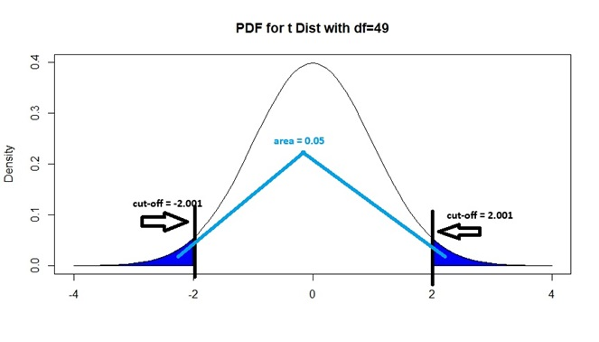
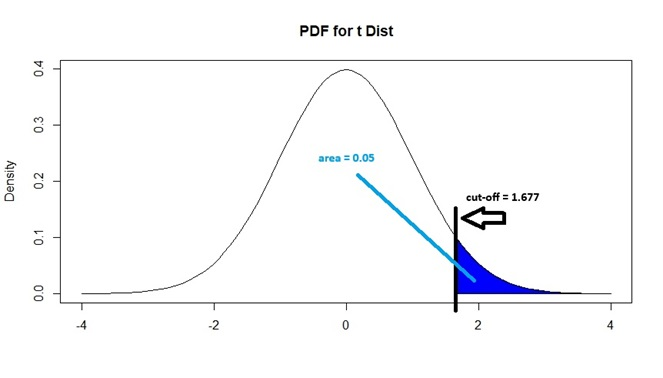

# Hypothesis Testing

```{r, echo=FALSE}
rm(list = ls())
```

This module is based on Introduction to Probability for Data Science (Chan), Chapter 9.3. You can access the book for free at https://probability4datascience.com. Please note that I cover additional topics.

## Introduction

Consider this scenario: you are conducting clinical trials to assess whether a new vaccine is more effective than existing vaccines. Suppose the efficacy of existing vaccines on a certain disease is 80%, and you conduct clinical trials on 30 patients, and the new vaccine is effective on 25 patients. How strong is this result in trying to prove that the new vaccine is more effective than existing vaccines? Questions like these lead to hypothesis testing.

In previous modules, we have established the fact that estimators are likely to deviate from the value from their corresponding parameter, just due to random sampling. Confidence intervals allow us to provide a measure of uncertainty over our estimator as well as a range of plausible values for the parameter, using concepts regarding the sampling distribution of estimators. These concepts can also be used to assess whether our observed value for the estimator is different enough from a potential value of the parameter that random sampling alone is unlikely to be the only reason for the difference. Once this assessment is done, we then want to make a conclusion and decision about the unknown parameter. This is the big picture idea behind hypothesis testing. **Hypothesis testing** is a method for making a systematic decision with statistical guarantees.

Hypothesis testing typically has the following steps:

1. State a hypothesis, based on the research question.
2. Assume the hypothesis is true, and then compute a metric that measures how much our observed data deviates from the assumed hypothesis.
3. Compare the metric with some sort of threshold to assess if our observed data deviates "far enough" from the assumed hypothesis, and then make a decision. 

For ease of exposition, we will introduce these ideas in the framework of the hypothesis test for the mean. We then show how the framework applies in two other situations: hypothesis test for the proportion, and goodness of fit tests which are used to assess if our data is consistent with a certain distribution or not. 

A hypothesis is a statement which we assess whether is is true or not using our observed data. In the framework of hypothesis testing, we state two competing hypotheses:

- The first hypothesis is the **null hypothesis**. This is normally the "status quo".

- The other hypothesis is the **alternative hypothesis**. This can be viewed as a statement that is "opposite" of the null hypothesis. 

The book presents these hypotheses and hypothesis testing using a court trial as an analogy. Defendants are assumed to be "innocent until proven guilty". The "null hypothesis" or status quo in this setting is that the defendant is innocent, and the "alternative hypothesis" is that the defendant is guilty. The prosecutor needs to then present evidence that contradicts the null hypothesis in order to prove guilt. The jurors, who come into the trial assuming the defendant is innocent, then assess how strong is the evidence presented: if its strength is beyond a certain threshold (i.e. beyond "reasonable doubt") then there is evidence to reject the null hypothesis and decide the defendant is guilty. However, if the evidence is not strong enough, there is not enough evidence to reject the null hypothesis and the jury renders a not guilty verdict. 

### Module Roadmap

- Section \@ref(testmean) covers the key concepts in hypothesis tests and how they apply to the mean.
- Section \@ref(testprop) shows how the concepts from the previous section carry over to the hypothesis test for the proportion. 
- Section \@ref(infcomments) provides comments on things to be mindful of when performing hypothesis tests in real life.
- Section \@ref(GOF) introduces another class of hypothesis tests: goodness of fit tests, which are used to assess how consistent our data are with some assumed distribution or model. 

## Hypothesis Test for the Mean {#testmean}

When testing for the mean, the parameter is the population mean. This happens when the variable we are measuring is quantitative. Consider this example: 

The term "Freshman 15" is an expression which says that college students gain 15 pounds (on average), in their first year in college. Researchers claim that with better education regarding healthier lifestyle habits, this gain is less than 15 pounds, on average. 

Next, we cover the first step in hypothesis testing: how to write the null and alternative hypothesis statements.

### Null and Alternative Hypotheses

Null and alternative hypotheses are statements regarding the value of a parameter. 

For the Freshman 15 example, the null hypothesis is that the average weight gain for first year college students is 15 pounds. This is denoted as $H_0: \mu = 15$, where $H_0$ denotes the null hypothesis. The alternative hypothesis is that the average weight gain for first year college students is less than 15 pounds. This is denoted as $H_a: \mu < 15$, where $H_a$ denotes the alternative hypothesis. 

#### Features of Null and Alternative Hypotheses

- Null and alternative hypotheses are always about a population parameter, not a sample estimator. The reason is that we want to make a claim about the population, based on data in our sample. Notice in the Freshman 15 example, that our null and alternative hypotheses are about the population mean $\mu$ and not the sample mean $\bar{x}$.

- The **null hypothesis** is a statement that says the parameter is equal to some specific value. Let $\mu_0$ denote this specific value. So we write $H_0: \mu = \mu_0$. In the Freshman 15 example, $\mu_0 = 15$.

- The **alternative hypothesis** is a statement against the null hypothesis. For the hypothesis test for the mean, there are a few possible alternative hypotheses. Which one we use is **driven by the research question**. The alternative hypothesis could say the the parameter is:

  - Different from some specific value, i.e. $H_a: \mu \neq \mu_0$. This is called a **two-sided alternative** since the parameter could be greater or less than some specific value. 
  
  - Greater than some specific value, i.e. $H_a: \mu > \mu_0$. This is called a **one-sided alternative** since the parameter is greater than some specific value.
  
  - Less than some specific value, i.e. $H_a: \mu < \mu_0$. This is also called a one-sided alternative since the parameter is less than some specific value. 
  
So for the hypothesis test for the mean, there are 3 options for the alternative hypothesis.
  
In the Freshman 15 example, researchers claim that with better education, the average weight gain is less than 15 pounds, so that is why we write $H_a: \mu < 15$. 

#### Some Comments about the Null Hypothesis with a One-sided Alternative 

A number of textbooks (including the one we are using!) take the view that the null and alternative hypotheses are opposites, so if we write $H_a: \mu < \mu_0$, then we must write $H_0: \mu \geq \mu_0$. This way of writing a null hypothesis is different from that I wrote earlier: that the null hypothesis says the parameter is equal to $\mu_0$. There are a couple of reasons why I say the null hypothesis is a statement involving an equality, rather than an inequality:

1. The calculations performed to assess the evidence our data provides are done assuming the null hypothesis is true. You will realize in the later subsections that one can only perform these calculations if the null hypothesis says the parameter is equal to some specific value.

2. I have seen many people get confused with the null and alternative hypotheses if they insist the the null and alternative must be opposite with a one-sided alternative. Indeed, if you look at Practice Exercise 9.3 and 9.4 in our book, the author has gotten these confused in the proposed solutions. 

### Test Statistic

After writing the null and alternative hypotheses, the next step is to compute a value that measures how far our sample data are from their expected value if the null hypothesis is true. This value is called the **test statistic**. How a test statistic is calculated is based on the sampling distribution of the estimator being used. 

We remind ourselves of the sampling distribution of the sample mean, $\bar{X}_n$, from Section \@ref(sampdistmean). There are a couple of conditions to consider:

1. $X_1, \cdots, X_n$ are i.i.d. from a normal distribution with finite mean $\mu$ and finite variance $\sigma^2$. Then $\bar{X}_n \sim N(\mu, \frac{\sigma^2}{n})$.

2. $X_1, \cdots, X_n$ are i.i.d. from any distribution with finite mean $\mu$ and finite variance $\sigma^2$, and if $n$ is large enough, then $\bar{X}_n$ is approximately $N(\mu, \frac{\sigma^2}{n})$. 

If either of these conditions are met, then the distribution of $\bar{X}_n$ after standardization is either a standard normal or approaches a standard normal distribution, so $\frac{\bar{X}_n - \mu}{\frac{\sigma}{\sqrt{n}}} = \frac{\bar{X}_n - \mu}{\sqrt{Var(\bar{X})}} = \frac{\bar{X}_n - \mu}{SE(\bar{X}_n)}$ is either standard normal or approximately standard normal when $n$ is large enough. 

We then learned in Section \@ref(CImeant) that since the value of the population variance $\sigma^2$ is almost always unknown in real life, we use the sample variance $s^2$ instead. So we work with $\frac{\bar{X}_n - \mu}{\frac{s}{\sqrt{n}}}$ instead, which follows a $t$ distribution with $n-1$ degrees of freedom. 

Based on this distribution, the test statistic for a hypothesis test for the mean is

\begin{equation} 
\hat{t} =  \frac{\bar{x}_n - \mu_0}{\frac{s}{\sqrt{n}}} = \frac{\bar{x}_n - \mu_0}{SE(\bar{x}_n)},
(\#eq:9-teststatMean)
\end{equation}

where $SE(\bar{x}_n)$ is $\frac{s}{\sqrt{n}}$. This can be called a **$t$ statistic** to reflect that our test statistic is based on the $t$ distribution. The $t$ statistic follows a $t_{n-1}$ distribution (the subscript refers to the degrees of freedom) if either of the 2 conditions are met for the sampling distribution of $\bar{X}_n$ to be valid, and if we assume the null hypothesis is true, that the true mean of the data is $\mu_0$.

Note: A number of hypothesis tests involving other estimators and parameters are also based on the $t_{df}$ distribution, and have their own $t$ statistics. However, $t$ statistics will take on the general form 

\begin{equation} 
\hat{t} =  \frac{\text{estimated value }- \text{ value in } H_0}{\text{standard error of estimator}}.
(\#eq:9-tstatGen)
\end{equation}

Notice how equation \@ref(eq:9-tstatGen) is a generalization of equation \@ref(eq:9-teststatMean).

We go back to the Freshman 15 example. Suppose researchers collect a random sample of 50 first-year college students. Their average weight gain is 14 pounds, with standard deviation of 3 pounds. Derive the value of the $t$ statistic.

Using equation \@ref(eq:9-teststatMean), the $t$ statistic is:

$$
\begin{split}
\hat{t} &= \frac{14-15}{\frac{3}{\sqrt{50}}} \\
        &= -2.357023.
\end{split}
$$
This $t$ statistic is valid since our sample size is 50, which is usually large enough for the approximation to the $t$ distribution to be valid.

Remember that the test statistic is a measure of how far our sample data are from their expected value if the null hypothesis is true. Larger values of the test statistic (in magnitude) imply that our data deviate further from the null hypothesis, i.e. our data provide more evidence against the null hypothesis. 

The $t$ statistic also has this nice definition: it is the distance between our sample estimator and the value of the parameter if the null hypothesis is true, in terms of number of standard errors. So for our Freshman 15 example, the sample mean is 2.357 standard errors smaller than the hypothesized value of 15.

#### Factors Affecting $t$ Statistic for Mean {#factors}

We have established that larger values of the test statistic (in magnitude) imply more evidence against the null hypothesis. For the $t$ statistic for the mean, the factors that affect its magnitude are:

- The difference between the sample mean $\bar{x}$ of our data and the value of the population mean if the null is true $\mu_0$. This difference is called the **effect size**. Larger effect sizes lead to larger test statistics, in magnitude. This should make sense since a larger effect size implies the sample mean deviates more from the expected mean if the null hypothesis is true. 

- The sample size $n$. Larger sample sizes lead to larger magnitudes for the $t$ statistic, since $\frac{\bar{x}_n - \mu_0}{\frac{s}{\sqrt{n}}}$ can be written as $\sqrt{n}\frac{\bar{x}_n - \mu_0}{s}$. This implies that even if the effect size stays the same, larger sample sizes provide more evidence against the null. 

### Making a Decision {#decision}

After calculating the value of the test statistic, we need to assess if our data provide enough evidence against the null hypothesis or not. There are two approaches to making this assessment: one involves the p-value, and the other involves the  critical value.

- Using the p-value, we **reject the null hypothesis if our p-value is less than the significance level**  (i.e. our data have enough evidence against the null hypothesis). Otherwise, we fail to reject the null hypothesis (i.e. our data do not have enough evidence against the null hypothesis)

The **significance level** of the test, denoted by $\alpha$, is the probability of wrongly rejecting the null hypothesis when the null hypothesis is actually true. This error is called a type I error, which we will define more formally in a later subsection. So if we conduct a hypothesis test with significance level $\alpha = 0.05$, we are saying that we are willing to have a 5% probability of wrongly concluding that we have enough evidence against the null hypothesis, when it is actually true.

- Using the critical value, we **reject the null hypothesis if our test statistic is more extreme than the critical value in the direction of the alternative hypothesis** (i.e. our data have enough evidence against the null hypothesis). Otherwise, we fail to reject the null hypothesis (i.e. our data do not have enough evidence against the null hypothesis).

Both of these approaches are based on the sampling distribution of the estimator, and on the value of the significance level. Both of these approaches will always lead to the same conclusion, so you only need to use one of them. 

#### P-Value 

The **p-value** is the probability of observing the value of our test statistic, or a value more extreme in the direction of the alternative hypothesis, if the null hypothesis is true. 

Informally, this is also the probability of observing the value of our sample mean, or a value more extreme in the direction of the alternative hypothesis, if the null hypothesis is true. 

Recall that for a hypothesis test of the mean, the $t$ statistic follows a $t_{n-1}$ distribution, as our calculations assume the null hypothesis is true. Visually, we can use areas under the PDF of a $t_{n-1}$ to illustrate how the p-value is found. The specific area under the PDF depends on which of the three alternative hypotheses we are using. In Figures \@ref(fig:9-pvalneq), \@ref(fig:9-pvalgreater), and \@ref(fig:9-pvalless) below, we have examples on the relevant areas under the PDF if the value of the $t$ statistic is $\hat{t} = 1$.

1. If $H_a: \mu  \neq \mu_0$, i.e. we have a two-sided alternative, the corresponding areas under the PDF of the $t_{n-1}$ distribution that is the p-value is shown below in Figure \@ref(fig:9-pvalneq):

```{r 9-pvalneq, fig.cap="Finding P-value, with Two-Sided Alternative", echo=FALSE}
curve(dnorm, from = -4, to = 4, main = "PDF for t Dist with df=49", ylab="Density", xlab="")

colorArea <- function(from, to, density, ..., col="blue", dens=NULL){
    y_seq <- seq(from, to, length.out=500)
    d <- c(0, density(y_seq, ...), 0)
    polygon(c(from, y_seq, to), d, col=col, density=dens)
}

colorArea(from=-4, to=-1, dnorm)
colorArea(from=1, to=4, dnorm)
```
It is the area to the right of $|\hat{t}|$ and the area to the left of -$|\hat{t}|$. Using probability notation, this is $P(|t_{n-1}| \geq 1)$. 

2. If $H_a: \mu > \mu_0$, i.e. the population mean is greater than a specified value, the corresponding area under the PDF of the $t_{n-1}$ distribution that is the p-value is shown below in Figure \@ref(fig:9-pvalgreater):

```{r 9-pvalgreater, fig.cap="Finding P-value, with Greater Than Alternative", echo=FALSE}
curve(dnorm, from = -4, to = 4, main = "PDF for t Dist", ylab="Density", xlab="")

colorArea <- function(from, to, density, ..., col="blue", dens=NULL){
    y_seq <- seq(from, to, length.out=500)
    d <- c(0, density(y_seq, ...), 0)
    polygon(c(from, y_seq, to), d, col=col, density=dens)
}

colorArea(from=1, to=4, dnorm)
```

It is the area to the right of $\hat{t}$. Using probability notation, this is $P(t_{n-1} \geq 1)$. 

3. If $H_a: \mu < \mu_0$, i.e. the population mean is less than a specified value, the corresponding area under the PDF of the $t_{n-1}$ distribution that is the p-value is shown below in Figure \@ref(fig:9-pvalless):

```{r 9-pvalless, fig.cap="Finding P-value, with Less Than Alternative", echo=FALSE}
curve(dnorm, from = -4, to = 4, main = "PDF for t Dist", ylab="Density", xlab="")

colorArea <- function(from, to, density, ..., col="blue", dens=NULL){
    y_seq <- seq(from, to, length.out=500)
    d <- c(0, density(y_seq, ...), 0)
    polygon(c(from, y_seq, to), d, col=col, density=dens)
}

colorArea(from=-4, to=1, dnorm)
```

It is the area to the left of $\hat{t}$. Using probability notation, this is $P( t_{n-1} \leq 1)$. 

View the video below that explains finding the p-value a little bit more:

<iframe width="560px" height="320px" allowfullscreen="true" allow="autoplay *" title="Module 09: P-Values" src="https://virginiauniversity.instructuremedia.com/embed/6f752a78-f7e1-47c2-a298-44dfa328310b" frameborder="0"></iframe>


Going back to the Freshman 15 example, we found the $t$ statistic to be −2.357023. We had earlier written the alternative hypothesis as $H_a: \mu < 15$, so we find the PDF under a $t_{49}$ distribution using the area to the left of $-2.357023$, in a manner similar to Figure \@ref(fig:9-pvalless).

```{r 9-pvaleg, fig.cap="Finding P-value, For Freshman 15 Example", echo=FALSE}
curve(dnorm, from = -4, to = 4, main = "PDF for t Dist", ylab="Density", xlab="")

colorArea <- function(from, to, density, ..., col="blue", dens=NULL){
    y_seq <- seq(from, to, length.out=500)
    d <- c(0, density(y_seq, ...), 0)
    polygon(c(from, y_seq, to), d, col=col, density=dens)
}

colorArea(from=-4, to= -2.357023, dnorm)
```

Using R, this p-value is 0.01123. If our test is conducted at 5% significance level, we reject the null hypothesis, since this p-value is less than 0.05.

```{r}
pt(-2.357023, 49) ##enter t stat, then df
```

*Thought question*: Suppose the research question for the Freshman 15 example was tweaked, so the alternative hypothesis is $H_a:\mu > 15$. Assuming everything else stays the same, show that the p-value is now 0.98877. If the alternative hypothesis is $H_a: \mu \neq 15$, show that the p-value is 0.02246.

#### Critical Value

Informally, the critical value is the value of the test statistic that is considered "enough" to say that we have enough evidence against the null hypothesis to reject it, based on the value of the significance level. 

We use the PDF of a $t$ distribution to visualize what a critical is. We want to find the "cut off" value, denoted by $t_{n-1}^*$, of the distribution where the area under its PDF in the direction of the alternative hypothesis is equal to the significance level $\alpha$. Since we have three options for the alternative hypothesis, we have 3 different areas under the PDF to consider. In Figures \@ref(fig:9-critneq), \@ref(fig:9-critgreater), and \@ref(fig:9-critless) below, we have examples on the relevant areas under the PDF if $\alpha=0.05$ and $n=50$:

1. If $H_a: \mu \neq \mu_0$, i.e. we have a two-sided alternative, we want the areas under the PDF of the $t_{49}$ distribution to the right of $t_{49}^*$ and to the left of $-t_{49}^*$ to be equal to 0.05. This is shown in Figure \@ref(fig:9-critneq):

```{r 9-critneq, fig.cap = "Critical Value for 2-Sided Alternative, with 0.05 Sig Level", echo = FALSE}

```

Note that since the $t$ distribution is symmetric and both areas in blue add up to 0.05, each shaded area must be 0.025. So $-t_{49}^*$ and $t_{49}^*$ correspond to the 2.5th and 97.5th percentiles of a $t_{49}$ distribution respectively. We can show that $-t_{49}^*$ is -2.009575 by typing

```{r}
alpha<-0.05
n<-50
qt(alpha/2, n-1)
```
and by symmetry of the $t$ distribution, $t_{49}^*$ is 2.009575. The critical value is therefore $t_{49}^* = 2.009575$ for a 2-sided test. We will reject the null hypothesis if our $t$ statistic is to the right of 2.009575 or if it is to the left of -2.009575.

In general, for any significance level $\alpha$, the negative critical value $-t_{n-1}^*$ corresponds to the $(\alpha/2) \times 100$th percentile, and the positive critical value $t_{n-1}^*$ corresponds to the $(1 - \alpha/2) \times 100$th percentile of the appropriate $t_{n-1}$ distribution, if $H_a: \mu \neq \mu_0$.

2. If $H_a: \mu > \mu_0$, i.e. the population mean is greater than some specified value, we want the area under the PDF of the $t_{49}$ distribution to the right of $t_{49}^*$  to be equal to 0.05. This is shown in Figure \@ref(fig:9-critgreater):

```{r 9-critgreater, fig.cap = "Critical Value for Greater Than Alternative, with 0.05 Sig Level", echo = FALSE}

```

Note that $t_{49}^*$ corresponds to the 95th percentile of a $t_{49}$ distribution. We can show that $t_{49}^*$ is 1.677 by typing

```{r}
alpha<-0.05
n<-50
qt(1-alpha, n-1)
```

The critical value is therefore $t_{49}^* = 1.676551$ when $H_a: \mu > \mu_0$. We will reject the null hypothesis if our $t$ statistic is to the right of 1.676551.

In general, for any significance level $\alpha$, the critical value $t_{n-1}^*$ corresponds to the $(1 - \alpha) \times 100$th percentile of the appropriate $t_{n-1}$ distribution, if $H_a: \mu > \mu_0$.

3. If $H_a: \mu < \mu_0$, i.e. the population mean is less than some specified value, we want the area under the PDF of the $t_{49}$ distribution to the left of $t_{49}^*$  to be equal to 0.05. This is shown in Figure \@ref(fig:9-critless):

```{r 9-critless, fig.cap = "Critical Value for Less Than Alternative, with 0.05 Sig Level", echo = FALSE}
knitr::include_graphics("images/09-crit_less.jpeg")
```

Note that $t_{49}^*$ corresponds to the 5th percentile of a $t_{49}$ distribution. We can show that $t_{49}^*$ is -1.677 by typing

```{r}
alpha<-0.05
n<-50
qt(alpha, n-1)
```

The critical value is therefore $t_{49}^* = -1.676551$ when $H_a: \mu < \mu_0$. We will reject the null hypothesis if our $t$ statistic is to the left of -1.676551.

In general, for any significance level $\alpha$, the critical value $t_{n-1}^*$ corresponds to the $(\alpha) \times 100$th percentile of the appropriate $t_{n-1}$ distribution, if $H_a: \mu < \mu_0$.

View the video below that explains finding the critical value a little bit more:

<iframe width="560px" height="320px" allowfullscreen="true" allow="autoplay *" title="Module 09: Critical Values" src="https://virginiauniversity.instructuremedia.com/embed/b4fcecb8-a8f6-484d-9777-470b4660599c" frameborder="0"></iframe>

Going back to the Freshman 15 example, we found the $t$ statistic to be −2.357023. We had earlier written the alternative hypothesis as $H_a: \mu < 15$, so the critical value is the 5th percentile of a $t_{49}$ distribution, which we found to be -1.676551. Since our $t$ statistic is to the left of this critical value, we reject the null hypothesis. 

*Thought question*: Consider a hypothesis test for the mean with $n=10$. Assume the conditions for the sampling distribution of the sample mean to be met. Suppose $\alpha=0.10$. If the alternative hypothesis is 2-sided, show that the critical value is 1.833113. If the alternative hypothesis is 1-sided, show that the critical value is 1.383029.

### Writing Conclusions

In the previous subsection, we decide whether to reject the null hypothesis based on two approaches:

- If the p-value of our test is less than the significance level.
- If the test statistic of our test is more extreme than the critical value, in the direction of the alternative hypothesis.

The decision based on both approaches should always be the same and never contradict each other. All you need is to use one of these approaches, the other is redundant. It is up to you to choose which one you want to use, but you must be clear which one you are using. 

We decide between:

1. Rejecting the null hypothesis. This implies that we have enough evidence against the null hypothesis to reject it and support the alternative hypothesis. Our data support the claim in the alternative hypothesis. Using the court trial analogy, this is equivalent to saying we have enough evidence to prove a defendants guilt as we reject the assumption that the defendant is innocent, and give a guilty verdict. 

2. Failing to reject the null hypothesis. This implies that we do not have enough evidence against the null hypothesis and so we do not reject it. Our data do not support the claim in the alternative hypothesis. Using the court trial analogy, this is equivalent to saying we do not have enough evidence to prove a defendants and so give a not guilty verdict. 

A common mistake with failing to reject the null hypothesis is to say that our data support and proves the null hypothesis is true. Using the court trial analogy, a not guilty verdict is not the same as saying the defendant is innocent. 

After making a decision, we write a conclusion in the context of our research question. Using the Freshman 15 example, we rejected the null hypothesis. So our conclusion is is our data support the claim that the average weight gain among first-year college students is less than 15 pounds. 

We look at one more example to show how a hypothesis test is done from start to finish.

### Worked Example {#wafer}

The target thickness for silicon wafers used in a type of integrated circuit is 245 micrometers. As part of an assessment if the silicon wafers are meeting the target thickness, a sample of 50 wafers is obtained and the thickness of each one is determined, resulting in a sample mean thickness of 245.88 micrometers and a sample standard deviation of 3.60 micrometers. Does this data suggest that true average wafer thickness is something other than the target value? Test at the 0.05 significance level. 

The variable we are investigating is the thickness for silicon wafers, which is quantitative, so we performing a hypothesis test for the mean. 

The null and alternative hypotheses are $H_0: \mu = 245, H_a: \mu \neq 245$.

We do not know the distribution of the thickness for silicon wafers. But we have a sample of 50, which is usually large enough so the CLT applies, and the relevant distributions for the test statistic apply.

The $t$ statistic is

$$
\begin{split}
\hat{t} &= \frac{245.88 - 245}{\frac{3.6}{\sqrt{50}}} \\
        &= 1.728483.
\end{split}
$$
Since this is a two-sided test, the p-value can derived by finding the following area under the PDF of a $t_{49}$ distribution, as shown in Figure \@ref(fig:9-pvalworked) below.

```{r 9-pvalworked, fig.cap="Finding P-value, For Silicon Wafer Example", echo=FALSE}
curve(dnorm, from = -4, to = 4, main = "PDF for t Dist", ylab="Density", xlab="")

colorArea <- function(from, to, density, ..., col="blue", dens=NULL){
    y_seq <- seq(from, to, length.out=500)
    d <- c(0, density(y_seq, ...), 0)
    polygon(c(from, y_seq, to), d, col=col, density=dens)
}

colorArea(from=-4, to= -1.728483, dnorm)
colorArea(from=1.728483, to=4, dnorm)
```

Using R, we can find the p-value by typing:

```{r}
pt(-1.728483, 49)*2 
##supply test stat, then DF.
##multiply by 2 since pt only gives area to left of -1.728483, 
##but we also want area to right of 1.728483. 
```

Alternatively, we can work out the critical value by typing:

```{r}
alpha<-0.05
qt(1-alpha/2, 49)
```
Since our p-value is 0.09, which is greater than the significance level of 0.05, (or since our test statistic is 1.728483 which is not to the right of the critical value of 2.009575 ), we fail to reject the null hypothesis. Our data do not provide evidence against the null hypothesis.

Our conclusion is the data do not support the claim that the average thickness of silicon wafers is different from the target value of 245 micrometers.

## Hypothesis Test for the Proportion {#testprop}

Next, we will go over the hypothesis test for the proportion. This is another common hypothesis test. The sample proportion is an estimator for the population proportion. Proportions are used to summarize categorical variables, whereas means are used to summarize quantitative variables. 

The general steps are the same as the hypothesis test for the mean, with some changes to some of the details. The differences are:

- We are now using the sample proportion, $\hat{p}$, to estimate the population proportion, $p$, instead of using the sample mean, $\bar{x}$, to estimate the population mean, $\mu$.

- The test statistic is based on a standard normal distribution, not a $t_{df}$ distribution.

- The exact components involved in calculating the test statistic is a bit different, although it still takes the general form suggested by equation \@ref(eq:9-tstatGen).

*Thought question*: Can you make an educated guess as to what is the formula for the test statistic when testing the proportion, before reading further?

### Null and Alternative Hypotheses

- The null hypothesis is still a statement that says the parameter is equal to some specific value. Let $p_0$ denote this specific value. So we write $H_0: p = p_0$. 

- The **alternative hypothesis** is a statement against the null hypothesis. The alternative hypothesis could say the the parameter is:

  - Different from some specific value, i.e. $H_a: p \neq p_0$. 
  
  - Greater than some specific value, i.e. $H_a: p > p_0$. 
  
  - Less than some specific value, i.e. $H_a: p < p_0$. 

### Test Statistic

In Section \@ref(sampdistprops), we established the sampling distribution of sample proportions. If conditions are met, $\hat{p}$ is approximately $N\left(p, \frac{p(1-p)}{n}\right)$, where $p$ denotes the true population proportion. Therefore, the distribution of $\hat{p}$ after standardization is approximately standard normal, i.e. $\frac{\hat{p}-p}{\sqrt{\frac{p(1-p)}{n}}}$ is approximately standard normal.

Based on this distribution, the test statistic for a hypothesis test for the proportion is

\begin{equation} 
\hat{z} =  \frac{\hat{p} - p_0}{\sqrt{\frac{p_0(1-p_0)}{n}}} .
(\#eq:9-teststatProp)
\end{equation}

The test statistic is a $z$ statistic, since it follows a standard normal distribution. 

Notice how in equation \@ref(eq:9-teststatProp), we use $p_0$, the value of the population proportion when we assume the null hypothesis to be true, in place of the population proportion, which is unknown. The test statistic is still calculated by assuming the null hypothesis to be true. 

Also notice how equation \@ref(eq:9-teststatProp) follows the general form suggested by equation \@ref(eq:9-tstatGen). It turns out that $z$ statistics also take on this general form.

#### Conditions for Hypothesis Test for the Proportion

The CLT informs us that if $n$ is large enough, the sample proportion $\hat{p}$ can be approximated by a normal distribution. How large is large enough? Again, various rules of thumb are recommended, and they usually follow along the lines of needing at least a certain number of expected successes, $n p_0$, and expected failures, $n(1-p_0)$ in our sample. Values of at least 5 or 10 are usually recommended. Just bear in mind that the approximation works better as the expected number of successes and failures, $np_0$ and $n(1-p_0)$, increases.

### Making a Decision and Writing Conclusions

We make our decision on whether to reject the null hypothesis in the same manner as the hypothesis test for the mean. The only difference is that our test statistic follows a standard normal instead of a $t$ distribution. Visually a lot of the ideas are similar, since these are both bell-shaped distributions. 

Conclusions are also written in the same manner. 

### Worked Example

A university library ordinarily has a complete shelf inventory done once every year. Because of new shelving rules instituted the previous year, the head librarian believes it may be possible to save money by postponing the inventory. The librarian decides to select at random 1000 books from the library’s collection and have them searched in a preliminary manner. If evidence indicates strongly that the true proportion of misshelved or unlocatable books is less than 2%, then the inventory will be postponed. Among the 1000 books searched, 15 were misshelved or unlocatable. Test the relevant hypotheses and advise the librarian what to do, using significance level of 0.05. 

The variable we are investigating is whether the book is misshelved or unlocatable, which is categorical, so we performing a hypothesis test for the proportion. 

The null and alternative hypotheses are $H_0: p = 0.02, H_a: p < 0.02$.

To assess if we can conduct the hypothesis test for the proportion, we need to check if $n p_0 \geq 10$ and $n(1-p_0) \geq 10$. For our data, we have

- $n p_0 = 1000 \times 0.02 = 20 \geq 10$,
- $n (1-p_0) = 1000 \times 0.98 = 980 \geq 10$,

so we can proceed. 

The $z$ statistic is

$$
\begin{split}
\hat{z} &= \frac{\frac{15}{1000} - 0.02}{\sqrt{\frac{0.02 \times 0.98}{1000}}} \\
        &= -1.129385.
\end{split}
$$

Since this is a one-sided test with a less than alternative hypothesis, the p-value can derived by finding the following area under the PDF of a $Z$ distribution, as shown in Figure \@ref(fig:9-pvalworked2) below.

```{r 9-pvalworked2, fig.cap="Finding P-value, For Library Example", echo=FALSE}
curve(dnorm, from = -4, to = 4, main = "PDF for Standard Normal", ylab="Density", xlab="")

colorArea <- function(from, to, density, ..., col="blue", dens=NULL){
    y_seq <- seq(from, to, length.out=500)
    d <- c(0, density(y_seq, ...), 0)
    polygon(c(from, y_seq, to), d, col=col, density=dens)
}

colorArea(from=-4, to= -1.129385, dnorm)
```

Using R, we can find the p-value by typing:

```{r}
pnorm(-1.129385)
```

Alternatively, we can work out the critical value by typing:

```{r}
qnorm(0.05)
```
Since our p-value is 0.129, which is greater than the significance level of 0.05, (or since our test statistic is -1.129385 which is not to the left of the critical value of -1.644854), we fail to reject the null hypothesis. Our data do not provide evidence against the null hypothesis.

Our conclusion is the data do not support the claim that the true proportion of misshelved or unlocatable books is less than 2%. So there is not enough evidence to postpone the inventory. 

## Additional Comments on Hypothesis Test of Parameters {#infcomments}

### Two-Sided Tests and Confidence Intervals {#inference}

Notice how hypothesis tests and confidence intervals are based on the sampling distribution of the relevant estimator? If you look at how the critical value of a two-sided test and the critical value of a confidence interval are derived, you will notice that they are found in the exact same manner. Refer to Figure \@ref(fig:9-critneq) and Figure \@ref(fig:8-crit), and notice how these pictures look exactly the same, with the middle portion of the PDF having an area of $1-\alpha$ and the two tail ends having an area of $\alpha$.

What this implies is that conclusions from a $(1-\alpha) \times 100\%$ confidence interval will be consistent with a 2-sided hypothesis test conducted at significance $\alpha$. Also notice how we use the same notation $\alpha$ for the confidence level and significance level?

- If the null hypothesis is **rejected** for a 2-sided test, than the value of the parameter under the null hypothesis will lie **outside** the corresponding confidence interval. This should make sense since the confidence interval provides a range of plausible values for the parameter and values outside the interval are considered to be "ruled out".

- If the null hypothesis is **not rejected** for a 2-sided test, than the value of the parameter under the null hypothesis will lie **inside** the corresponding confidence interval. This should make sense since the confidence interval provides a range of plausible values for the parameter and values outside the interval are considered to be "ruled out".

We go back to the thickness of silicon wafers worked example in Section \@ref(wafer). The null and alternative hypotheses were $H_0: \mu = 245, H_a: \mu \neq 245$ and we ended up failing to reject the null hypothesis at 0.05 significance level. This informs us that if we were to construct a 95% confidence interval for the mean, the interval will include the value of 245, the value of the parameter under the null hypothesis. 

*Thought question*: Show that the 95% confidence interval for the mean thickness of silicon wafers in the worked example is (244.8569, 246.9031) which contains the value of 245.

### Type I and Type II Errors

The decision we make from hypothesis testing is not going to be perfect, as we have inherent uncertainty in estimators due to random sampling. So we may sometimes reject a null hypothesis when it is true, or we may fail to reject a null hypothesis when the alternative hypothesis is true. These errors are called **type I** and **type II** errors respectively. 

We go back to the thickness of silicon wafers worked example in Section \@ref(wafer). The null and alternative hypotheses were $H_0: \mu = 245, H_a: \mu \neq 245$. 

- The type I error in this study is concluding that the thickness of silicon wafers is not meeting the target thickness when it actually does.

- The type II error in this study is concluding that there is not enough evidence that the thickness of silicon wafers is not meeting the target thickness when it actually does not. 

Next, we discuss how we can measure or control the probability of making these errors. 

#### Significance Level and Type I Error

The probability of making a type I error is controlled by the **significance level**, $\alpha$, of the hypothesis test. The significance level is the probability of wrongly rejecting the null hypothesis when the null hypothesis is actually true. So if we conduct a hypothesis test with significance level $\alpha = 0.05$, we are saying that we are willing to have a 5% probability of making a type I error if the null hypothesis is true.

The value of the significance level for a hypothesis should be made in consultation with a subject matter expert and understanding the practical cost of making a type I error. From an ethical standpoint, this value should be decided upon before collecting and evaluating any data, as the significance level should not be adjusted in order to be able to conclude that the null hypothesis is rejected. 

We will run a Monte Carlo simulation to demonstrate the significance level determines the probability of making a type I error. This simulation is very similar to the one that was done in Section \@ref(CP) to explain coverage probabilities. You should realize that the probability of making a type I error is directly related to coverage probability which continues with the idea written in Section \@ref(inference) about how confidence intervals and 2-sided hypothesis tests are consistent. The code below does the following:

- Simulate $X_1, \cdots, X_{10}$ i.i.d. from standard normal.
- Calculate a $t$ statistic for the hypothesis test using equation \@ref(eq:9-teststatMean). 
  - The hypotheses will be $H_0: \mu = 0, H_a: \mu \neq 0$. 
  - Note that our data are simulated from a standard normal, so the null hypothesis is true in this simulation. 
- Assess if the calculated $t$ statistic is more extreme than the critical value.
  - We set the significance level to be $\alpha = 0.05$.
  - The critical value is $t_9^* = 2.262157$ since we are conducting a 2-sided test with $n=10$.
- Repeat these steps for a total of 10 thousand replicates.
- Count the number of times we reject the null hypothesis, and divide by the number of replicates. This value estimates the probability of making a type I error.
  - If we did things correctly the estimated probability of making a type I error should be close to the value of the significance level of 0.05.
  
```{r}
##Prob of Type I Error 

n<-10 ## sample size of each random sample
alpha<-0.05 ##sig level
reps<-10000 ##no of replicates

rejected<-array(0, reps) ##store assessment if the H0 is rejected or not for sample

set.seed(100)
for (i in 1:reps)
  
{
  
  X<-rnorm(n) ##draw n data points from standard normal
  ##calculate elements needed for CI of mean
  xbar<-mean(X) ##sample mean
  SE<-sd(X)/sqrt(n) ##SE of sample mean
  t.stat<-xbar/SE
  crit<-qt(1-alpha/2, n-1) ##critical value
  rejected[i]<-abs(t.stat) > crit ##assess if absolute value of t.stat is greater than critical value
  
}

##find proportion of random samples that wrongly rejected H0
##this is estimated prob of making type I error
sum(rejected)/reps 
```

The estimated probability of making a type I error is 0.0516, which matches the significance level which was set to be 0.05. 

*Thought question*: Feel free to play around with the code and adjust the value of the significance level, change the alternative hypothesis to a 1-sided test, or any other factor. The estimated probability of making a type I error should always match the significance level. 

#### Power and Type II Error {#power}

The **power** of a test is inversely related to the probability of making a type II error. The power of a test is its probability of being able to correctly reject the null alternative hypothesis, when the alternative hypothesis is true. Based on this definition, the power is the complement of the probability of making a type II error, i.e. power of a test is 1 minus the probability of making a type II error. 

Ideally, we would like the power of our hypothesis test to be large. So what are the factors of the power of a hypothesis test? Recall that power measures the probability of being able to correctly reject a null hypothesis, and that larger values (in magnitude) of a test statistic provide more evidence against the null hypothesis. So the factors that make a test statistic larger (in magnitude) also lead to an increase in the power of a hypothesis test. As mentioned in Section \@ref(factors), these are:

- The effect size, which is the difference between the sample mean $\bar{x}$ of our data and the value of the population mean if the null is true $\mu_0$. Larger effect sizes lead to larger test statistics, in magnitude. This should make sense since a larger effect size implies the sample mean deviates more from the expected mean if the null hypothesis is true. 

- The sample size $n$. Larger sample sizes lead to larger magnitudes for the test statistic, see equations \@ref(eq:9-teststatMean) and \@ref(eq:9-teststatProp).

- The standard error of the estimator. Smaller standard errors of the estimator lead to larger magnitudes for the test statistic, see equations \@ref(eq:9-teststatMean) and \@ref(eq:9-teststatProp).

- Another factor that increases the power of a hypothesis test is to raise the significance level $\alpha$. Think of the following extreme example: Suppose we set the significance level to be as low as possible, $\alpha=0$. Then the hypothesis test will always not reject the null hypothesis, and we never make a type I error. But always not rejecting the null hypothesis means that if the alternative hypothesis is true, we will always make a type II error, so the power will be 0. This illustrates the the probabilities of making a type I and type II error have an inverse relationship. Reducing one is done at the expense of the other. 

Please view the video below which provides a visual explanation as to why probabilities of making a type I and type II error have an inverse relationship:

<iframe width="560px" height="320px" allowfullscreen="true" allow="autoplay *" title="Module 09: Significance Level & Power" src="https://virginiauniversity.instructuremedia.com/embed/014c19d2-6cfb-49a2-a1ec-b13226f1f9be" frameborder="0"></iframe>

Calculating the power of a hypothesis test can be done by hand but is not usually a simple exercise. We will instead use Monte Carlo simulations to estimate the power of a hypothesis test. 

Suppose we want to estimate the power of the hypothesis test for the mean if the data are i.i.d from $N(1,1)$ (and so has a population mean of 1), with sample size of 10, and significance level set to 0.05, and the hypotheses are $H_0: \mu = 0, H_a: \mu \neq 0$. The code below does the following:

- Simulate $X_1, \cdots, X_{10}$ i.i.d. from $N(1,1)$.
- Calculate a $t$ statistic for the hypothesis test using equation \@ref(eq:9-teststatMean). 
  - The hypotheses are $H_0: \mu = 0, H_a: \mu \neq 0$. 
  - Note that our data are simulated from $N(1,1)$, so the alternative hypothesis is true in this simulation. 
- Assess if the calculated $t$ statistic is more extreme than the critical value.
  - We set the significance level to be $\alpha = 0.05$.
  - The critical value is $t_9^* = 2.262157$ since we are conducting a 2-sided test with $n=10$.
- Repeat these steps for a total of 10 thousand replicates.
- Count the number of times we reject the null hypothesis, and divide by the number of replicates. This value estimates the probability of correctly rejecting the null hypothesis, i.e. the power of this test.

```{r}
n<-10 ## sample size of each random sample
alpha<-0.05 ##sig level
reps<-10000 ## no of replicates

rejected<-array(0, reps) ##store assessment if the H0 is rejected or not

set.seed(100)
for (i in 1:reps)
  
{
  
  X<-rnorm(n, mean=1, sd=1) ##draw n data points from N(1,1)
  ##calculate elements needed for CI of mean
  xbar<-mean(X) ##sample mean
  SE<-sd(X)/sqrt(n) ##SE of sample mean
  t.stat<-xbar/SE
  crit<-qt(1-alpha/2, n-1) ##critical value
  rejected[i]<-abs(t.stat) > crit ##assess if absolute value of t.stat is greater than critical value
  
}

##find proportion of random samples that correctly rejected H0
##this estimates power since mu=1 so Ha is true
sum(rejected)/reps 
```

The estimated power of this test is 0.8044. So if the data come from a $N(1,1)$, the power of testing $H_0: \mu = 0, H_a: \mu \neq 0$ using a sample of size 10 and significance level of 0.05, is 0.8044.

Note: we must specify a specific value for the parameter that makes the alternative hypothesis true. In this simulation, we simulated data from a distribution with population mean 1. The value of the power will change if we used another value for the mean of the distribution. This value directly affects the effect size. The power is specific to this value for the alternative hypothesis, as well as to the specific values of $n$ and $\alpha$. 

**Power analysis** or power calculations are often done in well-designed experiments to determine what minimum sample size is needed for a hypothesis test to guarantee the hypothesis test achieves a certain power with a pre-determined significance level and specific alternative hypothesis (which impacts the effect size).

*Thought question*: How would you tweak the code above to do a power analysis to find the minimum sample size needed to have an estimated power of at least 0.90 (assuming every other factor remains the same)?

### Reporting Conclusions

You may have noticed that we make a binary decision at the end of a hypothesis test: we either reject or fail to reject a null hypothesis, by comparing our test statistic with a critical value or by comparing a p-value (which depends on the value of the test statistic) with a significance level. 

While the decision is binary, note that the numerical value of a test statistic is not binary. We have mentioned that larger values (in magnitude) imply more evidence against the null hypothesis. Are p-values of 0.049 and 0.051 really that much different? So the p-value also can be interpreted in the same manner: smaller values imply more evidence against the null hypothesis.

Therefore, when writing conclusions, it is recommended to also provide the p-value or the value of the test statistic, instead of just reporting that the "null hypothesis is rejected" or "the null hypothesis is not rejected". Readers than then make an assessment of how strong the evidence is against the null hypothesis, based on their judgement of what the value of the significance level should be.

### Statistical Vs Practical Significance

However, even with a p-value being reported, we need to be careful with conflating a "statistically significant" result (i.e. null hypothesis is rejected) with a "practically significant" result. 

We had earlier mentioned in Section \@ref(power) that the power of a hypothesis test can be increased when the sample size gets larger. This implies that we may be able to reject the null hypothesis when we have a small effect size but we have a huge sample size. 

Consider this hypothetical example. We have $H_0: \mu = 100, H_a: \mu \neq 100$, with $\bar{x} = 101, \sigma=10$, and various values for the sample size $n$. Suppose these values represent IQ scores. We work out the p-values as well as the corresponding 95% confidence intervals for the mean, and present the results in Table \@ref(tab:practical) below. 

Table: (\#tab:practical) Sample Size on P-Values and CIs

| $n$ | p-value | 95% CI |
| :------- | :------- | :------- | 
| 25 | 0.617 | (97.080, 104.920)|
| 350 | 0.061 | (99.952, 102.408) | 
| 400 | 0.455 | (100.020, 101.980) | 
| 2,500 | $5.7 \times 10^{-7}$ | (100.608, 101.392) | 

Most would probably agree that the effect size in this example is small, yet for a sample size of 400 or more, we will reject the null hypothesis. When the sample size is huge, the p-value is extremely small, which we may interpret as having strong evidence against the null hypothesis, so we have "statistical significance". On the other hand, the small effect size tells us that the practical significance may be of little consequence. 

A couple of recommendations when reporting results from a hypothesis test:

- If possible, report the corresponding confidence interval, so the reader can see what is the range of plausible values for the parameter and make their own decision. However, not every hypothesis test has an associated confidence interval; we will see one such class of hypothesis tests in the next subsection.

- Researchers need to establish the minimum effect size for a result to be considered practically significant. From an ethical standpoint, this value should be decided upon before collecting and evaluating any data, as the this value should not be adjusted in order to be able to conclude that the null hypothesis is rejected. 

To remind ourselves, we use hypothesis tests to test for "statistical significance". What we are testing is whether the deviation of our sample estimate from its value if the null hypothesis is true can be attributed to random sampling alone or not. If we reject the null hypothesis, the deviation is unlikely to be attributed to random sampling alone. 

To summarize, hypothesis testing is used to assess "statistical significance", but we use subject matter knowledge to assess "practical significance".

## Goodness of Fit Tests {#GOF}

**Goodness of Fit (GOF)** tests are a class of hypothesis tests that assess the deviation of observed data from a hypothesized distribution or model, instead of the deviation of estimators from parameters. The framework is still the same:

1. State a hypothesis, based on the research question.
2. Assume the hypothesis is true, and then compute a metric that measures how much our observed data deviate from the assumed hypothesis.
3. Compare the metric with some sort of threshold to assess if our observed data deviates "far enough" from the assumed hypothesis, and then make a decision. 

For GOF tests, the hypotheses are:

- $H_0:$ the data follow some assumed distribution.
  - Remember that the null hypothesis is a statement involving an equality. One way to remember is if the data follow some assumed distribution, their density plot should be consistent with the PDF of the assumed distribution. 
- $H_a:$ the data do not follow some assumed distribution.
  - There is only one alternative hypothesis for GOF tests.
  
There are a lot of different test statistics, we just need to remember that larger values (in magnitude) indicate our data deviate more from the null hypothesis.

We make conclusions in the same manner, by comparing the test statistic with a critical value, or the p-value with the significance level. 

One interesting thing to note with GOF tests is that they are usually used to assess if our data are consistent with some distribution or model. This may be done to see if we can then proceed with another procedure which depends on whether the data follow some distribution. In such instances, we would like to fail to reject the null hypothesis. Even though failing to reject the null hypothesis does not imply that we have proven the data follow the assumed distribution, we don't have evidence to suggest they do not follow the assumed distribution, and typically proceed. 

### Shapiro-Wilk Test for Normality

We have actually seen one such test in Sections \@ref(SW1) and \@ref(MOM): the Shapiro-Wilk test for normality. This test is used to assess if the data follow a normal distribution. The hypotheses are: $H_0:$ the data follow a normal distribution, $H_a:$ the data do not follow a normal distribution. 

We will not go into the details of the test statistic and the sampling distribution of the test statistic.

Next, we will use a couple of examples from simulated data:

- In the first example, we simulate 25 data points from a standard normal, and apply the Shapiro-Wilk test. As expected, the test fails to reject the null hypothesis, as the p-value is 0.1489.

```{r}
n<-25
set.seed(8)
X<-rnorm(n)
shapiro.test(X)
```
- In the second example, we simulate 25 data points from a non-normal distribution. We used a $\chi_1^2$ distribution (called chi-squared distribution with 1 degree of freedom), and apply the Shapiro-Wilk test. As expected, the test rejects the null hypothesis based on an extremely small p-value. 

```{r}
n<-25
set.seed(8)
X<-rchisq(n, df=1)
shapiro.test(X)
```

