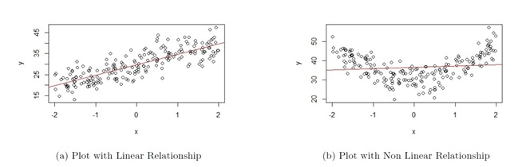
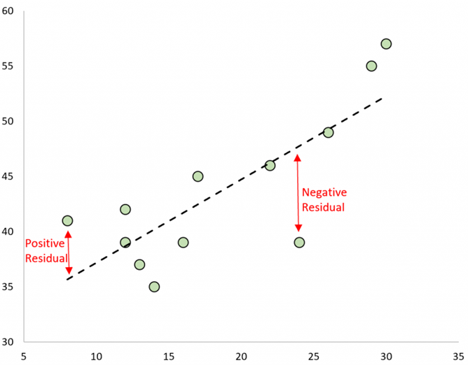
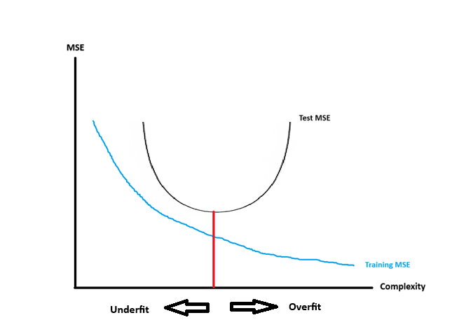

# Linear Regression

```{r, echo=FALSE}
rm(list = ls())
```

## Introduction

There is a broad range of statistical methods available for us to learn about data. Broadly speaking, these methods can be classified as **supervised** and **unsupervised**. Supervised methods involve relating a response variable with predictors, whereas unsupervised methods do not make a distinction between response variables and predictors and instead want to find structure or patterns in the data. 

Supervised methods generally have two primary uses:

1. **Association**: Quantify the relationship between variables. How does a change in the predictor variable change the value of the response variable?
2. **Prediction**: Predict a future value of a response variable, using information from predictor variables.

We always distinguish between a **response variable**, denoted by $y$, and a **predictor variable**, denoted by $x$. In most supervised methods, we say that the response variable can be approximated by some mathematical function, denoted by $f$, of the predictor variable, i.e.

$$
y \approx f(x).
$$

Oftentimes, we write this relationship as 

$$
y = f(x) + \epsilon,
$$

where $\epsilon$ denotes a **random error term**, with a mean of 0. The error term cannot be predicted based on the data we have. 

There are various methods to estimate $f$. Once we estimate $f$, we can use our method for association and / or prediction.

In this module, we will introduce one of the most traditional supervised methods: **linear regression**. It is used when there is a single response variable that is quantitative. The predictors could be quantitative or categorical. 

### Motivation

Why do we learn about linear regression?

- Linear regression is widely used in many fields, and, under certain conditions, does well in the two primary purposes of supervised methods: association and prediction. Other methods may be better at one of these purposes, but usually at the expense of the other purpose. The most important thing is to know what questions you have in order to select the right method that is best for your question.

- Linear regression is fairly easy to interpret and explain to others who may want to know how the method works. Other methods are generally more complicated and can feel like a black-box when explaining to others, leading to less confidence in the method. 

- A lot of the ideas used in other methods can be viewed as an extension or a variation of linear regression. Once you understand how linear regression works, it becomes easier to understand how other methods work. 

### Toy Example

The most common way of visualizing the relationship between one quantitative predictor variable and one quantitative response variable is with a scatter plot. In the simulated example below, we have data from 6000 UVa undergraduate students on the amount of time they spend studying in a week (in minutes), and how many courses they are taking in the semester (3 or 4 credit courses). Figure \@ref(fig:10-scatter) displays the scatter plot.

```{r, echo=FALSE}
gety <- function(x,intercept,slope,sigma)
{
  n<-length(x)
  y <- intercept + x*slope + rnorm(n,0,sigma)
  return(y)
}

##generate x values
courses<-c(rep(3,2000), rep(4,2000), rep(5,2000))

##generate parameters
b0<-60
b1<-120
sigma<-30

##simulate response
set.seed(6021)
study<-gety(courses, b0, b1, sigma)
```

```{r}
##create dataframe
df<-data.frame(study,courses)

##fit regression
result<-lm(study~courses, data=df)
```

```{r 10-scatter, fig.cap='Scatterplot of Study Time against Number of Courses Taken'}
##create scatterplot with regression line overlaid
plot(df$courses, df$study, xlab="# of Courses", ylab="Study Time (Mins)")
abline(result)
```

Figure \@ref(fig:10-scatter) could help us with the following questions:

- Are study time and the number of courses taken related to one another? 
- How strong is this relationship? 
- Could we use the data to make a prediction for the study time of a student who is not in this scatter plot? 

These questions can be answered using linear regression.

### Module Roadmap

- Section \@ref(SLR) sets up the linear regression model and covers the assumptions made.
- Section \@ref(estSLR) goes over how the linear regression model is estimated.
- Section \@ref(SLRinf) goes over the sampling distribution of the estimators in linear regression, as well as associated confidence intervals and hypothesis tests. These are the main tools used when we are focused on the primary goal of association.
- Section \@ref(SLRacc) goes over how we measure model accuracy in linear regression. These measures are used when we are focused on prediction. 

## Simple Linear Regression {#SLR}

In this module, we will keep things simple by only considering a single quantitative predictor. Such a regression is called **simple linear regression (SLR)** to emphasize that only one predictor is being considered. We will briefly touch on multiple linear regression (MLR) when multiple predictors are involved later in this module, and you will learn more about linear regression next semester. 

### Model Setup

In SLR, the function $f$ that relates the predictor variable with the response variable is typically $\beta_0 + \beta_1 x$. Mathematically, we express this as 

$$
y \approx f(x) = \beta_0 + \beta_1 x,
$$

or in other words, that the response variable has an approximately linear relationship with the predictor variable. So the SLR model is written as

\begin{equation} 
y_i=\beta_0+\beta_{1}x_i + \epsilon_i,
(\#eq:10-SLRmod)
\end{equation} 

where

- $y_i$ denotes the value of the response variable for observation $i$,
- $x_i$ denotes the value of the predictor for observation $i$,
- $\epsilon_i$ denotes the value of the error for observation $i$,
- $\beta_0$ and $\beta_1$ are parameters in the SLR model, and we want to estimate them. These parameters are sometimes called **regression coefficients**.
- $\beta_1$ is also called the **slope**. 
- $\beta_0$ is also called the **intercept**. 

In linear regression, we make some assumptions about the error term $\epsilon$:

\begin{equation} 
\epsilon_1,\ldots,\epsilon_n \ i.i.d. \sim N(0,\sigma^2).
(\#eq:10-assumptions)
\end{equation}

What these assumptions mean is that for each value of the predictor variable $x$, the response variable:

1. follows a normal distribution,
2. with expected value equal to $\beta_0+\beta_{1} x$, i.e.

\begin{equation} 
E(Y|X=x) = \beta_0+\beta_{1} x 
(\#eq:10-SLR)
\end{equation} 

3. and variance equal to $\sigma^2$.

View the video below that explains how these are derived:

In other words, the conditional distribution of $Y|X=x$ is $N(\beta_0+\beta_{1} x, \sigma^2)$. Applying this to our study time example, it implies that:

  * for students who take 3 courses, their study time follows a $N(\beta_0 + 3\beta_1, \sigma^2)$ distribution,
  * for students who take 4 courses, their study time follows a $N(\beta_0 + 4\beta_1, \sigma^2)$ distribution,
  * for students who take 5 courses, their study time follows a $N(\beta_0 + 5\beta_1, \sigma^2)$ distribution.
  
So if we were to subset our dataframe into three subsets, one with students who take 3 courses, another subset for students who take 4 courses, and another subset for students who take 5 courses, and then create a density plot of study times for each subset, each density plot should follow a normal distribution, with different means, and the same spread.

Let us take a look at these density plots below in Figures \@ref(fig:10-conddist3), \@ref(fig:10-conddist4), and \@ref(fig:10-conddist5) below:

```{r, warning=FALSE, message=FALSE}
library(tidyverse)
```


```{r 10-conddist3, fig.cap='Distribution of Study Time for 3, 4, 5 Classes Taken'}
##subset dataframe
x.3<-df[which(df$courses==3),]
##density plot of study time for students taking 3 courses
ggplot(x.3,aes(x=study))+
  geom_density()+
  labs(x="Study Time (Mins)", title="Dist of Study Times with 3 Courses")
```

```{r 10-conddist4, fig.cap='Distribution of Study Time for 3, 4, 5 Classes Taken'}
##subset dataframe
x.4<-df[which(df$courses==4),]
##density plot of study time for students taking 4 courses
ggplot(x.4,aes(x=study))+
  geom_density()+
  labs(x="Study Time (Mins)", title="Dist of Study Times with 4 Courses")
```

```{r 10-conddist5, fig.cap='Distribution of Study Time for 3, 4, 5 Classes Taken'}
##subset dataframe
x.5<-df[which(df$courses==5),]
##density plot of study time for students taking 5 courses
ggplot(x.5,aes(x=study))+
  geom_density()+
  labs(x="Study Time (Mins)", title="Dist of Study Times with 5 Courses")
```

Notice all of these plots are normal, with different means (centers), and similar spreads.

The notation on the left hand side of \@ref(eq:10-SLR) denotes the **expected value** of the response variable, for a fixed value of the predictor variable. Therefore, the regression coefficients can be interpreted in the following manner:

- $\beta_1$ denotes the change in the response variable, on average, when the predictor increases by one unit.
- $\beta_0$ denotes the mean of the response variable when the predictor is 0.

### Assessing Assumptions

The assumptions for the error terms, $\epsilon$, expressed in equation \@ref(eq:10-assumptions), can be re-stated with words as the following 4 assumptions:

1. For each value of the predictor, the errors have mean 0. 
  - This implies that $f(x) = \beta_0 + \beta_1 x$ approximates the relationship between the variables well.
  - A scatter plot of the variables should show a linear relationship.
  - This is the most important assumption of the 4. If it is not met, predictions will be biased, in other words, predictions will systematically over- or under- predict the value of the response variable. 

The plots in Figure \@ref(fig:10-ass1) are based on simulated data. The scatter plot shown in Figure \@ref(fig:10-ass1)(a) is an example of when this assumption is met. As we move from left to right on the plot, the data points are generally evenly scattered on both sides of the regression line that is overlaid. 

The scatter plot shown in Figure \@ref(fig:10-ass1)(b) is an example of when this assumption is not met. As we move from left to right on the plot in Figure \@ref(fig:10-ass1)(b), the data points are generally not evenly scattered on both sides of the regression line that is overlaid. The shape of the plots look more like a curve rather than a straight line.

```{r 10-ass1, fig.cap='Assumption 1 Assessment', echo=FALSE, message=FALSE}

```
  
2. For each value of the predictor, the errors have variance denoted by $\sigma^2$.
  - This implies that in a scatter plot, the vertical variation of data points around the regression equation has the same magnitude everywhere.
  - If this assumption is not met, hypothesis tests and confidence intervals from the linear regression will be unreliable. 
  
The plots in Figure \@ref(fig:10-ass2) are based on simulated data. The scatter plot shown in Figure \@ref(fig:10-ass2)(a) is an example of when this assumption is met (this figure is actually the same as Figure \@ref(fig:10-ass1)(a), so the data that produced these plots satisfy both assumptions). As we move from left to right on the plot, the vertical variation of the data points about the regression line is approximately constant. 

The scatter plot shown in Figure \@ref(fig:10-ass2)(b) is an example of when this assumption is not met. As we move from left to right on the plot in Figure \@ref(fig:10-ass2)(b), the vertical variation of the data points about the regression line becomes larger as the value of the response variable gets larger, so the variance is not constant.

```{r 10-ass2, fig.cap='Assumption 2 Assessment', echo=FALSE, message=FALSE}
knitr::include_graphics("images/10-ass2.jpg")
```

3. The errors are independent. 
  - This implies that the observations are independent. This is usually a by-product of how the observations were sampled. So knowing the data collection method will help assess whether this assumption is met. 
  - If this assumption is not met, hypothesis tests and confidence intervals from the linear regression will be unreliable. 

4. The errors are normally distributed.
  - This is considered the least important of the 4 assumptions, especially with large sample sizes. This is due to the Central Limit Theorem, and that in linear regression, we write the conditional expectation (or mean) of the response variable to be equal to $f(x) = \beta_0 + \beta_1 x$, so hypothesis tests and confidence intervals from the linear regression are likely to be reliable. 

*Thought question*: Look at the scatter plot of the toy example in Figure \@ref(fig:10-scatter). Can you explain why this scatter plot shows the first two assumptions are met for linear regression?

## Estimating Regression Coefficients {#estSLR}

There are two methods in estimating the regression coefficients: the method of least squares and the method of maximum likelihood. For large sample sizes, these methods give similar results.

We will go over the method of least squares first, since this is the method that is usually used to explain to new learners and is conceptually easier to understand. 

### Method of Least Squares

From \@ref(eq:10-SLR) and \@ref(eq:10-SLRmod), we noted that we have to estimate the regression coefficients $\beta_0, \beta_1$. We are unable to obtain numerical values of these parameters as we do not have data from the entire population. So what we do is use the data from our sample to estimate these parameters. We estimate $\beta_0,\beta_1$ using $\hat{\beta}_0,\hat{\beta}_1$ based on a sample of observations $(x_i,y_i)$ of size $n$.

Following \@ref(eq:10-SLR) and \@ref(eq:10-SLRmod), the sample versions are

\begin{equation} 
\hat{y}=\hat{\beta}_0+\hat{\beta}_1 x
(\#eq:10-fitted)
\end{equation}

and 

\begin{equation} 
y=\hat{\beta}_0+\hat{\beta}_1 x + e
(\#eq:10-fitted-model)
\end{equation}

respectively. \@ref(eq:10-fitted) is called the **fitted line**. The line that was overlaid in the scatter plot for the toy example in Figure \@ref(fig:10-scatter) represents the fitted line. \@ref(eq:10-fitted-model) is called the **estimated SLR model**.

$\hat{\beta}_1,\hat{\beta}_0$ are the estimators for $\beta_1,\beta_0$ respectively. These estimators can be interpreted in the following manner:

- $\hat{\beta}_1$ denotes the change in the predicted $y$ when $x$ increases by 1 unit. Alternatively, it estimates the change in $y$, on average, when $x$ increases by 1 unit.
- $\hat{\beta}_0$ denotes the predicted $y$ when $x=0$. Alternatively, it estimates the average of $y$ when $x=0$.

From \@ref(eq:10-fitted-model), notice we use $e$ to denote the **residual**, or in other words, the "error" in the sample. 

From \@ref(eq:10-fitted) and \@ref(eq:10-fitted-model), we have the following quantities that we can compute:

- Fitted values or predicted values:

\begin{equation}
\hat{y}_i = \hat{\beta}_0+\hat{\beta}_1 x_i.
(\#eq:10-fits)
\end{equation}

The **fitted values** are the predicted values of the response variable when the predictor is equal to some specific value. Visually, the fitted line represents each fitted value as we vary the value of the predictor. 

- Residuals:

\begin{equation} 
e_i = y_i-\hat{y}_i.
(\#eq:10-res)
\end{equation}

The **residuals** are the differences between the actual values of the response variable and their corresponding predicted values based on the fitted line. Visually, a residual is the vertical distance of a data point in the scatter plot from the fitted line, as shown in Figure \@ref(fig:10-res) below:

```{r 10-res, fig.cap = "Example of Residuals. Picture from https://www.statology.org/residuals/", echo = FALSE}

```

- Sum of Squared Errors:

\begin{equation} 
SS_{res} =  \sum\limits_{i=1}^n(y_i-\hat{y}_i)^2.
(\#eq:10-SSres)
\end{equation}

We compute the estimated coefficients $\hat{\beta}_1,\hat{\beta}_0$ using the **method of least squares**, i.e. choose the numerical values of $\hat{\beta}_1,\hat{\beta}_0$ that minimize $SS_{res}$ as given in \@ref(eq:10-SSres). We find the line which minimizes the sum of all the squared residuals on the scatter plot, hence the name method of least squares.

By minimizing $SS_{res}$ with respect to $\hat{\beta}_0$ and $\hat{\beta}_1$, the estimated coefficients in the simple linear regression equation are

\begin{equation} 
\hat{\beta}_1 = \frac{\sum\limits_{i=1}^n(x_i-\bar{x})(y_i-\bar{y})}{\sum\limits_{i=1}^n(x_i-\bar{x})^2}
(\#eq:10-b1)
\end{equation}

and

\begin{equation} 
\hat{\beta}_0 = \bar{y}- \hat{\beta}_1 \bar{x}
(\#eq:10-b0)
\end{equation}

$\hat{\beta}_1, \hat{\beta}_0$ are called **least squares estimators**, to emphasize that these values are found by minimizing $SS_{res}$.

The minimization of $SS_{res}$ with respect to $\hat{\beta}_0$ and $\hat{\beta}_1$ is done by taking the partial derivatives of \@ref(eq:10-SSres) with respect to $\hat{\beta}_1$ and $\hat{\beta}_0$, setting these two partial derivatives equal to 0, and solving these two equations for $\hat{\beta}_1$ and $\hat{\beta}_0$.

Let's take a look at the estimated coefficients for our study time example:

```{r}
##fit regression
result<-lm(study~courses, data=df) ##supply y, then x, and specify dataframe via data
##print out the estimated coefficients
result
```

From our sample of 6000 students, we have 

- $\hat{\beta}_1$ =  `r result$coefficients[2]`. The predicted study time increases by `r result$coefficients[2]` minutes for each additional course taken.
- $\hat{\beta}_0$ =  `r result$coefficients[1]`. The predicted study time is `r result$coefficients[1]` when no courses are taken. Notice this value does not make sense, as a student cannot be taking 0 courses. If you look at our data, the number of courses taken is 3, 4, or 5. So we should only use our regression when $3 \leq x \leq 5$. We cannot use it for values of $x$ outside the range of our data. Making predictions of the response variable for predictors outside the range of the data is called **extrapolation** and should not be done. 

*Thought question*: The response variable for the toy example is study time, in minutes. Suppose we convert these values to hours by dividing by 60. How will the numerical value of the estimated coefficients change? How will the interpretation of the estimated coefficients change?

Note: I often get a question about why we minimize $SS_{res}$ and not some other quantity such as minimizing the sum of the absolute value of the residuals $\sum_{i=1}^n |y_i - \hat{y}_i|$? We will state a famous theorem here without proving it. **Gauss Markov Theorem**: Under assumptions for a regression model (as stated in \@ref(eq:10-assumptions)), the least squares estimators $\hat{\beta}_1$ and $\hat{\beta}_0$ are unbiased and have minimum variance among all unbiased linear estimators. This means that any other way of deriving unbiased estimators will result in the estimators having larger variance than least squares estimators. 

### Method of Maximum Likelihood

We will give a brief overview of maximum likelihood estimation is carried out for simple linear regression. We had earlier written that the conditional distribution of $Y|X=x$ is $N(\beta_0+\beta_{1} x, \sigma^2)$. We know the PDF of any normal distribution takes the form in equation \@ref(eq:4-pdfNormal), which implies that we can write the PDF of this distribution as 

\begin{equation} 
f_{Y|X}(y|x) = \frac{1}{\sigma \sqrt{2 \pi}} \exp \left(-\frac{(y - (\beta_0+\beta_{1} x))^2}{2 \sigma^2} \right).
(\#eq:10-SLRpdf)
\end{equation}

We can then write the corresponding log-likelihood function, using equation \@ref(eq:7-loglike), as

\begin{equation}
\ell(\beta_0, \beta_1, \sigma^2 | \boldsymbol{y}, \boldsymbol{x}) = -\frac{n}{2} \log(2\pi) - n \log(\sigma) - \frac{1}{2 \sigma^2} \sum_{i=1}^n \left(y_i - (\beta_0 + \beta_1 x_i) \right)^2.
(\#eq:10-SLRloglike)
\end{equation}

We then take the partial derivatives of \@ref(eq:10-SLRloglike) with respect to $\hat{\beta}_1$ and $\hat{\beta}_0$, setting these two partial derivatives equal to 0, and solving these two equations for $\hat{\beta}_1$ and $\hat{\beta}_0$. We end up with the same solutions as the method of least squares. 

```{r}
##fit regression
result.mle<-glm(study~courses, data=df) ##we use glm() function for ML instead
##print out the estimated coefficients. Notice they are the same. 
result.mle
```

## Inference with Simple Linear Regression {#SLRinf}

The process of using data from a sample to draw a conclusion about the population is called (statistical) **inference**. Two methods associated with inference are confidence intervals and hypothesis testing. 

The most common inference deals with the slope, $\beta_1$. We are usually assessing whether the slope is 0 or not, as a slope of 0 implies that there is no linear relationship between the variables (if the slope is 0, the value of the response is not affected by the value of the predictor).

We will cover the confidence interval and hypothesis test for the slope. 

### Properties of Least Squares Estimators

Before proceeding, we will state a few properties associated with the least squares estimators $\hat{\beta}_1, \hat{\beta}_0$. The key here is to realize that the sampling distribution of the least squares estimators are known. Do not be too torn up about these formulas as a lot of these are computed using R. The proof of these are beyond the scope of this class, and there are countless books that provide these proofs if you are interested.

1. $\mbox{E}(\hat{\beta}_1) = \beta_1$, $\mbox{E}(\hat{\beta}_0) = \beta_0$. In other words, the least squares estimators are unbiased. 

2. The variance of $\hat{\beta}_1$ is

\begin{equation} 
\mbox{Var}(\hat{\beta}_1) = \frac{\sigma^{2}}{\sum_{i=1}^n{(x_{i}-\bar{x})^{2}}}
(\#eq:10-varb1)
\end{equation}

3. The variance of $\hat{\beta}_0$ is

\begin{equation} 
\mbox{Var}(\hat{\beta}_0) = \sigma^2 \left[\frac{1}{n} + \frac{\bar{x}^2}{\sum_{i=1}^n (x_i -\bar{x})^2}\right]
(\#eq:10-varb0)
\end{equation}

4. $\hat{\beta}_1$ and $\hat{\beta}_0$ both follow a normal distribution.

Note that in \@ref(eq:10-varb1) and \@ref(eq:10-varb0), we use $s^2 = \frac{SS_{res}}{n-2} = MS_{res}$ to estimate $\sigma^2$ since $\sigma^2$ is a unknown value.

What these imply is that if we standardize $\hat{\beta}_1$ and $\hat{\beta}_0$, these standardized quantities will follow a $t_{n-2}$ distribution, i.e.

\begin{equation} 
\frac{\hat{\beta}_1 - \beta_1}{se(\hat{\beta}_1)}\sim t_{n-2}
(\#eq:10-distb1)
\end{equation}

and

\begin{equation} 
\frac{\hat{\beta}_0 - \beta_0}{se(\hat{\beta}_0)}\sim t_{n-2},
(\#eq:10-distb0)
\end{equation}

where 

\begin{equation}
se(\hat{\beta}_1) = \sqrt{\frac{MS_{res}}{\sum_{i=1}^n{(x_{i}-\bar{x})^{2}}}} = \frac{s}{\sqrt{\sum_{i=1}^n{(x_{i}-\bar{x})^{2}}}}
(\#eq:10-seb1)
\end{equation}

and 

\begin{equation} 
se(\hat{\beta}_0) = \sqrt{MS_{res}\left[\frac{1}{n} + \frac{\bar{x}^2}{\sum_{i=1}^n (x_i -\bar{x})^2}\right]} = s \sqrt{\frac{1}{n} + \frac{\bar{x}^2}{\sum_{i=1}^n (x_i -\bar{x})^2}}
(\#eq:10-seb0)
\end{equation}

Note: The standardized quantities in equations \@ref(eq:10-distb1) and \@ref(eq:10-distb0) follow $t_{n-2}$ distribution. As mentioned in Section \@ref(df), we lose 1 degree of freedom for every equation that must be satisfied. In SLR, we have 2 equations, equations \@ref(eq:10-b1) and \@ref(eq:10-b0), that must be satisfied when calculating the least squares estimators, therefore we have $n-2$ degrees of freedom. 

### Confidence Interval

From equation \@ref(eq:10-distb1), we note that the standardized $\hat{\beta}_1$ follows a $t_{n-2}$ distribution, which is symmetric. This implies that the confidence interval for the slope takes on the form expressed in equation \@ref(eq:8-CIbasic2), which is $\text{point estimate } \pm \text{ margin of error}$. We also know that the margin of error is the critical value multiplied by the standard error of the estimator.

*Thought question*: Before scrolling any further, can you write out the formula for a confidence interval for the slope?

The $100(1-\alpha)\%$ CI for $\beta_1$ is

\begin{equation} 
\hat{\beta}_1 \pm t_{n-2}^*  se(\hat{\beta}_1) = \hat{\beta}_1 \pm t_{n-2}^* {\sqrt\frac{MS_{res}}{\sum_{i=1}^n(x_i - \bar{x})^{2}}}.
(\#eq:10-CIb1)
\end{equation}

The critical value $t_{n-2}^*$ is found in the usual manner; it corresponds to the $(1 - \alpha/2) \times 100$th percentile from a $t_{n-2}$ distribution. 

Going back to our study time example, the 95% CI for the slope is (`r confint(result,level = 0.95)[2,1]`, `r confint(result,level = 0.95)[2,2]`).

```{r}
##CI for coefficients
confint(result,level = 0.95)[2,]
```

An interpretation of this CI is that there is 95% probability that the random interval  (`r confint(result,level = 0.95)[2,1]`, `r confint(result,level = 0.95)[2,2]`) contains the true value of the slop.

The interval excludes 0, so there is a linear relationship between number of courses and study time.

### Hypothesis Testing

In the context of SLR, we usually want to test if the slope $\beta_1$ is 0 or not. If the slope is 0, there is no linear relationship between the variables. So the hypotheses are typically $H_0: \beta_1 = 0, H_a: \beta_1 \neq 0.$

In equation \@ref(eq:10-distb1), we noted that the standardized $\hat{\beta}_1$ follows a $t_{n-2}$ distribution, so the test statistic will be a t-statistic which takes on the general form in equation \@ref(eq:9-tstatGen).

*Thought question*: Before scrolling down any further, can you make an educated guess as to the formula of the t-statistic when testing the slope?

The test statistic is

\begin{equation} 
t = \frac{\hat{\beta}_1 - \text{ value in null}}{se(\hat{\beta}_1)}.
(\#eq:10-testslope)
\end{equation}

The p-value and critical value are found in the usual manner, based on a $t_{n-2}$ distribution, and are used in the usual manner. 

We go back to the study time example:

```{r}
summary(result)$coefficients ##print out est coeffs, SEs, t statistics, and p-vals
```
From R, the reported t-statistic and p-value are 255.74125 and approximately 0 respectively. So we reject the null hypothesis: our data support the claim that there is a linear relationship between study time and number of courses taken. 

Note: The reported values are based on a two-sided alternative hypothesis and a null hypothesis of $H_0: \beta_1 = 0$. If we have different hypotheses we will have to perform these calculations on our own. 

### Correlation

Another commonly used measure in linear regression is the correlation, which we explored earlier in Section \@ref(corr). Visually, variables with a higher correlation (in magnitude) means their observations will fall closer to the fitted line. A correlation of 1 or -1 will mean the observations fall perfectly on the fitted line.

### Coefficient of Determination

Another measure that is commonly used in linear regression is the **coefficient of determination**, usually denoted by $R^2$. The value represents the proportion of variation in the response variable that can be explained by our linear regression. In SLR, it is numerically equal to the squared of the sample correlation. 

A few notes about $R^2$:

- $0 \leq R^2 \leq 1$.
- Values closer to 1 indicate a better fit; values closer to 0 indicate a poorer fit.
- Often reported as a percentage. 

### Linear Regression in R

Next, we will perform a simple linear regression on a real data set using R. We will work with the data set `elmhurst` from the `openintro` package in R.

```{r, echo=FALSE}
rm(list = ls())
```

```{r, warning=FALSE, message=FALSE}
library(tidyverse)
library(openintro)
Data<-openintro::elmhurst
```

Type `?openintro::elmhurst` to read the documentation for data sets in R. Always seek to understand the background of your data! The key pieces of information are:

- A random sample of 50 students (all freshman from the 2011 class at Elmhurst College).
- Family income of the student (units are missing).
- Gift aid, in $1000s.

We want to explore how family income may be related to gift aid, in a simple linear regression framework.

#### Visualization {-}

We should always verify with scatter plot that the relationship is (approximately) linear before proceeding with correlation and simple linear regression! 

```{r 10-scatter-eg, fig.cap='Scatter Plot for Worked Example'}
##scatterplot of gift aid against family income
ggplot2::ggplot(Data, aes(x=family_income,y=gift_aid))+
  geom_point()+
  geom_smooth(method = "lm", se=FALSE)+
  labs(x="Family Income", y="Gift Aid", title="Scatterplot of Gift Aid against Family")
```

We note that the observations are fairly evenly scattered on both sides of the regression line, so a linear association exists. We see a negative linear association. As family income increases, the gift aid, on average, decreases. 

We also do not see any observation with weird values that may warrant further investigation.

#### Regression {-}

We use the `lm()` function to fit a regression model. We supply the response variable, then the predictor, with a ``~`` in between, then specify the dataframe via the `data` argument.

```{r}
##regress gift aid against family income
result<-lm(gift_aid~family_income, data=Data)
```

Use the `summary()` function to display relevant information from this regression:

```{r}
##look at information regarding regression
summary(result)
```

We see the following values:

- $\hat{\beta}_1 =$ `r summary(result)$coefficients[2,1]`. The estimated slope informs us the the predicted gift aid decreases by `r -summary(result)$coefficients[2,1]` thousands of dollars (or \$43.07) per unit increase in family income.
- $\hat{\beta}_0 =$ `r summary(result)$coefficients[1,1]`. For students with no family income, their predicted gift aid is \$24 319.33. Note: from the scatter plot, we have an observation with 0 family income. We must be careful in not extrapolating when making predictions with our regression. We should only make predictions for family incomes between the minimum and maximum values of family incomes in our data.
- $s$  = `r summary(result)$sigma`, is the estimate of the standard deviation of the error terms, $\sigma$. This is reported as residual standard error in R. Squaring this gives the estimated variance of the error terms.
- $R^2 =$ `r summary(result)$r.squared`. The coefficient of determination informs us that about 24.86% of the variation in gift aid can be explained by family income. This is reported as multiple R-squared in R.

#### Hypothesis Testing {-}

Under coefficients, we can see the results of the hypothesis tests for $\beta_1$ and $\beta_0$. Specifically, for $\beta_1$:

- $\hat{\beta}_1$ = `r summary(result)$coefficients[2,1]`
- $se(\hat{\beta}_1)$ = `r summary(result)$coefficients[2,2]`
- the test statistic is $t$ = `r summary(result)$coefficients[2,3]`
- the corresponding p-value is `r summary(result)$coefficients[2,4]`

You can work out the p-value using R (slight difference due to rounding):

```{r}
##pvalue
2*pt(-abs(-3.985), df = 50-2)
```

Or find the critical value using R:

```{r}
##critical value
qt(1-0.05/2, df = 50-2)
```

Either way, we end up rejecting the null hypothesis. The data support the claim that there is a linear association between gift aid and family income.

Remember the $t$ tests for the regression coefficients are based on $H_0: \beta_j = 0, H_a: \beta_j \neq 0$. The reported p-value is based on this set of null and alternative hypotheses. If your null and alternative hypotheses are different, you will need to compute your own test statistic and p-value.

#### Confidence Intervals {-}

To find the 95% confidence intervals for the coefficients, we use the `confint()` function:

```{r}
##to produce 95% CIs for all regression coefficients
confint(result,level = 0.95)
```

The 95% CI for $\beta_1$ is (`r confint(result,level = 0.95)[2,1]`, `r confint(result,level = 0.95)[2,2]`). We have 95% confidence that for each additional thousand dollars in family income, the predicted gift aid decreases between \$21.3378 and \$64.8056.

#### Extract Values from R Objects {-}

We can actually extract these values that are being reported from `summary(result)`. To see what can be extracted from an R object, use the `names()` function:

```{r}
##see what can be extracted from summary(result)
names(summary(result))
```

To extract the estimated coefficients:

```{r}
##extract coefficients
summary(result)$coefficients
```

Notice the information is presented in a table. To extract a specific value, we can specify the row and column indices:

```{r}
##extract slope
summary(result)$coefficients[2,1]
##extract intercept
summary(result)$coefficients[1,1]
```

On your own, extract the values of the residual standard error and $R^2$.

#### Prediction {-}

A use of regression models is prediction. Suppose I want to predict the gift aid of a student with family income of 50 thousand dollars (assuming the unit is in thousands of dollars). We use the `predict()` function:

```{r}
##create data point for prediction
newdata<-data.frame(family_income=50)
##predicted gift aid when x=50
predict(result,newdata)
```

This student's predicted gift aid is \$22 165.75. Alternatively, you could have calculated this by plugging $x=50$ into the estimated SLR equation:

```{r}
summary(result)$coefficients[1,1] + summary(result)$coefficients[2,1]*50
```

#### Correlation {-}

We use the `cor()` function to find the correlation between two quantitative variables:

```{r}
##correlation
cor(Data$family_income,Data$gift_aid)
```

The correlation is `r cor(Data$family_income,Data$gift_aid)`. We have a moderate, negative linear association between family income and gift aid. 

## Assessing Model Accuracy {#SLRacc}

In the introduction of this module, we wrote that supervised methods such as linear regression have two primary uses:

1. Association: Quantify the relationship between variables. How does a change in the predictor variable change the value of the response variable?
2. Prediction: Predict a future value of a response variable, using information from predictor variables.

In Section \@ref(SLRinf), we focused on the sampling distribution of the least squares estimators which was then used to construct confidence intervals and perform hypothesis tests. These tools are useful in trying to explain the relationship between the response variable and predictor, which is the first primary use of supervised methods. This has been the focus of a lot of traditional research in a wide variety of applications, for example:

- Medicine: Does increasing the dose of a medication reduce severity of symptoms? 
- Advertising: How does advertising in various media affect sales?
- Environmental science: How does increased greenhouse emissions affect air quality?
- Education: Does the use of AI tools aid in student learning outcomes?

In this section, we will focus on the second primary use of supervised methods: prediction. When we focus on prediction, we mainly care about how close are the predicted (or fitted) values with their true values. A lot of what was mentioned in Section \@ref(SLRinf) can actually be ignored (other than assumption 1 of the regression assumptions, since predictions will definitely suffer if this is not met) when our focus is on prediction. Prediction is in the domain of predictive analytics. While predictive analytics can be used in a wide variety of applications, the kind of questions they answer differ from the earlier questions, for example:

- Hospitality: Determining staffing needs for a casino. We want to be able to predict the right number of staff to hire: over-staffing costs money and under-staffing results in unhappy customers. 
- Online ads: Based on a user's history on Amazon, Amazon would like to be able to recommend products that the user is highly likely to purchase.
- Personalized medicine: Based on a patient's history, what is the most effective treatment plan?
- Dynamic pricing: airlines use dynamic pricing that adjusts price to maximize profits, based on real-time market conditions. 

In these questions, we want to know if our model can predict the value of the response variable well; we do not necessarily want to know how the predictors may explain the response variable.

### Metrics for Model Accuracy

We will introduce some common metrics that measure model accuracy. As we are talking about these in the framework of linear regression where the response variable is quantitative, these metrics only apply to supervised methods when the response variable is quantitative. There are separate metrics when the response variable is categorical which you will learn about next semester. 

#### Mean-Squared Error

The **mean-squared error (MSE)** is a commonly used metric to assess model accuracy. The MSE is

\begin{equation} 
MSE(\hat{y}) = \frac{\sum_{i=1}^n (y_i - \hat{y}_i)^2}{n}.
(\#eq:10-MSE)
\end{equation}

The MSE can be interpreted as an average squared prediction error. If you compare equation \@ref(eq:10-MSE) with equation \@ref(eq:10-SSres), you may notice the numerator of the MSE is the $SS_{res}$. 

You may also recall that the MSE was introduced in Section \@ref(estMSE). In that section, we were measuring the average squared difference between an estimator and its parameter, rather than the average squared difference between a predicted value and its true value. From a terminology standpoint, they are both MSEs: one being the MSE of an estimator, the other being the MSE of predictions, so you may need to clarify which MSE is being discussed if someone just uses the term MSE. 

It should then not come as a surprise that the MSE in equation \@ref(eq:10-MSE) can be decomposed like the MSE of an estimator in equation \@ref(eq:7-MSEdecomp):

\begin{equation} 
MSE(\hat{y}) = Var(\hat{y}) + Bias(\hat{y})^2.
(\#eq:10-MSEdecomp)
\end{equation}

So the MSE can be decomposed into the variance of the predicted values and the squared bias of the predicted values. In a linear regression setting, the bias will be theoretically 0 if we find the correct form of $f(X)$ to relate the response variable with the predictors.

#### Root Mean-Squared Error

The MSE is a popular metric for model accuracy because of its decomposition per equation \@ref(eq:10-MSEdecomp). However, interpreting its numerical value can be challenging, as the unit associated with the MSE is the squared of the unit of the response variable, which poses some difficulty in making a judgement as to whether a reported value for the MSE is actually large or small.

The **root mean-squared error (RMSE)** has been suggested, since it has the same unit as the response variable, making it easy to make a judgement as to whether a reported value is large or small:

\begin{equation} 
RMSE(\hat{y}) = \sqrt{\frac{\sum_{i=1}^n (y_i - \hat{y}_i)^2}{n}} = \sqrt{MSE(\hat{y})}.
(\#eq:10-RMSE)
\end{equation}

The RMSE is simply the square root of the MSE. Interpreting the RMSE gets tricky; it is tempting to interpret as the average prediction error, but it is not quite correct to do so, since $\sqrt{\frac{\sum_{i=1}^n (y_i - \hat{y}_i)^2}{n}}$ is not the same as $\frac{\sum_{i=1}^n \sqrt{(y_i - \hat{y}_i)^2}}{n}$.

#### Mean Absolute Deviation

In response to the difficulty in interpreting RMSE, another metric, called the **mean absolute deviation (MAD)** has been proposed:

\begin{equation} 
MAD(\hat{y}) = \frac{\sum_{i=1}^n |y_i - \hat{y}_i|}{n}.
(\#eq:10-MAD)
\end{equation}

The unit of MAD is the same as the response variable, and it can be interpreted as the average prediction error. 

#### Additional Comments about MSE, RMSE, MAD

In the rest of this module, we will be focusing on the MSE and RMSE, as certain properties for them have been proven mathematically.

### Model Complexity

Thus far, we have only considered simple linear regression, i.e. only one predictor in our model. This approach is useful if we want to focus on how a single predictor is related to the response variable. However, it should not be surprising to learn that in many settings, we can improve predictions of the response variable by either

- incorporating additional predictors (that are useful), or
- considering polynomials for the predictor (if the relationship between the response variable and predictor is not linear), or
- adding interactions between predictors.

With additional predictors, the linear regression model is  written as

\begin{equation} 
y=\beta_0+\beta_{1}x_1 + \beta_2 x_2 + \cdots + \beta_k x_k + \epsilon,
(\#eq:10-MLRmod)
\end{equation} 

if we incorporate $k$ quantitative predictors $x_1, \cdots, x_k$. 

If the relationship between the response variable and predictor is not linear, the linear regression model can be written as

\begin{equation} 
y=\beta_0+\beta_{1}x + \beta_2 x^2 + \cdots + \beta_k x^k + \epsilon,
(\#eq:10-polymod)
\end{equation} 

if we consider a $k$-degree polynomial for $f(x)$ to approximate the relationship between the response variable and the predictor. Notice the linear regression model gets more complex when we add more predictors, or higher degree polynomials. 

**Interactions between predictors** occur when the effect of one predictor on the response variable depends on the value of another predictor. Consider predicting recovery rates of patients, based on amount of medication administered and age of the patient. Perhaps higher doses of the medication speeds recovery, but only for young patients. However, the medication may not work at all for old patients. The effect of medication on recovery depends on the age of a patient, so there is an interaction between amount of medicine administered and age of patient. In this scenario, the linear regression model can be written as

\begin{equation} 
y=\beta_0+\beta_{1}x_1 + \beta_2 x_2 + \beta_3 x_1 x_2 + \epsilon,
(\#eq:10-intmod)
\end{equation}

where the term $x_1 x_2$ represents that we are considering an interaction between the predictors.

It is also possible for a linear regression model to have multiple predictors, higher order polynomials, and interactions. For example, y=\beta_0+\beta_{1}x_1 + \beta_2 x_2 + \beta_3 x_3 + \beta_4 x_3^2 + \beta_5 z_1 x_2 + \epsilon$.

For this class, we will only consider comparing the complexity of models that are **nested**. Two models are nested if one model can be derived from the other by setting some parameters of the more complex model to be equal to 0. As an example, the SLR model in equation \@ref(eq:10-SLRmod) is nested within the model in equation \@ref(eq:10-MLRmod), as we can get the SLR model by setting $\beta_2 = \beta_3 = \cdots = \beta_k = 0$ in equation \@ref(eq:10-MLRmod).

*Thought question*: Can you explain why the SLR model in equation \@ref(eq:10-SLRmod) is nested within the model in equation \@ref(eq:10-polymod)? Can you explain why the SLR model in equation \@ref(eq:10-SLRmod) is nested within the model in equation \@ref(eq:10-intmod)?

The **complexity** of linear regression models can be measured by the number of parameters in the model, which we denote by $p$. So for the SLR model in equation \@ref(eq:10-SLRmod), $p=2$, since we have $\beta_0$ and $\beta_1$.

Note: Some consider models that are more complex to be more **flexible**, so fairly often what I call model complexity is sometimes called model flexibility. 

So there are many potential models to consider. Metrics involving model accuracy can help us decide which model is the best in terms of prediction accuracy, by selecting the model that has the smallest MSE (or RMSE). 

### Training-Test Split

After reading the previous subsections, one may consider the following strategy when assessing model accuracy and choosing between several nested models: fit all models under consideration using all available data, then choose the model that the smallest MSE (or RMSE). 

A property of the MSE and RMSE of nested models is that these values only decrease as the model gets more complex! We will not go through the whole proof of this, but intuitively, one can see why the more complex model will never do worse than the less complex model: this happens when the additional parameters are all 0. This property suggests that using this strategy will always end up selecting the most complex model, as the most complex model will always have the smallest MSE and RMSE. 

Take a step back and remind ourselves what we actually want to do with prediction: after fitting the model, we want to be able to accurately predict the values of the response variable in the future. When we fit a model well based on the current data, the model may do poorly on new data. This is called **overfitting**. 

So what we will do is to split a given data set into two portions. One portion, called the **training data**, is used to fit (or train) the model. The other portion, called the **test data**, is used to assess the prediction accuracy of the model. The test data are never used to fit the model, so the test data play the role of new data. 

The MSE (or RMSE) is then calculated on both portions, and are called the training MSE and the test MSE. The relationship between the training and test MSEs with the complexity of nested models is shown below in Figure \@ref(fig:10-MSE):

```{r 10-MSE, fig.cap = "Training & Test MSE vs Complexity", echo = FALSE}

```

We make the following comments about Figure \@ref(fig:10-MSE):

- The blue curve represents how the training MSE behaves as models get more complex. As models get more complex, the training MSE never decreases.
- The black curve represents how the test MSE behaves as models get more complex. The test MSE is minimum when we find an appropriate level of complexity, and this is denoted by the red line. We call this model the optimal model. The test MSE increases as models get more complex, or less complex, than the optimal model. 
- Overfitted models are models that are more complex than the optimal model.
  - Overfitted models generally have low training MSE, and high test MSE. A large difference between these two is also indicative of overfitting.
- Underfitted models are models that are less complex than the optimal model. 
  - Underfitted models generally have high training MSE and high test MSE. 
- On average, the training MSE is lower than the test MSE for any model. This is because the model is usually estimated by minimizing some quantity that is related to the training MSE. For example, we minimize $SS_{res}$, which is the numerator of the training MSE, for linear regression.

### Bias-Variance Trade-Off & Model Complexity

In equation \@ref(eq:10-MSEdecomp), we see that the MSE can be decomposed into the variance of the predicted values and the squared bias of the predicted values. In Figure \@ref(fig:10-MSE), we see that the MSE is related to the complexity of the model. So it should not be a surprise to see that the complexity of models is related to the bias and variance of the predictions from those models. This relationship is called the **bias-variance tradeoff**. This tradeoff tells us that if a model produces predictions that are more biased, the predictions will have smaller variance, and vice versa. We summarize the relationship between model complexity and bias and variance of their predictions:

- Bias increase as the model gets less complex. Models are too simple (or not complex enough) if we do not include important predictors, or misspecify the relationship between the response and the predictors, or fail to include relevant interactions. 

- Variance increase as the model gets more complex. Models are too complex if we include unnecessary predictors, include higher order polynomials that not needed, or include interactions when they are not needed. 

So we can see that to minimize the test MSE, we need to find the right balance between bias and variance of the model, by finding the right level of complexity. 

### Monte Carlo Simulations

Next, we use Monte Carlo simulations to illustrate how MSE, bias, variance, and model complexity are related. In our simulation, we are going to simulate data from this model $y = x^2 + \epsilon$, where $\epsilon$ is i.i.d. $N(0,1)$. The true relationship between the response variable and the predictor is $f(x) = x^2$. We write a function that simulates data from this model:

```{r}
##function to simulate y = x^2 + eps
get.sim.data <- function(samp.size, sigma)
  
{
  
  x<-runif(n=samp.size) ##note that there are no assumptions made about x so can simulate from any distribution
  eps<-rnorm(n=samp.size, sd=sigma)
  y<-x^2 + eps ##since f(x) = 2x^2
  
  data.frame(x,y) ##return a dataframe with x and y
}
```

Note that in a linear regression setting, there are no assumptions made about the predictor, so we are free to simulate the predictor from any distribution. We need to be sure to specify $y = f(x) + \epsilon$ where the errors are i.i.d. Normal with mean 0 and some fixed value for its variance, which we set to be 1. 

We consider fitting a few different fitted lines for our simulated data:

1. Fitted line 1: $\hat{y} = \hat{\beta}_0,$ so $\hat{f}(x) = \hat{\beta}_0$.
2. Fitted line 2: $\hat{y} = \hat{\beta}_0 + \hat{\beta}_1 x,$ so $\hat{f}(x) = \hat{\beta}_0 + \hat{\beta}_1 x$.
3. Fitted line 3: $\hat{y} = \hat{\beta}_0 + \hat{\beta}_1 x + \hat{\beta}_2 x^2,$ so $\hat{f}(x) = \hat{\beta}_0 + \hat{\beta}_1 x + \hat{\beta}_2 x^2$.
4. Fitted line 4: $\hat{y} = \hat{\beta}_0 + \hat{\beta}_1 x + \cdots + \hat{\beta}_9 x^9,$ so $\hat{f}(x) = \hat{\beta}_0 + \hat{\beta}_1 x + \cdots + \hat{\beta}_9 x^9$.

We simulate 1 replicate of 1000 observations, and then fit the four models. 

```{r}
set.seed(11)

n <- 1000

Data.sim<-get.sim.data(n,1)

fit1 <- lm(y ~ 1,                   data = Data.sim)
fit2 <- lm(y ~ x,                   data = Data.sim)
fit3 <- lm(y ~ poly(x, degree = 2), data = Data.sim)
fit4 <- lm(y ~ poly(x, degree = 9), data = Data.sim)
```

In Figure \@ref(fig:10-sims1), we create a scatter plot of this simulated data, and overlay lines to represent the four fitted lines (in blue, red, green, orange). We also overlay a curve to represent the true relationship between the variables, in black. 

```{r 10-sims1, fig.cap='Four Polynomial Models Fitted to a Simulated Dataset', echo=FALSE}
plot(y ~ x, data = Data.sim, col = "grey", pch = 20,
     main = "Four Polynomial Models Fitted to a Simulated Dataset", ylim=c(-0.5,2))
grid <- seq(from = 0, to = 1, by = 0.01)
lines(grid, grid^2, col = "black", lwd = 3)
lines(grid, predict(fit1, newdata = data.frame(x = grid)), col = "blue",  lwd = 2, lty = 2)
lines(grid, predict(fit2, newdata = data.frame(x = grid)), col = "red",   lwd = 2, lty = 3)
lines(grid, predict(fit3, newdata = data.frame(x = grid)), col = "green", lwd = 2, lty = 4)
lines(grid, predict(fit4, newdata = data.frame(x = grid)), col = "orange",  lwd = 2, lty = 5)

legend("topleft", 
       c("line 1", "line 2", "line 3",  "line 4", "truth"), 
       col = c("blue", "red", "green", "orange", "black"), lty = c(2, 3, 4, 5, 1), lwd = 2)
```

From Figure \@ref(fig:10-sims1), we make the following comments:

- Fitted line 1, in blue, generally deviates far from the truth (in black).
- Fitted line 2, in red, is closer to the truth, but there are portions where it does not match the truth.
- Fitted line 3, in green, appears to be best in that it matches the closest to the truth, generally.
- Fitted line 4, in orange, does not quite match the true, especially at the extreme ends of the x-axis.

Of course, these comments are based on 1 simulated data set, but if we were to create many replicates of the data set and create a similar scatter plot, we would expect to see similar characteristics. 

To illustrate the idea behind the bias and variance of predictions, we simulate 3 replicates data sets, each of size 1000, and show fitted lines 1 and 4 on each replicate in Figure \@ref(fig:10-sims3). Let us remind ourselves of what was written earlier about the bias variance tradeoff and the complexity of models:

- Fitted line 1 is too simple, so we expect a high degree of bias and a low degree of variance.
- Fitted line 2 is also simple, so we expect some bias, and a higher degree of variance.
- Fitted line 3 should be optimal, since its $\hat{f}(x)$ takes the correct form, so we expect bias to be theoretically 0, and a even higher degree of variance. 
- Fitted line 4 is too complex, so we expect its bias to be theoretically 0, but it will have the highest degree of variance. 

```{r 10-sims3, fig.cap='Fitted Lines 1 & 4 on Three Different Simulated Datasets', echo=FALSE}
par(mfrow = c(1, 3))

set.seed(77)
Data.sim1 <- get.sim.data(n,1)
Data.sim2 <- get.sim.data(n,1)
Data.sim3 <- get.sim.data(n,1)
fit_1_v1 <- lm(y ~ 1, data = Data.sim1)
fit_1_v2 <- lm(y ~ 1, data = Data.sim2)
fit_1_v3 <- lm(y ~ 1, data = Data.sim3)
fit_4_v1 <- lm(y ~ poly(x, degree = 9), data = Data.sim1)
fit_4_v2 <- lm(y ~ poly(x, degree = 9), data = Data.sim2)
fit_4_v3 <- lm(y ~ poly(x, degree = 9), data = Data.sim3)

plot(y ~ x, data = Data.sim1, col = "grey", pch = 20, main = "Simulated Dataset 1", xlim=c(0,1), ylim=c(min(Data.sim1$y, Data.sim2$y, Data.sim3$y), max(Data.sim1$y, Data.sim2$y, Data.sim3$y)))
grid <- seq(from = 0, to = 2, by = 0.01)
lines(grid, predict(fit_1_v1, newdata = data.frame(x = grid)), col = "blue", lwd = 2, lty = 2)
lines(grid, predict(fit_4_v1, newdata = data.frame(x = grid)), col = "orange", lwd = 2, lty = 5)
legend("topleft", c("y ~ 1", "y ~ poly(x, 9)"), col = c("blue", "orange"), lty = c(2, 5), lwd = 2)

plot(y ~ x, data = Data.sim2, col = "grey", pch = 20, main = "Simulated Dataset 2", xlim=c(0,1), ylim=c(min(Data.sim1$y, Data.sim2$y, Data.sim3$y), max(Data.sim1$y, Data.sim2$y, Data.sim3$y)))
grid <- seq(from = 0, to = 2, by = 0.01)
lines(grid, predict(fit_1_v2, newdata = data.frame(x = grid)), col = "blue", lwd = 2, lty = 2)
lines(grid, predict(fit_4_v2, newdata = data.frame(x = grid)), col = "orange", lwd = 2, lty = 5)
legend("topleft", c("y ~ 1", "y ~ poly(x, 9)"), col = c("blue", "orange"), lty = c(2, 5), lwd = 2)

plot(y ~ x, data = Data.sim3, col = "grey", pch = 20, main = "Simulated Dataset 3", xlim=c(0,1), ylim=c(min(Data.sim1$y, Data.sim2$y, Data.sim3$y), max(Data.sim1$y, Data.sim2$y, Data.sim3$y)))
grid <- seq(from = 0, to = 2, by = 0.01)
lines(grid, predict(fit_1_v3, newdata = data.frame(x = grid)), col = "blue", lwd = 2, lty = 2)
lines(grid, predict(fit_4_v3, newdata = data.frame(x = grid)), col = "orange", lwd = 2, lty = 5)
legend("topleft", c("y ~ 1", "y ~ poly(x, 9)"), col = c("blue", "orange"), lty = c(2, 5), lwd = 2)
```

For fitted line 1:

- We see that the the blue line always does a poor job capturing the truth in the data, therefore, it will have high bias as it will systematically over- or under-predict.
- However, the blue lines are all pretty similar across all three simulated data sets. Therefore, it has low variance as the line is pretty much the same. 

For fitted line 4:

- We see that the orange lines are very different across all three simulated data sets. Therefore, it has high variance.
- Fitted line 4 will be, on average, theoretically unbiased. However, being an unbiased but highly variable fitted line is can be problematic, since we only observe one data set in real life, so we cannot average the predictions over many data sets. This is why we also want fitted lines with low variance. 

We now carry out the Monte Carlo simulations, over 1000 replicates. Ideally, the number of replicates should be more, but this simulation takes some time to run (fitting high degree polynomials is computationally expensive). We will use these 1000 replicates to compute the MSE, bias, and variance of the four fitted lines, evaluated at the point $x=0.1$. The simulation would do the following:

- Simulate 1 data set of 1000 observations.
- Fitted fitted lines 1 to 4 on the data set.
- Compute the predicted value $\hat{y}$ when $x=0.9$ based on each of the four fitted lines, and record these values.
- Repeat these steps for over 1000 replicates.

```{r, echo=FALSE}
reps <- 1000 ##should be bigger but this takes a long time to run
num.models <- 4 ##we are considering 4 models
x0 <- data.frame(x = 0.1) ##fix x=0.5. We need to fix value to verify bias variance tradeoff
yhats <- data.frame(0, c(reps, num.models)) ##store yhat for each rep and each model

set.seed(4)

start_time <- Sys.time() ##start time of loop

for (i in 1:reps)
  
{
  
  ##simulate data
  Data.sim<-get.sim.data(n,1)
  
  ##fitted lines 1, 2, 3, 4
  fit1 <- lm(y ~ 1,                   data = Data.sim)
  fit2 <- lm(y ~ x,                   data = Data.sim)
  fit3 <- lm(y ~ poly(x, degree = 2), data = Data.sim)
  fit4 <- lm(y ~ poly(x, degree = 9), data = Data.sim)
  
  ##predict yhat, when x0 = 0.5, using each of the fitted lines
  yhats[i, 1] = predict(fit1, x0)
  yhats[i, 2] = predict(fit2, x0)
  yhats[i, 3] = predict(fit3, x0)
  yhats[i, 4] = predict(fit4, x0)
  
}
```

Let's take a look at the distributions of $\hat{y}$s for each fitted line, in Figure \@ref(fig:10-simsboxplot). 

```{r 10-simsboxplot, fig.cap='Box Plots of Predictions for Four Fitted Lines', echo=FALSE}
yhats.df <- data.frame(line1=yhats[,1], line2=yhats[,2], line3=yhats[,3], line4=yhats[,4])

library(tidyverse)
data.tidy <- yhats.df %>% pivot_longer(cols = c('line1', 'line2', 'line3', 'line4'),
                                         names_to = 'line',
                                         values_to = 'yhats')

true.y <- as.numeric(x0)^2

boxplot(yhats~line, data=data.tidy, main="Distribution of Predictions for each Fitted Line", xlab="", ylab="Predictions")
abline(h=true.y, col="blue")
```

The blue horizontal line represents the true value of $y$ when $x=0.1$. Let $y_0$ denote this value, i.e. $y_0 = f(0.1) = 0.1^2$. Figure \@ref(fig:10-simsboxplot) pretty much matches with what we expected:

- The variance, or spread, of $\hat{y}$s is higher as the model gets more complex.
- Fitted lines 1 and 2 are bias, since the middle of their boxplots are far away from the blue line, but fitted lines 3 and 4 are unbiased, since the middle of their boxplots matches with the blue line. 

We then evaluate the test MSE, bias, and variance of $hat{y}$ from each fitted line:

- MSE: the average squared difference between $\hat{y}$ and $y_0$.
- Bias: the average difference between $\hat{y}$ and $y_0$.
- Variance: the sample variance of $\hat{y}$.

```{r 10-table, echo=FALSE}
get.MSE <- function(predictions, true.val)
  
{
  
  mean((predictions-true.val)^2)
  
}

get.bias <- function(predictions, true.val)
  
{
  
  mean(predictions-true.val)
  
}


MSEs <- apply(yhats.df, 2, get.MSE, true.val = true.y)
bias <- apply(yhats.df, 2, get.bias, true.val = true.y)
variance <- apply(yhats.df, 2, var)

# Define your table data
my_data <- data.frame(
  degree = c(0, 1, 2, 9),
  MSE = c(MSEs[1], MSEs[2], MSEs[3], MSEs[4]),
  Squared.Bias = c(bias[1]^2, bias[2]^2, bias[3]^2, bias[4]^2),
  Variance = c(variance[1], variance[2], variance[3], variance[4])
)

# Create the table using kable
knitr::kable(my_data, caption = "Metrics for Four Fitted Lines")
```

The results in Table \@ref(tab:10-table) pretty much match with our expectations:

- The variance of the predictions increase as the model gets more complicated (higher degree).
- The bias of the predictions pretty much works in the opposite direction: it decreases as the model gets more complicated.
- The test MSE is smallest for fitted line 3, as its form of $\hat{f}(x)$ matches the true $f(x)$. So we see the optimal model balances the bias-variance tradeoff. 


