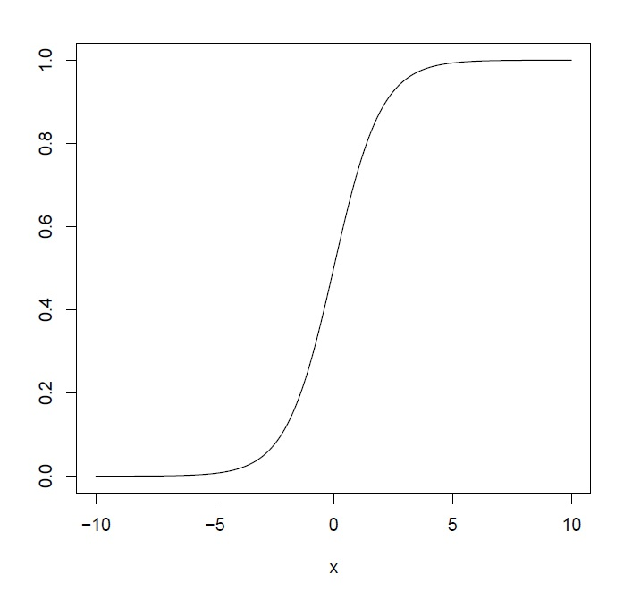

# Logistic Regression {#logistic1}

## Introduction

```{r, echo=FALSE}
rm(list = ls())
```

Up to this point, you have been learning about linear regression, which is used when we have one quantitative response variable and at least one predictor. When we have a binary response variable and at least one predictor, we use logistic regression.
 
Common ways of summarizing binary variables include using probabilities and odds. For example, you may want to estimate the probability of college students who haven driven while drunk based on characteristics such as how often they party and how often they drink alcohol. You may consider using a linear regression model, with the probability of driving while drunk as the response variable. However, a linear regression model may end up having estimated probabilities that are less than 0 or greater than 1. A logistic regression model is set up to guarantee the estimated probability is always between 0 and 1.
 
Typical questions that a logistic regression model can answer include how does partying more often increase the odds of driving while drunk? Do characteristics such as gender help us better predict the odds of driving while drunk when we already know how often the student parties? How confident are we of our estimated odds?
 
In this module, you will learn about the logistic regression model. Similar to what you learned when studying the linear regression model, you will learn how to interpret the coefficients of a logistic regression model, perform various inferential procedures to answer various questions of interests, and learn how to assess the accuracy of the model. As you study the logistic regression model, it will be helpful for you to compare and contrast what you are learning with what you learned about the linear regression model.

## Logistic Regression

We will introduce the notation of terms commonly used in logistic regression:

- $\pi$: **probability** of "success" (belonging in class coded 1 when using indicator variable to denote the binary response variable).
- $1-\pi$: probability of "failure" (belonging in class coded 0 when using indicator variable to denote the binary response variable).
- $\frac{\pi}{1-\pi}$: **odds** of "success". 
- $\log \left( \frac{\pi}{1-\pi} \right)$: **log-odds** of "success".

Using the driving while drunk example from the introduction section, the response variable is whether the student has driven drunk, which is binary with levels "yes" or "no". We could use indicator variable to denote this binary response, with 1 denoting "yes", and 0 denoting "no". In this example:

- $\pi$ denotes the probability that a student has driven while drunk,
- $1-\pi$ denotes the probability that a student has not driven while drunk,
- $\frac{\pi}{1-\pi}$ denotes the odds that a student has driven while drunk,
- $\log \left( \frac{\pi}{1-\pi} \right)$ denotes the log odds that a student has driven while drunk.

Notice in these definitions, probability and odds are not exactly the same. If the probability is small, then probability and odds are approximately the same. 

Because the response variable is binary, it can no longer be modeled using a normal distribution (which is assumed in linear regression). We will now assume the response variable follows a **Bernoulli** distribution. Another assumption we make is that observations are independent of each other.

- A Bernoulli variable has a probability distribution $P(y_i = 1) = \pi_i$ and $P(y_i = 0) = 1-\pi_i$.
- The expectation is $E(y_i) = \pi_i$.
- The variance is $Var(y_i) = \pi_i (1-\pi_i)$.

It may be tempting to try to fit a linear regression model in this framework, i.e.

$$
E(y_i) = \pi_i = \beta_0 + \beta_1 x_1 + \cdots + \beta_k x_k.
$$
However, this formulation does not work. The estimated value for $\hat{\pi_i}$ has to be between 0 and 1. Nothing in this formulation ensures this. 

### The logistic regression equation

Instead, the logistic regression equation is written as

\begin{equation} 
\log(\frac{\pi}{1-\pi})=\beta_0+\beta_1x_1+...+\beta_{k} x_{k} = \boldsymbol{X \beta},
(\#eq:11logistic)
\end{equation}

where $\boldsymbol{X}$ and $\boldsymbol{\beta}$ denote the design matrix and vector of parameters respectively. The formulation in \@ref(eq:11logistic) has the following characteristics:

- The estimated log odds, $\log \left( \frac{\hat{\pi}}{1-\hat{\pi}} \right)$, will be any real number. 
- The estimated probability, $\hat{\pi}$, will be between 0 and 1. 
- The log odds is expressed as a linear combination of the predictors.
- The log odds is a transformed version of the mean of the response.  
- This transformation $\log \left( \frac{\pi}{1-\pi} \right)$ is called a **logit link**, and is denoted as $logit(\pi)$.

Two algebraically equivalent expressions of the logistic regression equation \@ref(eq:11logistic) are

\begin{equation} 
\text{Odds: }\frac{\pi}{1-\pi}=e^{\beta_0+\beta_1x_1+...+\beta_{k} x_{k}} = \exp(\boldsymbol{X \beta})
(\#eq:11odds)
\end{equation}

and

\begin{equation} 
\text{Probability: }\pi=\frac{e^{\beta_0+\beta_1x_1+...+\beta_{k} x_{k}}}{1+e^{\beta_0+\beta_1x_1+...+\beta_{k} x_{k}}} = \frac{\exp(\boldsymbol{X \beta})}{1+\exp(\boldsymbol{X \beta})}.
(\#eq:11prob)
\end{equation}

Suppose we have just one predictor, $x$, and we wish to plot probability against $x$, we will have (assuming $\beta_1$ is positive)

```{r echo=FALSE, message=FALSE}

```

So we see that with a positive coefficient for the predictor, the probability increases as the predictor increases. However, the increase is not linear. It is the log odds that increases linearly with the predictor, not the probability. 

#### Thought question

How are probability and odds related? In other words, given the odds, how can we quickly calculate the probability?

## Coefficient Estimation in Logistic Regression

Recall that  we used the method of least squares to estimate the coefficients in a linear regression model. So a reasonable thought would be to apply a similar idea in a logistic regression framework, i.e. minimize

$$
\sum_{i=1}^n (y_i - \boldsymbol{x_i^{\prime} \hat{\beta}})^2
$$

with respect to $\boldsymbol{\hat{\beta}}$, and using a rule that the fitted response $\boldsymbol{x_i^{\prime} \hat{\beta}}$ is rounded to either 0 or 1.

From a purely predictive standpoint, this idea could work. However, statistical inference (intervals, hypothesis tests) is not reliable as the distribution of the response variable is now Bernoulli and not normal. Although the linear regression model is robust to the normality assumption, we still need the distribution to be continuous, not discrete.

For logistic regression, the coefficients are estimated using a different method, called the method of **maximum likelihood**.

### Maximum likelihood estimation for logistic regression

This subsection will give a very brief overview of maximum likelihood estimation in logistic regression.

The motivation behind **maximum likelihood estimation** is that model parameters are estimated by maximizing the likelihood that the process described by the model produced the observed data.

Since we assume the response variable follows a Bernoulli distribution, the probability distribution of each observation is 

\begin{equation} 
f_i(y_i) = \pi_i^{y_i} (1 - \pi_i)^{1-y_i}
(\#eq:11dist)
\end{equation}

where $y_i$ is either 0 or 1. Since we assume the observations are independent, the likelihood function is 

\begin{equation} 
L(y_1, \cdots, y_n, \boldsymbol{\beta}) = \prod_{i=1}^n f_i(y_i) = \prod_{i=1}^n \pi_i^{y_i} (1 - \pi_i)^{1-y_i}
(\#eq:11likelihood)
\end{equation}

We want to maximize the likelihood function \@ref(eq:11likelihood) with respect to $\boldsymbol{\beta}$. Since maximizing a function is the same as maximizing the log of a function, we can instead maximize the log-likelihood function

\begin{equation}
\log L(y_1, \cdots, y_n, \boldsymbol{\beta}).
(\#eq:11log)
\end{equation}

It turns out that for logistic regression, it is computationally more efficient to maximize the log-likelihood function \@ref(eq:11log) instead of the likelihood function \@ref(eq:11likelihood).

Using $\pi_i=\frac{\exp(\boldsymbol{x_i^{\prime}\beta})}{1 + \exp(\boldsymbol{x_i^{\prime}\beta})}$ from \@ref(eq:11prob) and after some algebra on the log-likelihood function \@ref(eq:11log), we maximize the following with respect to $\boldsymbol{\beta}$

\begin{equation} 
\log L(\boldsymbol{y}, \boldsymbol{\beta}) = \sum_{i=1}^n y_i \boldsymbol{x_i^{\prime}\beta} - \sum_{i=1}^n \log [ 1 + \exp(\boldsymbol{x_i^{\prime}\beta}) ]
(\#eq:11max)
\end{equation}

There is no closed-form solution to maximizing \@ref(eq:11max). A numerical method called iteratively reweighted least squares is used. The details of which are beyond the scope of this class. 

*Please view the video for a more thorough explanation on maximum likelihood estimation.*

## Interpreting Coefficients in Logistic Regression

There are a few equivalent interpretations of the coefficient of a predictor. For $\beta_1$, they are:

- For a one-unit increase in the predictor $x_1$, the **log odds changes by $\beta_1$**, while holding other predictors constant.
- For a one-unit increase in the predictor $x_1$, the **odds are multiplied by a factor of $\exp(\beta_1)$**, while holding other predictors constant.

Let us go back to the driving while drunk example. The response variable is whether the student has driven while drunk, with 1 denoting "yes" and 0 denoting "no". Let us consider two predictors: $x_1$: `PartyNum` which denotes the number of days the student parties in a month, on average, and a categorical predictor `Gender`. The estimated coefficients are shown below:

```{r echo=FALSE, message=FALSE, warning=FALSE}
library(tidyverse)
Data<-read.table("students.txt", header=TRUE, sep="")
##first column is index, remove it
Data<-Data[,-1]

##convert DrivDrnk and Gender to factors
Data$DrivDrnk<-factor(Data$DrivDrnk)
Data$Gender<-factor(Data$Gender)

##set seed so results are reproducible
set.seed(111)

##evenly split data into train and test sets
sample.data<-sample.int(nrow(Data), floor(.50*nrow(Data)), replace = F)
train<-Data[sample.data, ]
test<-Data[-sample.data, ]
```

```{r}
result2<-glm(DrivDrnk~PartyNum+Gender, family=binomial, data=train)
result2
```

So the estimated logistic regression equation is

$$
\log \left( \frac{\hat{\pi}}{1-\hat{\pi}} \right) = -1.2433 + 0.1501x_1 + 0.4136I_1,
$$

where $I_1$ is 1 for male students and 0 for female students. 

The estimated coefficient for $x_1$ is $\hat{\beta_1} = 0.1501$, and can be interpreted as

- The estimated log odds of having driven while drunk for college students increases by 0.1501 for each additional day of partying, when controlling for gender. 
- The estimated odds of having driven while drunk for college students is multiplied by $\exp(0.1501) = 1.1620$ for each additional day of partying, when controlling for gender.

The estimated coefficient for $I_1$ is $\hat{\beta_2} = 0.4136$, and can be interpreted as

- The estimated log odds of having driven while drunk for college students is 0.4136 higher for males than females, when controlling for the number of days they party.
- The estimated odds of having driven while drunk for male college students is $\exp(0.4136) = 1.5123$ times the odds for female college students, when controlling for the number of days they party.

*Please view the video for a more thorough explanation on interpreting the coefficients in logistic regression.*

## Inference in Logistic Regression

There are a number of hypothesis tests that we can conduct in logistic regression. These tests have analogous versions with linear regression.

|       | Logistic | Linear |
|:-----:|:--------:|:------:|
| Drop single term | Wald (Z) test | $t$ test | 
| Is model useful? | Likelihood ratio test | ANOVA $F$ test |
| Full vs reduced models | Likelihood ratio test | General linear $F$ test |

### Wald test

We can assess whether to drop a single term, with a **Wald test**, which is basically a $Z$ test. We can test $H_0: \beta_j = 0$ with the Z statistic

\begin{equation} 
Z = \frac{\hat{\beta}_j - 0}{se(\hat{\beta}_j)},
(\#eq:11Z)
\end{equation}

which is compared with a standard normal distribution. A standard normal distribution is denoted by $N(0,1)$, which is read as a normal distribution with mean 0 and variance 1. Let us look at the Wald tests in our earlier drink driving example:

```{r}
summary(result2)
```

To assess the coefficient for `PartyNum`, we have

- $H_0: \beta_1 = 0, H_a: \beta_1 \neq 0$.
- Test statistic $Z = \frac{\hat{\beta}_1 - 0}{se(\hat{\beta}_1)} = \frac{0.15012}{0.04216} = 3.560$.
- P-value of 0.00037 (or using `2*(1-pnorm(abs(3.560)))` in R).
- Reject the null. Do not drop `PartyNum` from the logistic regression model. 

To assess the coefficient for `Gender`, we have a large p-value, which means we can drop `Gender` from the model and leave `PartyNum` in.

#### Pratice
Verify the Z statistic and p-value when testing $H_0: \beta_2 = 0, H_a: \beta_2 \neq 0$ in this example.

### Confidence intervals for coefficients

A $(1-\alpha) \times 100\%$ confidence interval for $\beta_j$ is 

\begin{equation} 
\hat{\beta}_j \pm Z_{1- \alpha/2} se(\hat{\beta}_j).
(\#eq:11CI)
\end{equation}

Going back to our drink driving example, the $95\%$ CI for $\beta_1$ is: 

\begin{eqnarray*}
\hat{\beta_1} &\pm& Z_{0.975} se(\hat{\beta}_1) \nonumber \\
= 0.15012 &\pm& 1.96 \times 0.04216 \nonumber \\
= (0.0675&,& 0.2328). \nonumber
\end{eqnarray*}

Note that $Z_{0.975}$ is found using `qnorm(0.975)`. Based on this confidence interval, we can say that:

- We are 95\% confident the true $\beta_1$ is between 0.0675 and 0.2328.
- CI excludes 0, so coefficient is significant. Do not drop term from model.
- Consistent conclusion with 2-sided hypothesis test at $\alpha = 0.05$.
- The log odds of having driven while drunk for college students increases between 0.0675 and 0.2328 for each additional day of partying, when controlling for gender. 
- The odds of having driven while drunk for college students is multiplied by a factor between $\exp(0.0675) = 1.0698$ and $\exp(0.2328) = 1.2621$ for each additional day of partying, when controlling for gender.

### Likelihood ratio tests in logistic regression

Likelihood ratio tests (LRTs) allow us to compare between a full and reduced model, denoted by $F$ and $R$ respectively. The test statistic measures the difference in deviances of the models, i.e.

\begin{equation} 
\Delta G^2 = D(R) - D(F),
(\#eq:11LRT)
\end{equation}

where $D(R)$ and $D(F)$ denote the deviance of the reduced model and deviance of the full model respectively. The deviance of a model is analogous to the $SS_{res}$ of a linear regression model. 

The test statistic $\Delta G^2$ is then compared with a chi-squared distribution, denoted by $\chi^2_{df}$, where df denotes the number of parameters you are dropping to get the reduced model. 

The deviance of a model is labeled as **residual deviance** in R. The **null deviance** in R is the deviance of an intercept-only model. Going back to our drink driving example, with predictors `PartyNum` and `Gender`, the residual deviance is 151.93, and the null deviance is 169.13. So we can compare our model with an intercept-only model.

- $H_0: \beta_1 = \beta_2 = 0, H_a: \text{ at least one coefficient in null is nonzero.}$
- $\Delta G^2 = D(R) - D(F) =  169.13 - 151.93 = 17.2$.
- P-value is `1-pchisq(17.2,2)` which is close to 0.
- Critical value is `qchisq(0.95,2)` which is 5.9915.
- We reject the null hypothesis and support our two predictor over the intercept-only model. 

## R Tutorial

```{r, echo=FALSE}
rm(list = ls())
```

In this tutorial, we will learn how to fit a (binary) logistic regression model in R. Logistic regression is used when the response variable is binary. We model the log odds of "success" as a linear combination of coefficients and predictors:

$$
\log(\frac{\pi}{1-\pi}) = \beta_0 + \beta_1 x_1 + \cdots \beta_{k} x_{k}.
$$
We have a dataset, `students.txt`, that contains information on about 250 college students at a large public university and their study and party habits. The variables are:

- `Gender`: gender of student
- `Smoke`: whether the student smokes
- `Marijuan`: whether the student uses marijuana
- `DrivDrnk`: whether the student has driven while drunk
- `GPA`: student's GPA
- `PartyNum`: number of times the student parties in a month
- `DaysBeer`: number of days the student drinks at least 2 beers in a month
- `StudyHrs`: number of hours the students studies in a week

Suppose we want to relate the likelihood of a student driving while drunk with the other variables. Notice that the response variable, `DrivDrnk` is a binary variable with yes or no as levels. When the response variable is binary and not quantitative, we have to use logistic regression instead of linear regression.

Let us read the data in:

```{r, message=FALSE, warning=FALSE}
library(tidyverse)
Data<-read.table("students.txt", header=T, sep="")
```

We are going to perform some basic data wrangling for our dataframe:

- Remove the first column, as it is just an index.
- Apply `factor()` to categorical variables. As a reminder, this should be done to categorical variables if you want to change the reference class.

```{r, message=FALSE, warning=FALSE}
##first column is index, remove it
Data<-Data[,-1]

##convert categorical to factors. needed for contrasts
Data$Gender<-factor(Data$Gender)
Data$Smoke<-factor(Data$Smoke)
Data$Marijuan<-factor(Data$Marijuan)
Data$DrivDrnk<-factor(Data$DrivDrnk)
```

We are going to split the dataset into equal sets: one a training set, and another a test set. Recall that the training set is used to build the model, and the test set is used to assess how the model performs on new observations. We use the `set.seed()` function so that we can replicate the same split each time this block of code is run. An integer needs to be supplied to the function. 

```{r}
##set seed so results (split) are reproducible
set.seed(6021)

##evenly split data into train and test sets
sample.data<-sample.int(nrow(Data), floor(.50*nrow(Data)), replace = F)
train<-Data[sample.data, ]
test<-Data[-sample.data, ]
```

### Visualizations with Logistic Regression {-}

Given that the response variable, `DrivDrnk`, is categorical, we use slightly different visualizations than with linear regression. 

#### Barcharts {-}

Barcharts are useful to visualize how categorical predictors may be related to the categorical response variable. Since we have three categorical predictors, `Gender`, `Smoke`, and `Marijuan`, we will be creating three barcharts:

```{r}
chart1<-ggplot2::ggplot(train, aes(x=Gender, fill=DrivDrnk))+
  geom_bar(position = "fill")+
  labs(x="Gender", y="Proportion",
       title="Proportion of Driven Drunk by Gender")

chart2<-ggplot2::ggplot(train, aes(x=Smoke, fill=DrivDrnk))+
  geom_bar(position = "fill")+
  labs(x="Smokes?", y="Proportion",
       title="Proportion of Driven Drunk by Smoking Status")

chart3<-ggplot2::ggplot(train, aes(x=Marijuan, fill=DrivDrnk))+
  geom_bar(position = "fill")+
  labs(x="Use Marijuana?", y="Proportion",
       title="Proportion of Driven Drunk by Marijuana Status")
```

Instead of displaying these barcharts individually, we can display them simultaneously, using the `grid.arrange()` function from the `gridExtra` package. We will display these 3 barcharts in a 2 by 2 matrix:

```{r, message=FALSE}
##put barcharts in a matrix
library(gridExtra)
gridExtra::grid.arrange(chart1, chart2, chart3, ncol = 2, nrow = 2)
```

- We can see that a slightly higher proportion of male students have driven drunk, compared to female students.
- There is a much higher proportion of smokers who have driven drunk, compared to non smokers.
- Similarly, a higher proportion of students who use marijuana have driven drunk, compared to non users. 
- Each of these categorical predictors have some relationship with whether the student has driven drunk. 

#### Two way tables {-}

We can create two way tables to summarize the relationship between each categorical predictor and whether students have driven drunk:

```{r}
##two way tables of counts
table(train$Gender, train$DrivDrnk)
table(train$Smoke, train$DrivDrnk)
table(train$Marijuan, train$DrivDrnk)
```

Or we can display the tables via proportions instead of counts:

```{r}
##two way tables using proportions
prop.table(table(train$Gender, train$DrivDrnk),1)
prop.table(table(train$Smoke, train$DrivDrnk),1)
prop.table(table(train$Marijuan, train$DrivDrnk),1)
```

- About 53% of male students have driven drunk, compared to about 41% of female students.
- About 77% of smokers have driven drunk, compared to 38% of non smokers.
- About 67% of marijuana users have driven drunk, compared to 28% of non users. 

The earlier barcharts are the visualizations of these tables.

#### Quantitative predictors {-}

To see how the quantitative predictors, `GPA`, `PartyNum`, `DaysBeer`, and `StudyHrs` may differ between those who have driven drunk and those who have not, we can compare the distributions of these quantitative variables between the two groups:

```{r}
dp1<-ggplot2::ggplot(train,aes(x=GPA, color=DrivDrnk))+
  geom_density()+
  labs(title="Density Plot of GPA by Driven Drunk")

dp2<-ggplot2::ggplot(train,aes(x=PartyNum, color=DrivDrnk))+
  geom_density()+
  labs(title="Density Plot of Number of Party Days by Driven Drunk")

dp3<-ggplot2::ggplot(train,aes(x=DaysBeer, color=DrivDrnk))+
  geom_density()+
  labs(title="Density Plot of Number of Days drank Beer by Driven Drunk")

dp4<-ggplot2::ggplot(train,aes(x=StudyHrs, color=DrivDrnk))+
  geom_density()+
  labs(title="Density Plot of Study Hours by Driven Drunk")

gridExtra::grid.arrange(dp1, dp2, dp3, dp4, ncol = 2, nrow = 2)
```

- Among those who have driven drunk, we see a fairly uniform proportion of students with GPAs between 2.75 and 3.5. For those who have not driven drunk, a higher proportion of students have higher GPAs (above 3.0).
- A higher proportion of students who have not driven drunk party less than 10 days a month, compared to students who have driven drunk.
- Similarly, a higher proportion of students who have not driven drunk spend less than 10 days drinking beer, compared to students who have driven drunk. 
- The density plots of study hours are almost identical for those who have driven drunk and those who have not driven drunk. This suggests study hours is not associated with the likelihood of having driven drunk. 
- It looks like lower GPAs, partying more, and drinking more are associated with increased likelihood of having driven drunk. 

#### Correlations between quantitative predictors {-}

We can quickly check the correlations between the quantitative predictors:

```{r}
##correlations between quantitative predictors
round(cor(train[,5:8], use= "complete.obs"),3)
```
Notice that `DaysBeer` and `PartyNum` are highly correlated. Probably not surprising since drinking is probably done at parties, so a student who parties more is likely to drink more. 

### Fit Logistic Regression {-}

Based on the visualizations, we suspect that all the predictors, other than `StudyHrs`, may influence the response variable. We use the `glm()` function to fit logistic regression using of these predictors as a starting point:

```{r}
##fit logistic regression
result<-glm(DrivDrnk~., family=binomial, data=train)
```

Notice we specify the argument `family = "binomial"`. This has to be specified for a logistic regression. If this is not specified, a linear regression is fitted instead. The function \verb=glm()= uses maximum likelihood estimation whereas \verb=lm()= uses ordinary least squares. We can look at the Wald tests and deviance of our model using `summary()`:

```{r}
summary(result)
```
We make the following observations:

- Notice only `Smoke` is significant. 
- We did note earlier that `PartyNum` and `DaysBeer` are highly correlated, so both being insignificant may be due to multicollinearity, and not that they are not related to the response variable. The visualizations earlier showed they may be significant predictors. 
- `Marijuan` is also barely insignificant, which may be a bit surprising since we did see that it could be a significant predictor from the visualizations. 

We can also assess variance inflation factors (VIFs) in logistic regression like before:

```{r}
library(faraway)
faraway::vif(result)
```

Not surprisingly, we have evidence of multicollinearity. 

#### Likelihood ratio tests {-}

Given what we have seen, we try to fit a reduced model with `Smoke` (significant), `Marijuan` (barely insignificant but visualization suggested it may be significant), and `DaysBeer` (barely insignificant, which could be due to its correlation with `PartyNum` and visualzation suggested it may be significant). 

Let us see if we can drop `Gender`, `GPA`, `PartyNum`, and `StudyHrs` from the model, via a likelihood ratio test (LRT). The $\Delta G^2$ test statistic is found by finding the difference in the deviances of the two models. The deviance can be found by extracting the component `deviance` from an object created by `glm()`:

```{r}
reduced<-glm(DrivDrnk~Smoke+Marijuan+DaysBeer, family=binomial, data=train)

##test to compare reduced and full model
##test stat
TS<-reduced$deviance-result$deviance
TS
##pvalue
1-pchisq(TS,4)
##critical value
qchisq(1-0.05,4)
```

- The null hypothesis supports dropping the 4 predictors, and the alternative hypothesis supports not dropping the 4 predictors. 
- The $\Delta G^2$ test statistic is 6.996, and is compared with a $\chi^2_4$ distribution, i.e. a chi-squared distribution with 4 degrees of freedom. The degrees of freedom is equal to the number of terms we are dropping. 
- The p-value is 0.1361, and the critical value us 9.4877.
- So we fail to reject the null hypothesis. Data do not support using the full model with all the predictors, so we drop `Gender`, `GPA`, `PartyNum`, and `StudyHrs` to use the reduced model.

Let us take a look at the estimated coefficients for this model:

```{r}
summary(reduced)
```

So our logistic regression equation is 

$$
\log \left( \frac{\hat{\pi}}{1-\hat{\pi}}   \right) = -1.7408 + 1.2096I_1 + 0.9336I_2 + 0.1133 DaysBeer,
$$
where $I_1 = 1$ if the student smokes, and $I_2 = 1$ if the student uses marijuana.

- Given that these coefficients are positive, smoking, using marijuana, and drinking on more days are associated with higher likelihood of having driven drunk.
- The odds of driving drunk for smokers is $\exp(1.2096) = 3.3521$ times the odds for non smokers, when controlling for marijuana use and days drinking.
- The odds of driving drunk for marijuana users is $\exp(0.9336) = 2.5437$ times the odds for non users, when controlling for smoking and days drinking.
- The odds of driving drunk is multiplied by a factor of $\exp(0.1133) = 1.1200$ for each additional day of drinking, when controlling for smoking and marijuana use. 

#### Predicted log odds and probabilities {-}

We can use the `predict()` function to calculate predicted log odds for our test data, using the reduced model:

```{r}
##predicted log odds for test data
logodds<-predict(reduced,newdata=test)
head(logodds)
```

To find probabilities instead, supply `type="response"` within the `predict()` function:

```{r}
##predicted probabilities for test data
preds<-predict(reduced,newdata=test, type="response")
head(preds)
```

So for observation index 2, the student's predicted log odds of driving drunk is -1.7407941, with corresponding predicted probability of 0.1492121.
